# KDIGO-2013-Lipids-Guideline-English - Figures and Tables Index

This document lists all figures and tables extracted from `KDIGO-2013-Lipids-Guideline-English.pdf`.

## Table of Contents
- [Figures](#figures)
- [Tables](#tables)

---

## Figures

### Fig_1

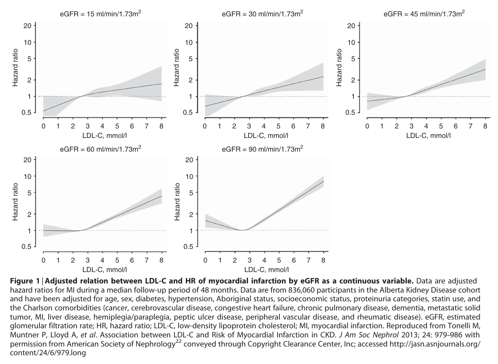

Figure 1 Adjusted relation between LDL-C and HR of myocardial infarction by eGFR as a continuous variable

---

### Fig_2

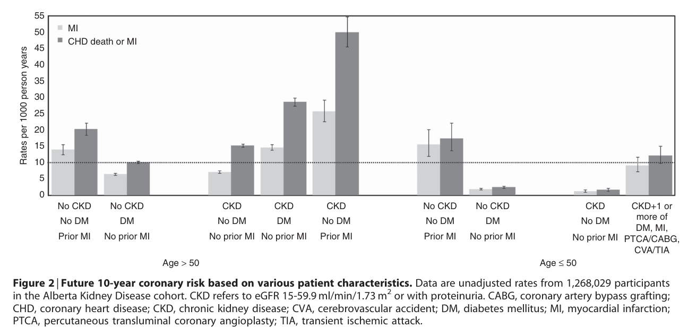

Figure 2 Future 10-year coronary risk based on various patient characteristics

---

### Fig_3

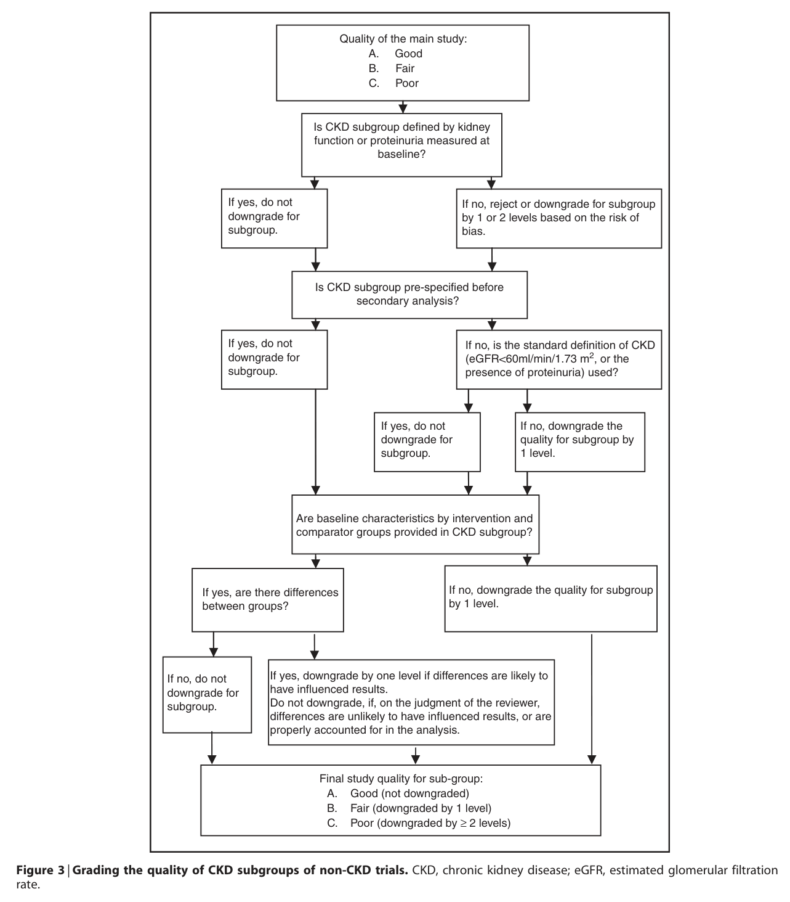

Figure 3 Grading the quality of CKD subgroups of non-CKD trials

---

## Tables

### Table_1

#### Table Image

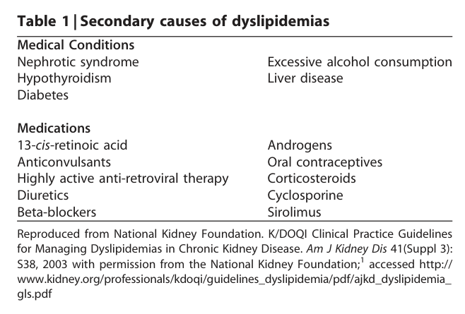

#### Table Data (CSV: [Table_1.csv](Table_1.csv))

```markdown
| Table Text (OCR) |
| :--- |
| Table 1 \| Secondary causes of dyslipidemias Medical Conditions      Nephrotic syndrome  Excessive alcohol consumption    Hypothyroidism  Liver disease    Diabetes            Medications 13-cis-retinoic acid  Androgens    Anticonvulsants  Oral contraceptives    Highly active anti-retroviral therapy  Corticosteroids      Cyclosporine    Diuretics      Beta-blockers  Sirolimus Reproduced from National Kidney Foundation. K/DOQI Clinical Practice Guidelines for Managing Dyslipidemias in Chronic Kidney Disease. Am J Kidney Dis 41(Suppl 3): S38, 2003 with permission from the National Kidney Foundation;<sup>1</sup> accessed http:// www.kidney.org/professionals/kdoqi/guidelines_dyslipidemia/pdf/ajkd_dyslipidemia_ gls.pdf |
```

Table 1 Secondary causes of dyslipidemias 270

---

### Table_2

#### Table Image

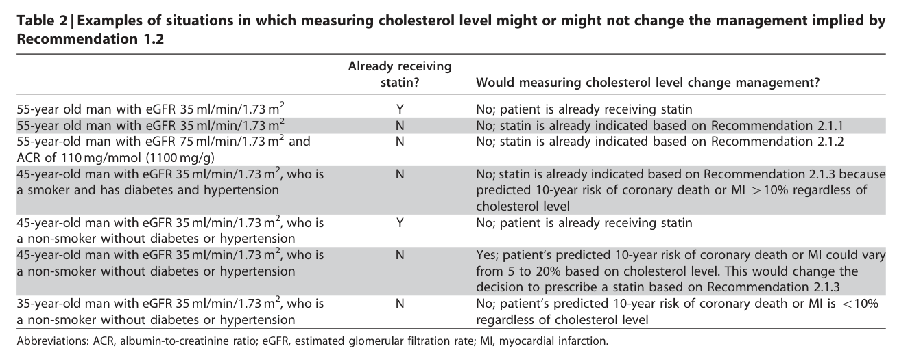

#### Table Data (CSV: [Table_2.csv](Table_2.csv))

```markdown
| Table Text (OCR) |
| :--- |
| Table 2 \| Examples of situations in which measuring cholesterol level might or might not change the management implied by Recommendation 1.2 Already receiving statin?  Would measuring cholesterol level change management?    55-year old man with eGFR 35 ml/min/1.73 m²  Y  No; patient is already receiving statin    55-year old man with eGFR 35 ml/min/1.73 m²  N  No; statin is already indicated based on Recommendation 2.1.1    55-year-old man with eGFR 75 ml/min/1.73 m² and ACR of 110 mg/mmol (1100 mg/g)  N  No; statin is already indicated based on Recommendation 2.1.2    45-year-old man with eGFR 35 ml/min/1.73 m², who is a smoker and has diabetes and hypertension  N  No; statin is already indicated based on Recommendation 2.1.3 because predicted 10-year risk of coronary death or MI >10% regardless of    45-year-old man with eGFR 35 ml/min/1.73 m², who is a non-smoker without diabetes or hypertension  Y  cholesterol level No; patient is already receiving statin    45-year-old man with eGFR 35 ml/min/1.73 m², who is a non-smoker without diabetes or hypertension  N  Yes; patient's predicted 10-year risk of coronary death or MI could vary from 5 to 20% based on cholesterol level. This would change the    35-year-old man with eGFR 35 ml/min/1.73 m², who is  N  decision to prescribe a statin based on Recommendation 2.1.3 No; patient's predicted 10-year risk of coronary death or MI is < 10% regardless of cholesterol level Abbreviations: ACR, albumin-to-creatinine ratio; eGFR, estimated glomerular filtration rate; MI, myocardial infarction. |
```

Table 2 Examples of situations in which measuring cholesterol level might or might not change the management implied by Recommendation 1.2 272

---

### Table_3

#### Table Image

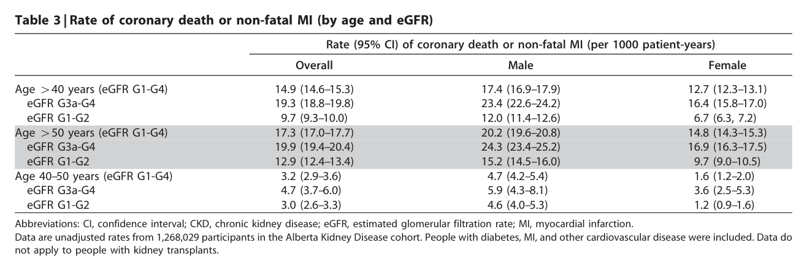

#### Table Data (CSV: [Table_3.csv](Table_3.csv))

```markdown
| Table Text (OCR) |
| :--- |
| Table 3 \| Rate of coronary death or non-fatal MI (by age and eGFR) Rate (95% Cl) of coronary death or non-fatal MI (per 1000 patient-years)    Overall  Male  Female    Age >40 years (eGFR G1-G4)  14.9 (14.6–15.3)  17.4 (16.9–17.9)  12.7 (12.3–13.1)    eGFR G3a-G4  19.3 (18.8–19.8)  23.4 (22.6–24.2)  16.4 (15.8–17.0)    eGFR G1-G2  9.7 (9.3–10.0)  12.0 (11.4–12.6)  6.7 (6.3, 7.2)    Age >50 years (eGFR G1-G4)  17.3 (17.0–17.7)  20.2 (19.6–20.8)  14.8 (14.3–15.3)    eGFR G3a-G4  19.9 (19.4–20.4)  24.3 (23.4–25.2)  16.9 (16.3–17.5)    eGFR G1-G2  12.9 (12.4–13.4)  15.2 (14.5–16.0)  9.7 (9.0–10.5)    Age 40–50 years (eGFR G1-G4)  3.2 (2.9–3.6)  4.7 (4.2–5.4)  1.6 (1.2–2.0)    eGFR G3a-G4  4.7 (3.7–6.0)  5.9 (4.3–8.1)  3.6 (2.5–5.3)    eGFR G1-G2  3.0 (2.6–3.3)  4.6 (4.0–5.3)  1.2 (0.9–1.6) Abbreviations: CI, confidence interval; CKD, chronic kidney disease; eGFR, estimated glomerular filtration rate; MI, myocardial infarction. Data are unadjusted rates from 1,268,029 participants in the Alberta Kidney Disease cohort. People with diabetes, MI, and other cardiovascular disease were included. Data do not apply to people with kidney transplants. |
```

Table 3 Rate of coronary death or non-fatal MI (by age and eGFR) 274

---

### Table_4

#### Table Image

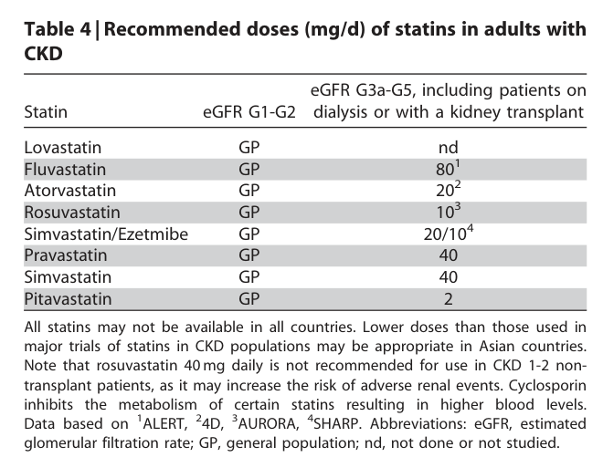

#### Table Data (CSV: [Table_4.csv](Table_4.csv))

```markdown
| Table Text (OCR) |
| :--- |
| Table 4 \| Recommended doses (mg/d) of statins in adults with CKD Statin  eGFR G1-G2  eGFR G3a-G5, including patients on dialysis or with a kidney transplant    Lovastatin  GP  nd    Fluvastatin  GP  801    Atorvastatin  GP  202    Rosuvastatin  GP  10³    Simvastatin/Ezetmibe  GP   2 0 / 1 0 ^ { 4 }     Pravastatin  GP  40    Simvastatin  GP  40    Pitavastatin  GP  2 All statins may not be available in all countries. Lower doses than those used in major trials of statins in CKD populations may be appropriate in Asian countries. Note that rosuvastatin 40 mg daily is not recommended for use in CKD 1-2 non- transplant patients, as it may increase the risk of adverse renal events. Cyclosporin inhibits the metabolism of certain statins resulting in higher blood levels. Data based on <sup>1</sup>ALERT, <sup>2</sup>4D, <sup>3</sup>AURORA, <sup>4</sup>SHARP. Abbreviations: eGFR, estimated glomerular filtration rate; GP, general population; nd, not done or not studied. |
```

Table 4 Recommended doses of statins in adults with CKD 281

---

### Table_5

#### Table Image

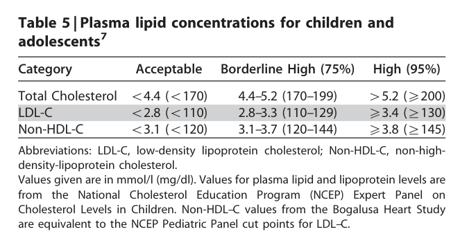

#### Table Data (CSV: [Table_5.csv](Table_5.csv))

```markdown
| Table Text (OCR) |
| :--- |
| Table 5 \| Plasma lipid concentrations for children and adolescents<sup>7</sup> Category  Acceptable  Borderline High (75%)  High (95%)    Total Cholesterol  <4.4 (<170)  4.4–5.2 (170–199)  >5.2 (≥200)    LDL-C  <2.8 (<110)  2.8–3.3 (110–129)  ≥3.4 (≥130)    Non-HDL-C  <3.1 (<120)  3.1–3.7 (120–144)  ≥3.8 (≥145) Abbreviations: LDL-C, low-density lipoprotein cholesterol; Non-HDL-C, non-high- density-lipoprotein cholesterol. Values given are in mmol/l (mg/dl). Values for plasma lipid and lipoprotein levels are from the National Cholesterol Education Program (NCEP) Expert Panel on Cholesterol Levels in Children. Non-HDL–C values from the Bogalusa Heart Study are equivalent to the NCEP Pediatric Panel cut points for LDL–C. |
```

Table 5 Plasma lipid concentrations for children and adolescents 288

---

### Table_6

#### Table Image

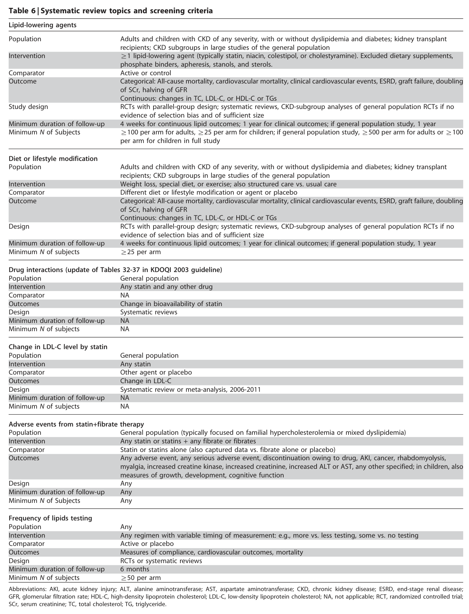

#### Table Data (CSV: [Table_6.csv](Table_6.csv))

```markdown
| Table Text (OCR) |
| :--- |
| Table 6 \| Systematic review topics and screening criteria Lipid-lowering agents      Population  Adults and children with CKD of any severity, with or without dyslipidemia and diabetes; kidney transplant recipients; CKD subgroups in large studies of the general population    Intervention  ≥1 lipid-lowering agent (typically statin, niacin, colestipol, or cholestyramine). Excluded dietary supplements, phosphate binders, apheresis, stanols, and sterols.    Comparator  Active or control Categorical: All-cause mortality, cardiovascular mortality, clinical cardiovascular events, ESRD, graft failure, doubling    Outcome  of SCr, halving of GFR Continuous: changes in TC, LDL-C, or HDL-C or TGs    Study design  RCTs with parallel-group design; systematic reviews, CKD-subgroup analyses of general population RCTs if no    Minimum duration of follow-up Minimum N of Subjects  evidence of selection bias and of sufficient size 4 weeks for continuous lipid outcomes; 1 year for clinical outcomes; if general population study, 1 year ≥ 100 per arm for adults, ≥25 per arm for children; if general population study, ≥500 per arm for adults or ≥ 100    Diet or lifestyle modification  per arm for children in full study    Population  Adults and children with CKD of any severity, with or without dyslipidemia and diabetes; kidney transplant recipients; CKD subgroups in large studies of the general population    Intervention  Weight loss, special diet, or exercise; also structured care vs. usual care    Comparator  Different diet or lifestyle modification or agent or placebo Categorical: All-cause mortality, cardiovascular mortality, clinical cardiovascular events, ESRD, graft failure, doubling    Outcome  of SCr, halving of GFR    Design  Continuous: changes in TC, LDL-C, or HDL-C or TGs RCTs with parallel-group design; systematic reviews, CKD-subgroup analyses of general population RCTs if no    Minimum duration of follow-up  evidence of selection bias and of sufficient size 4 weeks for continuous lipid outcomes; 1 year for clinical outcomes; if general population study, 1 year    Minimum N of subjects  ≥25 per arm    Drug interactions (update of Tables 32-37 in KDOQI 2003 guideline) Population  General population    Intervention  Any statin and any other drug    Comparator  NA    Outcomes  Change in bioavailability of statin    Design Minimum duration of follow-up  Systematic reviews NA    Minimum N of subjects  NA          Change in LDL-C level by statin      Population Intervention  General population Any statin    Comparator  Other agent or placebo    Outcomes  Change in LDL-C    Design  Systematic review or meta-analysis, 2006-2011    Minimum duration of follow-up Minimum N of subjects  NA      NA    Adverse events from statin+fibrate therapy      Population  General population (typically focused on familial hypercholesterolemia or mixed dyslipidemia)    Intervention  Any statin or statins + any fibrate or fibrates    Comparator Outcomes  Statin or statins alone (also captured data vs. fibrate alone or placebo) Any adverse event, any serious adverse event, discontinuation owing to drug, AKl, cancer, rhabdomyolysis,      myalgia, increased creatine kinase, increased creatinine, increased ALT or AST, any other specified; in children, also      measures of growth, development, cognitive function    Design Minimum duration of follow-up  Any Any    Minimum N of Subjects  Any          Frequency of lipids testing      Population  Any    Intervention  Any regimen with variable timing of measurement: e.g., more vs. less testing, some vs. no testing    Comparator  Active or placebo    Outcomes  Measures of compliance, cardiovascular outcomes, mortality          Design  RCTs or systematic reviews    Minimum duration of follow-up  6 months          Minimum N of subjects                                ≥50 per arm                                                                                                                Abbreviations: AKI, acute kidney injury; ALT, alanine aminotransferase; AST, aspartate aminotransferase; CKD, chronic kidney disease; ESRD, end-stage renal disease;                                          GFR, glomerular filtration rate; HDL-C, high-density lipoprotein cholesterol; LDL-C, low-density lipoprotein cholesterol; NA, not applicable; RCT, randomized controlled trial; |
```

Table 6 Systematic review topics and screening criteria 289

---

### Table_7

#### Table Image

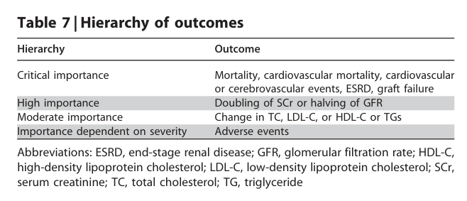

#### Table Data (CSV: [Table_7.csv](Table_7.csv))

```markdown
| Table Text (OCR) |
| :--- |
| Table 7 \| Hierarchy of outcomes Hierarchy  Outcome    Critical importance  Mortality, cardiovascular mortality, cardiovascular or cerebrovascular events, ESRD, graft failure    High importance  Doubling of SCr or halving of GFR    Moderate importance  Change in TC, LDL-C, or HDL-C or TGs    Importance dependent on severity  Adverse events Abbreviations: ESRD, end-stage renal disease; GFR, glomerular filtration rate; HDL-C, high-density lipoprotein cholesterol; LDL-C, low-density lipoprotein cholesterol; SCr, serum creatinine; TC, total cholesterol; TG, triglyceride |
```

Table 7 Hierarchy of outcomes 289

---

### Table_8

#### Table Image

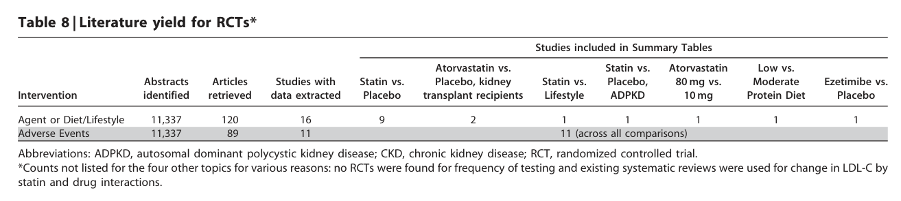

#### Table Data (CSV: [Table_8.csv](Table_8.csv))

```markdown
| Table Text (OCR) |
| :--- |
| Table 8 \| Literature yield for RCTs* Abstracts      Studies included in Summary Tables    Intervention  identified  Articles retrieved  Studies with data extracted  Statin vs. Placebo  Atorvastatin vs. Placebo, kidney transplant recipients  Statin vs. Lifestyle  Statin vs. Placebo, ADPKD  Atorvastatin 80 mg vs. 10mg  Low vs. Moderate Protein Diet  Ezetimibe vs. Placebo    Agent or Diet/Lifestyle  11,337  120  16  9    1  1  1  1  1    Adverse Events  11,337  89  11    11 (across all comparisons) Abbreviations: ADPKD, autosomal dominant polycystic kidney disease; CKD, chronic kidney disease; RCT, randomized controlled trial. *Counts not listed for the four other topics for various reasons: no RCTs were found for frequency of testing and existing systematic reviews were used for change in LDL-C by statin and drug interactions. |
```

Table 8 Literature yield for RCTs 290

---

### Table_9

#### Table Image

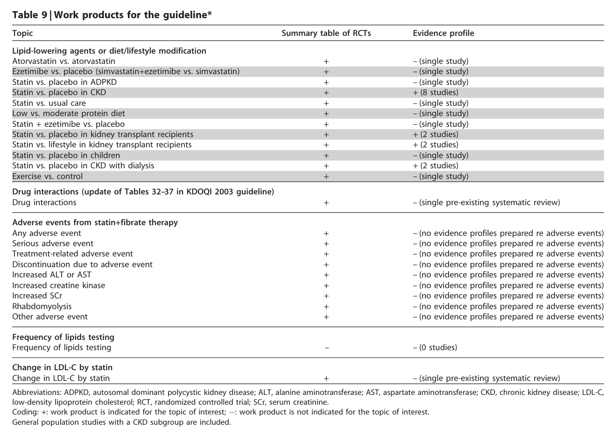

#### Table Data (CSV: [Table_9.csv](Table_9.csv))

```markdown
| Table Text (OCR) |
| :--- |
| Table 9 \| Work products for the guideline* Topic  Summary table of RCTs  Evidence profile    Lipid-lowering agents or diet/lifestyle modification    Atorvastatin vs. atorvastatin  +  - (single study)    Ezetimibe vs. placebo (simvastatin+ezetimibe vs. simvastatin)  +  – (single study)    Statin vs. placebo in ADPKD  +  – (single study)    Statin vs. placebo in CKD  十  + (8 studies)    Statin vs. usual care  +  - (single study)    Low vs. moderate protein diet  +  - (single study)    Statin + ezetimibe vs. placebo  +  - (single study)    Statin vs. placebo in kidney transplant recipients  +  + (2 studies)    Statin vs. lifestyle in kidney transplant recipients  +  + (2 studies)    Statin vs. placebo in children  +  – (single study)    Statin vs. placebo in CKD with dialysis  +  + (2 studies)    Exercise vs. control  +  – (single study)    Drug interactions (update of Tables 32–37 in KDOQI 2003 guideline)    Drug interactions  +  – (single pre-existing systematic review)    Adverse events from statin+fibrate therapy    Any adverse event  十  – (no evidence profiles prepared re adverse events)    Serious adverse event  +  – (no evidence profiles prepared re adverse events)    Treatment-related adverse event  十  – (no evidence profiles prepared re adverse events)    Discontinuation due to adverse event  +  – (no evidence profiles prepared re adverse events)    Increased ALT or AST  十  – (no evidence profiles prepared re adverse events)    Increased creatine kinase  十  – (no evidence profiles prepared re adverse events)    Increased SCr  十  – (no evidence profiles prepared re adverse events)    Rhabdomyolysis  十  – (no evidence profiles prepared re adverse events)    Other adverse event  十  – (no evidence profiles prepared re adverse events)    Frequency of lipids testing Frequency of lipids testing        – (0 studies)    Change in LDL-C by statin    Change in LDL-C by statin  +  – (single pre-existing systematic review) Abbreviations: ADPKD, autosomal dominant polycystic kidney disease; ALT, alanine aminotransferase; AST, aspartate aminotransferase; CKD, chronic kidney disease; LDL-C, low-density lipoprotein cholesterol; RCT, randomized controlled trial; SCr, serum creatinine. Coding: +: work product is indicated for the topic of interest; -: work product is not indicated for the topic of interest. General population studies with a CKD subgroup are included |
```

Table 9 Work products for the guideline 290

---

### Table_10

#### Table Image

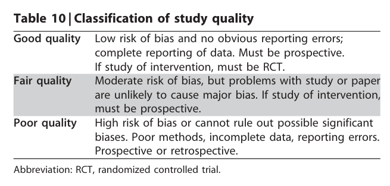

#### Table Data (CSV: [Table_10.csv](Table_10.csv))

```markdown
| Table Text (OCR) |
| :--- |
| Table 10 \| Classification of study quality Good quality  Low risk of bias and no obvious reporting errors; complete reporting of data. Must be prospective.    Fair quality  If study of intervention, must be RCT. Moderate risk of bias, but problems with study or paper are unlikely to cause major bias. If study of intervention, must be prospective.    Poor quality  High risk of bias or cannot rule out possible significant biases. Poor methods, incomplete data, reporting errors. Prospective or retrospective. Abbreviation: RCT, randomized controlled trial. |
```

Table 10 Classification of study quality 291

---

### Table_11

#### Table Image

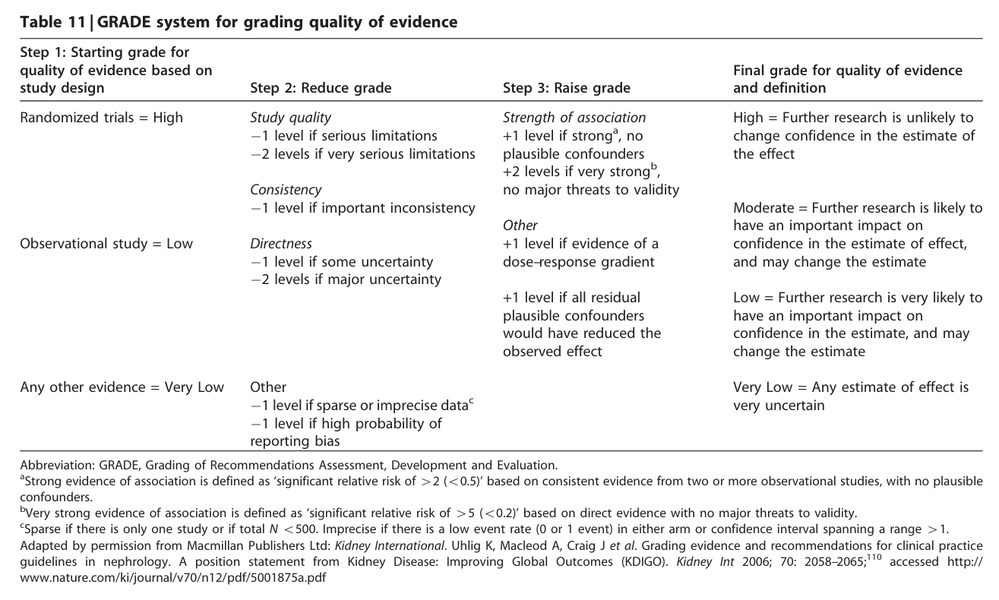

#### Table Data (CSV: [Table_11.csv](Table_11.csv))

```markdown
| Table Text (OCR) |
| :--- |
| images/a2efb69cf4a6c50502738620f69d57c3f584e7e2a4149fb928567b64503f99de.jpg Table 11 \| GRADE system for grading quality of evidence Abbreviation: GRADE, Grading of Recommendations Assessment, Development and Evaluation. <sup>a</sup>Strong evidence of association is defined as ‘significant relative risk of 42 (o0.5)’ based on consistent evidence from two or more observational studies, with no plausible confounders. <sup>b</sup>Very strong evidence of association is defined as ‘significant relative risk of 45 (o0.2)’ based on direct evidence with no major threats to validity. <table><tr><td>Step 1: Starting grade for quality of evidence based on study design</td><td>Step 2: Reduce grade</td><td>Step 3: Raise grade</td><td>Final grade for quality of evidence and definition</td></tr><tr><td rowspan="4">Randomized trials = High</td><td>Study quality —1 level if serious limitations</td><td>Strength of association +1 level if strongª, no</td><td>High = Further research is unlikely to change confidence in the estimate of</td></tr><tr><td>—2 levels if very serious limitations</td><td>plausible confounders +2 levels if very strongb,</td><td>the effect</td></tr><tr><td>Consistency —1 level if important inconsistency</td><td>no major threats to validity</td><td>Moderate = Further research is likely to</td></tr><tr><td>Directness</td><td>Other</td><td>have an important impact on</td></tr><tr><td rowspan="4">Observational study = Low</td><td>—1 level if some uncertainty</td><td>+1 level if evidence of a</td><td>confidence in the estimate of effect,</td></tr><tr><td>—2 levels if major uncertainty</td><td>dose-response gradient</td><td>and may change the estimate</td></tr><tr><td></td><td>+1 level if all residual</td><td>Low = Further research is very likely to</td></tr><tr><td></td><td>plausible confounders would have reduced the observed effect</td><td>have an important impact on confidence in the estimate, and may change the estimate</td></tr><tr><td>Any other evidence = Very Low</td><td>Other</td><td></td><td>Very Low = Any estimate of effect is</td></tr><tr><td></td><td></td><td></td><td></td></tr><tr><td></td><td></td><td></td><td></td></tr><tr><td></td><td>—1 level if sparse or imprecise data</td><td></td><td></td></tr><tr><td></td><td></td><td></td><td>very uncertain</td></tr><tr><td></td><td></td><td></td><td></td></tr><tr><td></td><td></td><td></td><td></td></tr><tr><td></td><td>—1 level if high probability of reporting bias</td><td></td><td></td></tr></table> complex_table <sup>c</sup>Sparse if there is only one study or if total N o500. Imprecise if there is a low event rate (0 or 1 event) in either arm or confidence interval spanning a range 41. Sparse if there is only one study or if total N <500. Imprecise if there is a low event rate (0 or 1 event) in either arm or confidence interval spanning a range >1. Adapted by permission from Macmillan Publishers Ltd: Kidney International. Uhlig K, Macleod A, Craig J et al. Grading evidence and recommendations for clinical practice guidelines in nephrology. A position statement from Kidney Disease: Improving Global Outcomes (KDIGO). Kidney Int 2006; 70: 2058–2065;<sup>110</sup> accessed http:// www.nature.com/ki/journal/v70/n12/pdf/5001875a.pdf |
```

Table 11 GRADE system for grading quality of evidence 293

---

### Table_12

#### Table Image

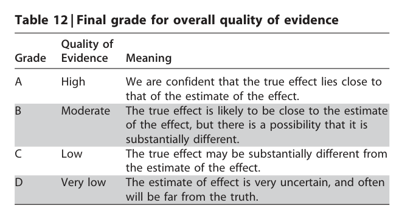

#### Table Data (CSV: [Table_12.csv](Table_12.csv))

```markdown
| Table Text (OCR) |
| :--- |
| Table 12 \| Final grade for overall quality of evidence Quality of    Grade  Evidence  Meaning We are confident that the true effect lies close to    A B  High Moderate  that of the estimate of the effect. The true effect is likely to be close to the estimate        of the effect, but there is a possibility that it is substantially different.    C  Low  The true effect may be substantially different from the estimate of the effect.    D  Very low  The estimate of effect is very uncertain, and often will be far from the truth. |
```

Table 12 Final grade for overall quality of evidence 293

---

### Table_13

#### Table Image

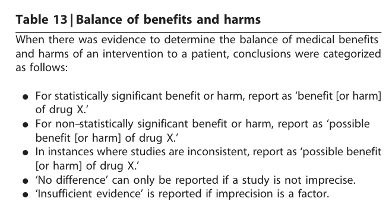

#### Table Data (CSV: [Table_13.csv](Table_13.csv))

```markdown
| Table Text (OCR) |
| :--- |
| Table 13 \| Balance of benefits and harms When there was evidence to determine the balance of medical benefits and harms of an intervention to a patient, conclusions were categorized as follows: K For statistically significant benefit or harm, report as ‘benefit [or harm] of drug X.’ K For non–statistically significant benefit or harm, report as ‘possible benefit [or harm] of drug X. K In instances where studies are inconsistent, report as ‘possible benefit [or harm] of drug X. K ‘No difference’ can only be reported if a study is not imprecise. K ‘Insufficient evidence’ is reported if imprecision is a factor. |
```

Table 13 Balance of benefits and harms 293

---

### Table_14

#### Table Image

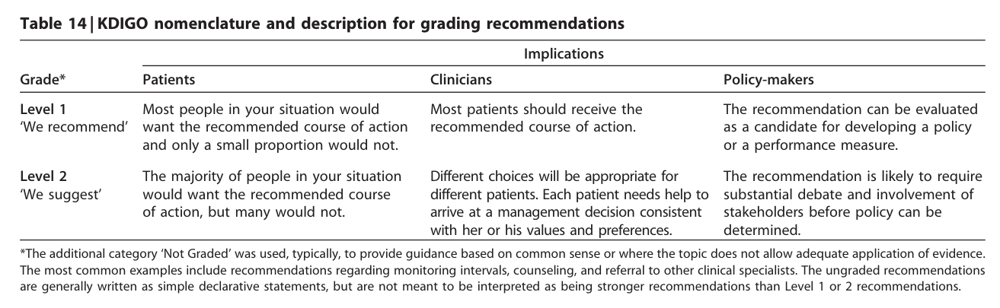

#### Table Data (CSV: [Table_14.csv](Table_14.csv))

```markdown
| Table Text (OCR) |
| :--- |
| Table 14 \| KDIGO nomenclature and description for grading recommendations Implications    Grade*  Patients  Clinicians  Policy-makers    Level 1 'We recommend'  Most people in your situation would want the recommended course of action and only a small proportion would not  Most patients should receive the recommended course of action.  The recommendation can be evaluated as a candidate for developing a policy or a performance measure.    Level 2  The majority of people in your situation would want the recommended course  Different choices will be appropriate for different patients. Each patient needs help to  The recommendation is likely to require substantial debate and involvement of *The additional category ‘Not Graded’ was used, typically, to provide guidance based on common sense or where the topic does not allow adequate application of evidence. The most common examples include recommendations regarding monitoring intervals, counseling, and referral to other clinical specialists. The ungraded recommendations are generally written as simple declarative statements, but are not meant to be interpreted as being stronger recommendations than Level 1 or 2 recommendations. |
```

Table 14 KDIGO nomenclature and description for grading recommendations 293

---

### Table_15

#### Table Image

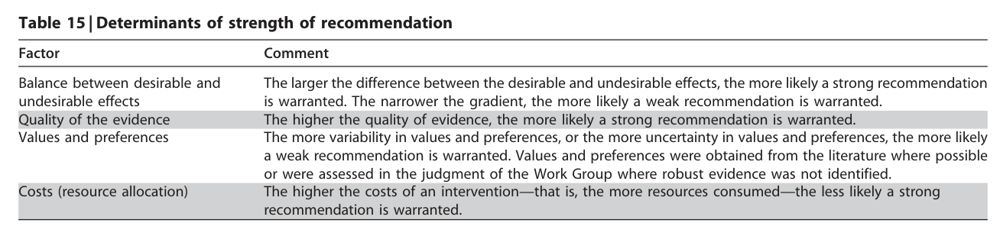

#### Table Data (CSV: [Table_15.csv](Table_15.csv))

```markdown
| Table Text (OCR) |
| :--- |
| Table 15 \| Determinants of strength of recommendation Factor  Comment    Balance between desirable and undesirable effects  The larger the difference between the desirable and undesirable effects, the more likely a strong recommendation is warranted. The narrower the gradient, the more likely a weak recommendation is warranted.    Quality of the evidence  The higher the quality of evidence, the more likely a strong recommendation is warranted.    Values and preferences  The more variability in values and preferences, or the more uncertainty in values and preferences, the more likely a weak recommendation is warranted. Values and preferences were obtained from the literature where possible    Costs (resource allocation)  or were assessed in the judgment of the Work Group where robust evidence was not identified. The higher the costs of an intervention—that is, the more resources consumed—the less likely a strong recommendation is warranted. |
```

Table 15 Determinants of strength of recommendation 294

---

### Table_16

#### Table Images (2 Parts)

- **Part 1 (Page 45)**:
  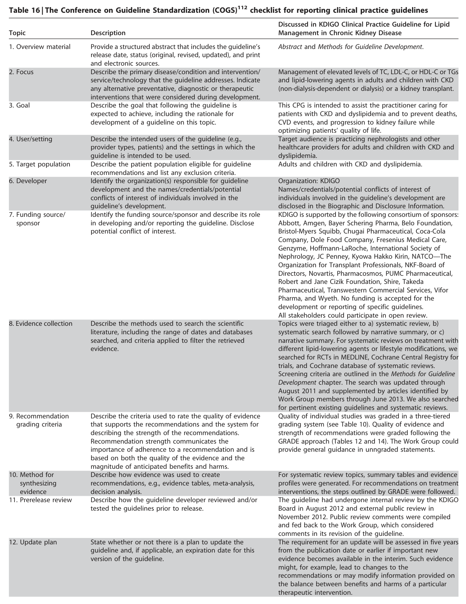

- **Part 2 (Page 46)**:
  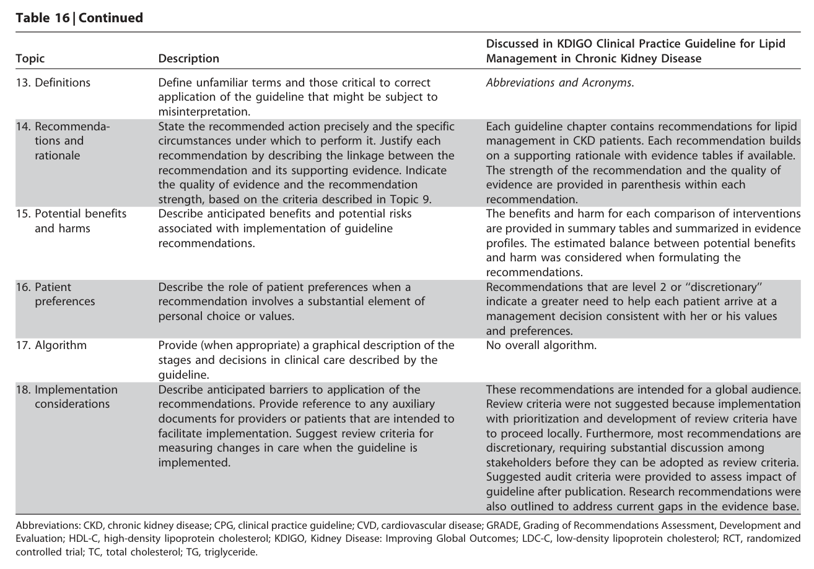

#### Table Data (CSV: [Table_16.csv](Table_16.csv))

```markdown
| Table Text (OCR) |
| :--- |
| images/957a04c39937097378b768eacab71ca2c6057979bf1e3a89a63230f1accb9f49.jpg Table 16 \| The Conference on Guideline Standardization (COGS)<sup>112</sup> checklist for reporting clinical practice guidelines <table><tr><td>Topic</td><td>Description</td><td>Discussed in KDIGO Clinical Practice Guideline for Lipid Management in Chronic Kidney Disease</td></tr><tr><td>1. Overview material</td><td>Provide a structured abstract that includes the guideline's release date, status (original, revised, updated), and print and electronic sources.</td><td>Abstract and Methods for Guideline Development.</td></tr><tr><td>2. Focus</td><td>Describe the primary disease/condition and intervention/ service/technology that the guideline addresses. Indicate any alternative preventative, diagnostic or therapeutic</td><td>Management of elevated levels of TC, LDL-C, or HDL-C or TGs and lipid-lowering agents in adults and children with CKD (non-dialysis-dependent or dialysis) or a kidney transplant.</td></tr><tr><td>3. Goal</td><td>interventions that were considered during development. Describe the goal that following the guideline is expected to achieve, including the rationale for development of a guideline on this topic.</td><td>This CPG is intended to assist the practitioner caring for patients with CKD and dyslipidemia and to prevent deaths, CVD events, and progression to kidney failure while</td></tr><tr><td>4. User/setting</td><td>Describe the intended users of the guideline (e.g., provider types, patients) and the settings in which the</td><td>optimizing patients' quality of life. Target audience is practicing nephrologists and other healthcare providers for adults and children with CKD and</td></tr><tr><td>5. Target population</td><td>guideline is intended to be used. Describe the patient population eligible for guideline recommendations and list any exclusion criteria.</td><td>dyslipidemia. Adults and children with CKD and dyslipidemia.</td></tr><tr><td>6. Developer</td><td>Identify the organization(s) responsible for guideline development and the names/credentials/potential conflicts of interest of individuals involved in the</td><td>Organization: KDIGO Names/credentials/potential conflicts of interest of individuals involved in the guideline's development are disclosed in the Biographic and Disclosure Information.</td></tr><tr><td>7. Funding source/ sponsor</td><td>guideline's development. Identify the funding source/sponsor and describe its role in developing and/or reporting the guideline. Disclose potential conflict of interest.</td><td>KDIGO is supported by the following consortium of sponsors: Abbott, Amgen, Bayer Schering Pharma, Belo Foundation, Bristol-Myers Squibb, Chugai Pharmaceutical, Coca-Cola Company, Dole Food Company, Fresenius Medical Care, Genzyme, Hoffmann-LaRoche, International Society of Nephrology, JC Penney, Kyowa Hakko Kirin, NATCO—The Organization for Transplant Professionals, NKF-Board of Directors, Novartis, Pharmacosmos, PUMC Pharmaceutical, Robert and Jane Cizik Foundation, Shire, Takeda Pharmaceutical, Transwestern Commercial Services, Vifor</td></tr><tr><td>8. Evidence collection</td><td>Describe the methods used to search the scientific literature, including the range of dates and databases searched, and criteria applied to filter the retrieved evidence.</td><td>development or reporting of specific guidelines. All stakeholders could participate in open review. Topics were triaged either to a) systematic review, b) systematic search followed by narrative summary, or c) narrative summary. For systematic reviews on treatment with different lipid-lowering agents or lifestyle modifications, we searched for RCTs in MEDLINE, Cochrane Central Registry for trials, and Cochrane database of systematic reviews. Screening criteria are outlined in the Methods for Guideline Development chapter. The search was updated through</td></tr><tr><td>9. Recommendation grading criteria</td><td>Describe the criteria used to rate the quality of evidence that supports the recommendations and the system for describing the strength of the recommendations. Recommendation strength communicates the importance of adherence to a recommendation and is</td><td>August 2011 and supplemented by articles identified by Work Group members through June 2013. We also searched for pertinent existing guidelines and systematic reviews. Quality of individual studies was graded in a three-tiered grading system (see Table 10). Quality of evidence and strength of recommendations were graded following the GRADE approach (Tables 12 and 14). The Work Group could provide general guidance in unngraded statements.</td></tr><tr><td>10. Method for</td><td>based on both the quality of the evidence and the magnitude of anticipated benefits and harms. Describe how evidence was used to create recommendations, e.g., evidence tables, meta-analysis,</td><td>For systematic review topics, summary tables and evidence profiles were generated. For recommendations on treatment</td></tr><tr><td>evidence 11. Prerelease review</td><td>decision analysis. Describe how the guideline developer reviewed and/or tested the guidelines prior to release.</td><td>interventions, the steps outlined by GRADE were followed. The guideline had undergone internal review by the KDIGO Board in August 2012 and external public review in November 2012. Public review comments were compiled and fed back to the Work Group, which considered</td></tr><tr><td>12. Update plan</td><td>State whether or not there is a plan to update the guideline and, if applicable, an expiration date for this version of the guideline.</td><td>comments in its revision of the guideline. The requirement for an update will be assessed in five years from the publication date or earlier if important new evidence becomes available in the interim. Such evidence might, for example, lead to changes to the recommendations or may modify information provided on</td></tr><tr><td>13. Definitions</td><td>Define unfamiliar terms and those critical to correct application of the guideline that might be subject to misinterpretation.</td><td>Abbreviations and Acronyms.</td></tr><tr><td>14. Recommenda- tions and rationale</td><td>State the recommended action precisely and the specific circumstances under which to perform it. Justify each recommendation by describing the linkage between the recommendation and its supporting evidence. Indicate the quality of evidence and the recommendation</td><td>Each guideline chapter contains recommendations for lipid management in CKD patients. Each recommendation builds on a supporting rationale with evidence tables if available. The strength of the recommendation and the quality of evidence are provided in parenthesis within each</td></tr><tr><td>15. Potential benefits and harms</td><td>strength, based on the criteria described in Topic 9. Describe anticipated benefits and potential risks associated with implementation of guideline recommendations.</td><td>recommendation. The benefits and harm for each comparison of interventions are provided in summary tables and summarized in evidence profiles. The estimated balance between potential benefits and harm was considered when formulating the</td></tr><tr><td>16. Patient preferences</td><td>Describe the role of patient preferences when a recommendation involves a substantial element of personal choice or values.</td><td>recommendations. Recommendations that are level 2 or “discretionary" indicate a greater need to help each patient arrive at a management decision consistent with her or his values and preferences.</td></tr><tr><td>17. Algorithm</td><td>Provide (when appropriate) a graphical description of the stages and decisions in clinical care described by the guideline.</td><td>No overall algorithm.</td></tr><tr><td>18. Implementation considerations</td><td>Describe anticipated barriers to application of the recommendations. Provide reference to any auxiliary documents for providers or patients that are intended to facilitate implementation. Suggest review criteria for measuring changes in care when the guideline is implemented.</td><td>These recommendations are intended for a global audience. Review criteria were not suggested because implementation with prioritization and development of review criteria have to proceed locally. Furthermore, most recommendations are discretionary, requiring substantial discussion among stakeholders before they can be adopted as review criteria. Suggested audit criteria were provided to assess impact of guideline after publication. Research recommendations were also outlined to address current gaps in the evidence base.</td></tr></table> simple_table images/ simple_table Abbreviations: CKD, chronic kidney disease; CPG, clinical practice guideline; CVD, cardiovascular disease; GRADE, Grading of Recommendations Assessment, Development and Evaluation; HDL-C, high-density lipoprotein cholesterol; KDIGO, Kidney Disease: Improving Global Outcomes; LDC-C, low-density lipoprotein cholesterol; RCT, randomized controlled trial; TC, total cholesterol; TG, triglyceride. |
```

Table 16 The Conference on Guideline Standardization (COGS) checklist for reporting clinical practice guidelines

---
