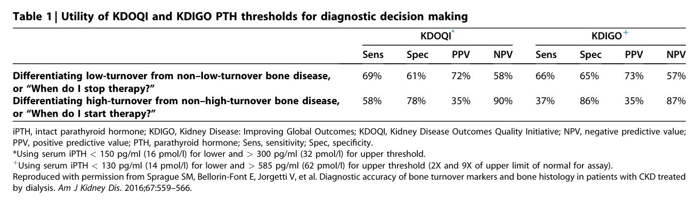
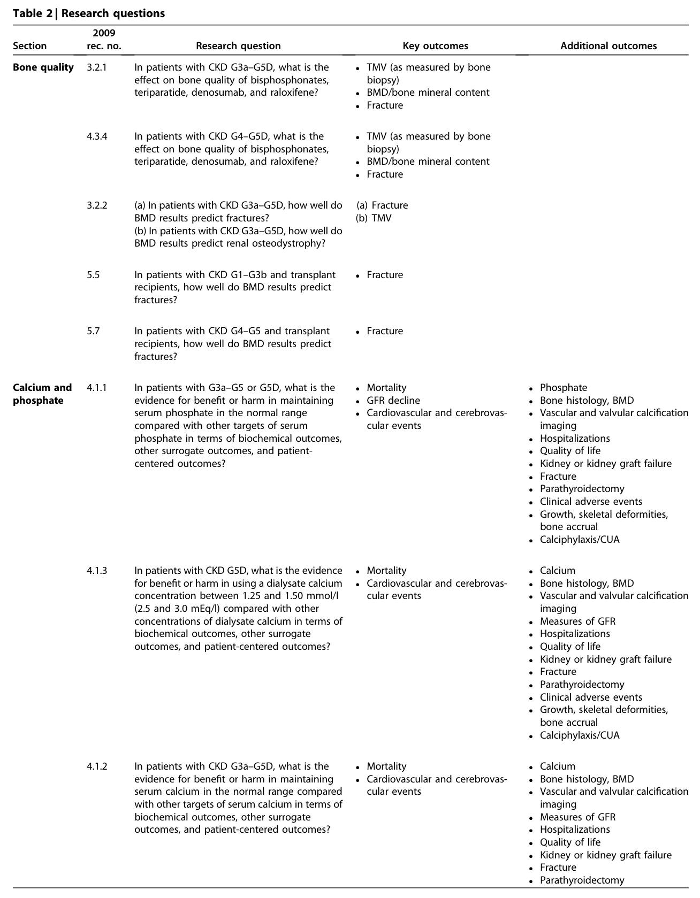
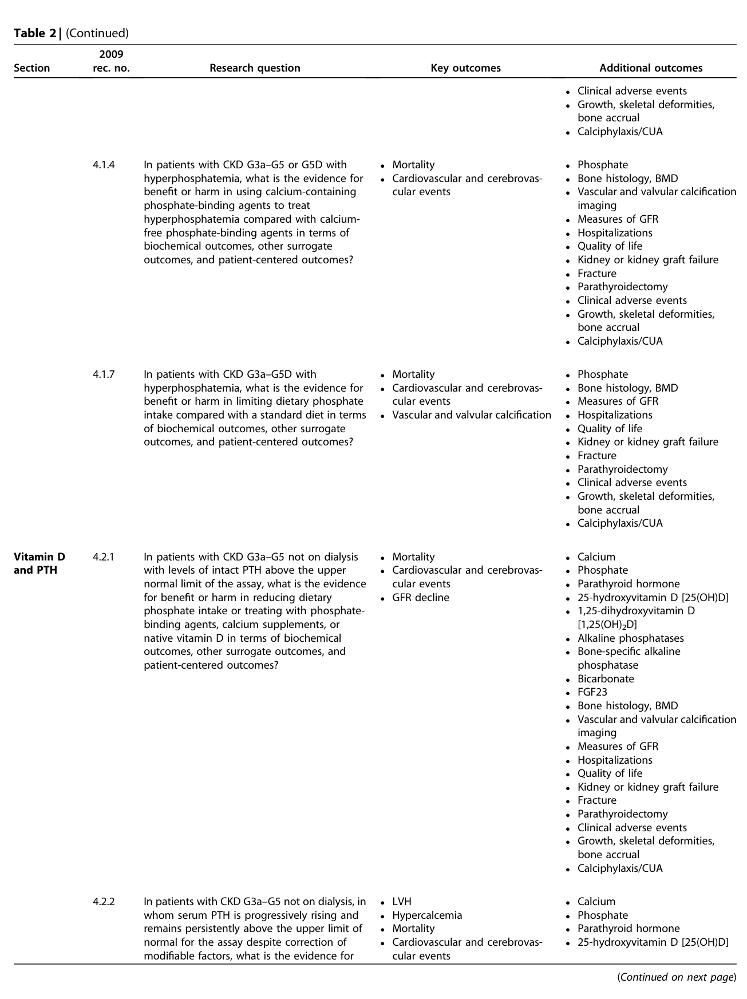
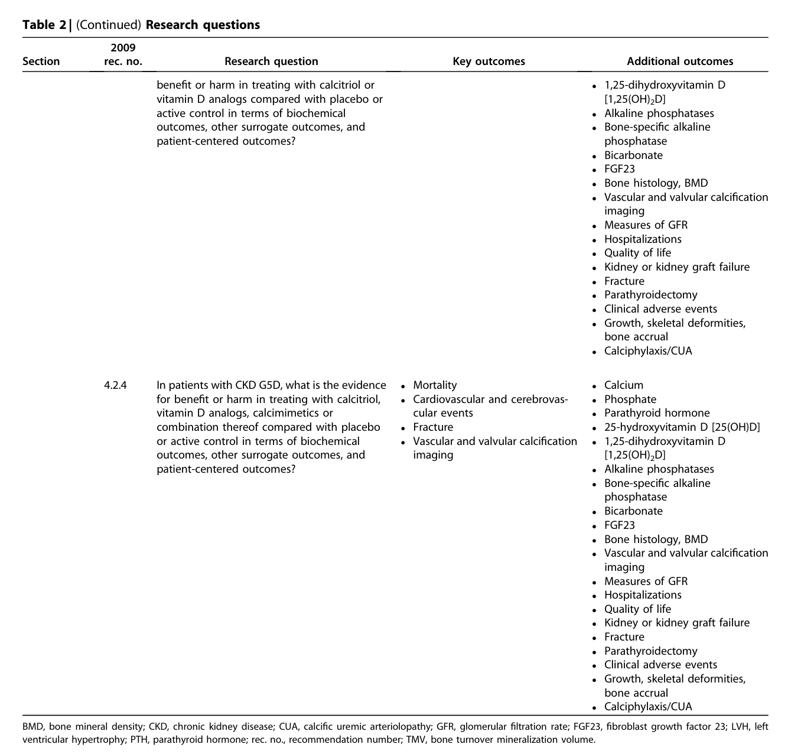
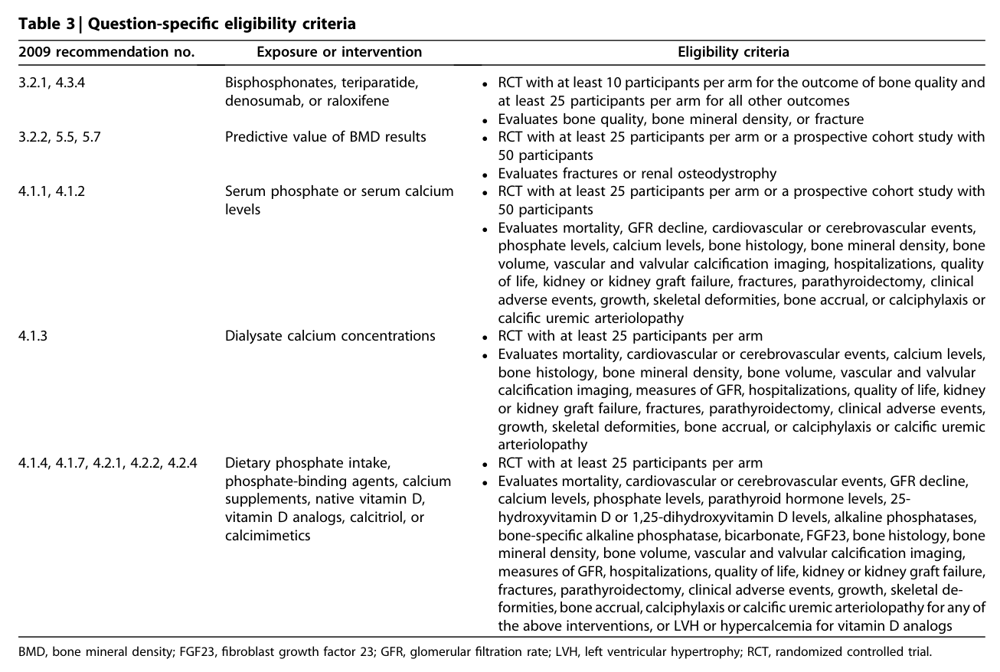
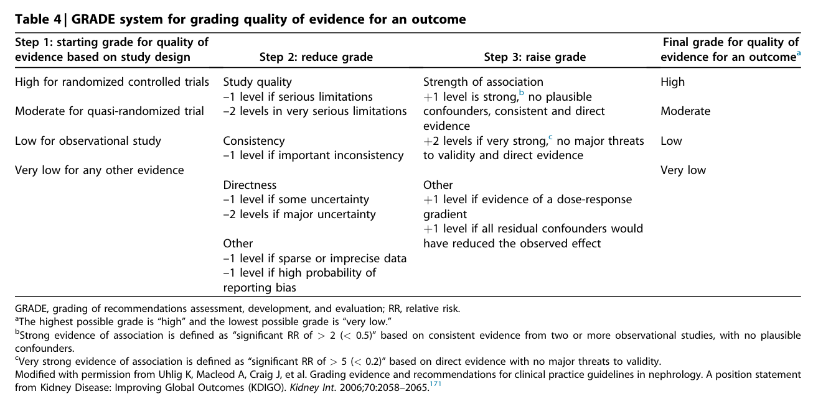
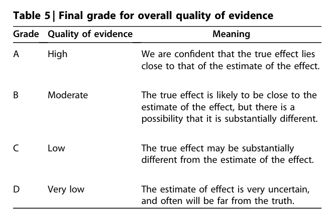
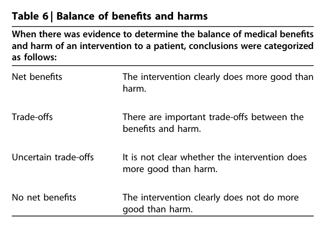
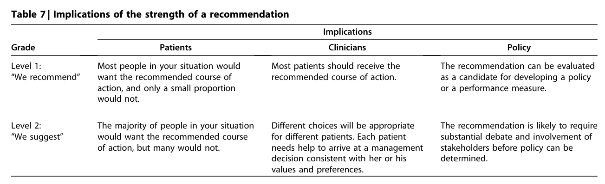
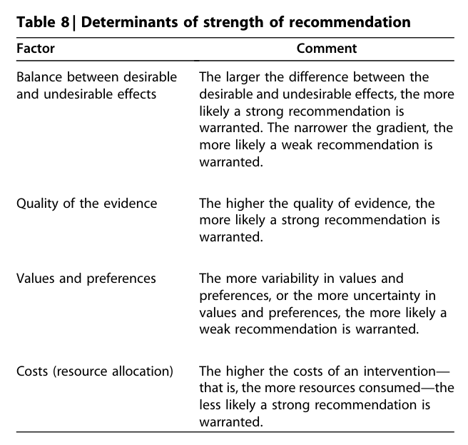

# KDIGO-2017-KDIGO-CKD-MBD-GL-Update - Figures and Tables Index

This document lists all figures and tables extracted from `KDIGO-2017-KDIGO-CKD-MBD-GL-Update.pdf`.

## Table of Contents
- [Figures](#figures)
- [Tables](#tables)

---

## Figures

*No figures resolved for this chapter.*

## Tables

### Table_1

#### Table Image



#### Table Data (CSV: [Table_1.csv](Table_1.csv))

```markdown
| Table Text (OCR) |
| :--- |
| Table 1 \| Utility of KDOQI and KDIGO PTH thresholds for diagnostic decision making KDOQI  KDIGO+      Sens  Spec  PPV  NPV  Sens  Spec  PPV  NPV    Differentiating low-turnover from non-low-turnover bone disease, or “When do I stop therapy?"  69%  61%  72%  58%  66%  65%  73%  57%    Differentiating high-turnover from non-high-turnover bone disease, or “When do I start therapy?"  58%  78%  35%  90%  37%  86%  35%  87% iPTH, intact parathyroid hormone; KDIGO, Kidney Disease: Improving Global Outcomes; KDOQI, Kidney Disease Outcomes Quality Initiative; NPV, negative predictive value; PPV, positive predictive value; PTH, parathyroid hormone; Sens, sensitivity; Spec, speci<sup>fi</sup>city. *Using serum iPTH < 150 pg/ml (16 pmol/l) for lower and > 300 pg/ml (32 pmol/l) for upper threshold. þUsing serum iPTH < 130 pg/ml (14 pmol/l) for lower and > 585 pg/ml (62 pmol/l) for upper threshold (2X and 9X of upper limit of normal for assay). Reproduced with permission from Sprague SM, Bellorin-Font E, Jorgetti V, et al. Diagnostic accuracy of bone turnover markers and bone histology in patients with CKD treated by dialysis. Am J Kidney Dis. 2016;67:559–566. |
```

Table 1 Utility of KDOQI and KDIGO PTH thresholds for diagnostic decision making

---

### Table_2

#### Table Images (3 Parts)

- **Part 1 (Page 43)**:
  

- **Part 2 (Page 44)**:
  

- **Part 3 (Page 45)**:
  

#### Table Data (CSV: [Table_2.csv](Table_2.csv))

```markdown
| Table Text (OCR) |
| :--- |
| images/b46c8c2070c44ab7da3e452a6025b8a9532718f4e2e88a1f60a7e1c4204e8b33.jpg Table 2 \| Research questions <table><tr><td>Section</td><td>2009 rec. no.</td><td>Research question</td><td>Key outcomes</td><td>Additional outcomes</td></tr><tr><td rowspan="4">Bone quality</td><td>3.2.1</td><td>In patients with CKD G3a-G5D, what is the effect on bone quality of bisphosphonates, teriparatide, denosumab, and raloxifene?</td><td>• TMV (as measured by bone biopsy) • BMD/bone mineral content • Fracture</td><td></td></tr><tr><td>4.3.4</td><td>In patients with CKD G4–G5D, what is the effect on bone quality of bisphosphonates, teriparatide, denosumab, and raloxifene?</td><td>• TMV (as measured by bone biopsy) • BMD/bone mineral content • Fracture</td><td></td></tr><tr><td>3.2.2</td><td>(a) In patients with CKD G3a-G5D, how well do BMD results predict fractures? (b) In patients with CKD G3a-G5D, how well do BMD results predict renal osteodystrophy?</td><td>(a) Fracture (b) TMV</td><td></td></tr><tr><td>5.5</td><td>In patients with CKD G1-G3b and transplant recipients, how well do BMD results predict</td><td>• Fracture</td><td></td></tr><tr><td>Calcium and phosphate</td><td>fractures? 5.7 fractures?</td><td>In patients with CKD G4-G5 and transplant recipients, how well do BMD results predict</td><td>• Fracture</td><td>• Phosphate</td></tr><tr><td rowspan="4"></td><td>4.1.1</td><td>In patients with G3a-G5 or G5D, what is the evidence for benefit or harm in maintaining serum phosphate in the normal range compared with other targets of serum phosphate in terms of biochemical outcomes, other surrogate outcomes, and patient- centered outcomes?</td><td>• Mortality • GFR decline • Cardiovascular and cerebrovas- cular events</td><td>• Bone histology, BMD • Vascular and valvular calcification imaging • Hospitalizations • Quality of life • Kidney or kidney graft failure • Fracture • Parathyroidectomy • Clinical adverse events • Growth, skeletal deformities,</td></tr><tr><td>4.1.3</td><td>In patients with CKD G5D, what is the evidence • Mortality for benefit or harm in using a dialysate calcium concentration between 1.25 and 1.50 mmol/I (2.5 and 3.0 mEg/l) compared with other concentrations of dialysate calcium in terms of biochemical outcomes, other surrogate outcomes, and patient-centered outcomes?</td><td>• Cardiovascular and cerebrovas cular events</td><td>bone accrual • Calciphylaxis/CUA • Calcium Bone histology, BMD Vascular and valvular calcification imaging • Measures of GFR • Hospitalizations • Quality of life • Kidney or kidney graft failure • Fracture • Parathyroidectomy</td></tr><tr><td>4.1.2</td><td>In patients with CKD G3a-G5D, what is the evidence for benefit or harm in maintaining serum calcium in the normal range compared</td><td>• Mortality • Cardiovascular and cerebrovas-</td><td>• Clinical adverse events • Growth, skeletal deformities, bone accrual • Calciphylaxis/CUA • Calcium Bone histology, BMD</td></tr><tr><td></td><td>with other targets of serum calcium in terms of biochemical outcomes, other surrogate outcomes, and patient-centered outcomes?</td><td>cular events</td><td>Vascular and valvular calcification imaging • Measures of GFR • Hospitalizations • Quality of life • Kidney or kidney graft failure • Fracture • Parathyroidectomy</td></tr></table> complex_table Table 2 \| (Continued) images/7212c9a6de1cb0439d02706b2d01d5605470366cb753a44960615520facdfa43.jpg (Continued on next page) <table><tr><td></td><td colspan="4"></td></tr><tr><td>Section</td><td>2009 rec. no.</td><td>Research question</td><td>Key outcomes</td><td>Additional outcomes • Clinical adverse events</td></tr><tr><td rowspan="4"></td><td>4.1.4</td><td>In patients with CKD G3a-G5 or G5D with hyperphosphatemia, what is the evidence for benefit or harm in using calcium-containing phosphate-binding agents to treat hyperphosphatemia compared with calcium- free phosphate-binding agents in terms of</td><td rowspan="2">• Mortality • Cardiovascular and cerebrovas- cular events</td><td>• Growth, skeletal deformities, bone accrual • Calciphylaxis/CUA • Phosphate • Bone histology, BMD</td></tr><tr><td></td><td>biochemical outcomes, other surrogate outcomes, and patient-centered outcomes?</td><td>• Vascular and valvular calcification imaging • Measures of GFR • Hospitalizations • Quality of life • Kidney or kidney graft failure • Fracture • Parathyroidectomy • Clinical adverse events • Growth, skeletal deformities, bone accrual • Calciphylaxis/CUA</td></tr><tr><td>4.1.7</td><td>In patients with CKD G3a-G5D with hyperphosphatemia, what is the evidence for benefit or harm in limiting dietary phosphate intake compared with a standard diet in terms of biochemical outcomes, other surrogate outcomes, and patient-centered outcomes?</td><td>• Mortality • Cardiovascular and cerebrovas- cular events • Vascular and valvular calcification</td><td>• Phosphate • Bone histology, BMD • Measures of GFR • Hospitalizations • Quality of life • Kidney or kidney graft failure • Fracture • Parathyroidectomy • Clinical adverse events • Growth, skeletal deformities, bone accrual • Calciphylaxis/CUA</td></tr><tr><td>Vitamin D and PTH</td><td>4.2.1 In patients with CKD G3a-G5 not on dialysis with levels of intact PTH above the upper normal limit of the assay, what is the evidence for benefit or harm in reducing dietary phosphate intake or treating with phosphate- binding agents, calcium supplements, or native vitamin D in terms of biochemical outcomes, other surrogate outcomes, and patient-centered outcomes?</td><td>• Mortality • Cardiovascular and cerebrovas- cular events • GFR decline</td><td>• Calcium • Phosphate • Parathyroid hormone • 25-hydroxyvitamin D [25(OH)D] • 1,25-dihydroxyvitamin D [1,25(OH)₂D] • Alkaline phosphatases • Bone-specific alkaline phosphatase • Bicarbonate • FGF23 • Bone histology, BMD • Vascular and valvular calcification imaging • Measures of GFR • Hospitalizations • Quality of life • Kidney or kidney graft failure • Fracture • Parathyroidectomy • Clinical adverse events • Growth, skeletal deformities, bone accrual</td></tr><tr><td>4.2.2</td><td></td><td colspan="4">In patients with CKD G3a-G5 not on dialysis, in • LVH whom serum PTH is progressively rising and • Hypercalcemia remains persistently above the upper limit of • Mortality normal for the assay despite correction of • Cardiovascular and cerebrovas- modifiable factors, what is the evidence for cular events</td></tr></table> complex_table images/692e3c91513a3a22ece1b2608c37151d125545b3ae3b0e6681b82b1e0d498fc8.jpg Table 2 \| (Continued) Research questions BMD, bone mineral density; CKD, chronic kidney disease; CUA, calci<sup>fi</sup>c uremic arteriolopathy; GFR, glomerular <sup>fi</sup>ltration rate; FGF23, <sup>fi</sup>broblast growth factor 23; LVH, left ventricular hypertrophy; PTH, parathyroid hormone; rec. no., recommendation number; TMV, bone turnover mineralization volume. <table><tr><td rowspan=1 colspan=4>2009Section       rec. no.               Research question                        Key outcomes                  Additional outcomes</td></tr><tr><td></td><td></td><td></td><td rowspan=1 colspan=1>• Clinical adverse events• Growth, skeletal deformities,bone accrual• Calciphylaxis/CUA• Calcium• Phosphate</td></tr><tr><td></td><td rowspan=1 colspan=2>cular events</td><td rowspan=1 colspan=1>• Parathyroid hormone</td></tr><tr><td></td><td></td><td rowspan=1 colspan=1></td><td rowspan=2 colspan=1>• 25-hydroxyvitamin D [25(OH)D]• 1,25-dihydroxyvitamin D</td></tr><tr><td></td><td></td><td></td><td rowspan=1 colspan=1>1,25</td></tr><tr><td></td><td></td><td></td><td rowspan=1 colspan=1>[1,25(0</td></tr><tr><td></td><td></td><td></td><td rowspan=1 colspan=1>• Bone-specific alkaline</td></tr><tr><td></td><td></td><td></td><td rowspan=1 colspan=1>phosphatase• Bicarbonate• FGF23• Bone histology, BMD• Vascular and valvular calcification</td></tr><tr><td></td><td></td><td></td><td rowspan=1 colspan=1>imaging• Measures of GFR</td></tr><tr><td></td><td></td><td></td><td rowspan=1 colspan=1>• Hospitalizations• Quality of life• Kidney or kidney graft failure• Fracture• Parathyroidectomy• Clinical adverse events• Growth, skeletal deformities,</td></tr><tr><td></td><td></td><td></td><td rowspan=1 colspan=1>bone accrual• Calciphylaxis/CUA</td></tr></table> complex_table |
```

Table 2 Research questions

---

### Table_3

#### Table Image



#### Table Data (CSV: [Table_3.csv](Table_3.csv))

```markdown
| Table Text (OCR) |
| :--- |
| Table 3 \| Question-speci<sup>fi</sup>c eligibility criteria 2009 recommendation no.  Exposure or intervention  Eligibility criteria    3.2.1, 4.3.4  Bisphosphonates, teriparatide, denosumab, or raloxifene  • RCT with at least 10 participants per arm for the outcome of bone quality and at least 25 participants per arm for all other outcomes • Evaluates bone quality, bone mineral density, or fracture    3.2.2, 5.5, 5.7  Predictive value of BMD results  • RCT with at least 25 participants per arm or a prospective cohort study with 50 participants • Evaluates fractures or renal osteodystrophy    4.1.1, 4.1.2  Serum phosphate or serum calcium levels  • RCT with at least 25 participants per arm or a prospective cohort study with 50 participants • Evaluates mortality, GFR decline, cardiovascular or cerebrovascular events, phosphate levels, calcium levels, bone histology, bone mineral density, bone volume, vascular and valvular calcification imaging, hospitalizations, quality of life, kidney or kidney graft failure, fractures, parathyroidectomy, clinical adverse events, growth, skeletal deformities, bone accrual, or calciphylaxis or    4.1.3  Dialysate calcium concentrations  calcific uremic arteriolopathy • RCT with at least 25 participants per arm • Evaluates mortality, cardiovascular or cerebrovascular events, calcium levels, bone histology, bone mineral density, bone volume, vascular and valvular calcification imaging, measures of GFR, hospitalizations, quality of life, kidney or kidney graft failure, fractures, parathyroidectomy, clinical adverse events, growth, skeletal deformities, bone accrual, or calciphylaxis or calcific uremic    4.1.4, 4.1.7, 4.2.1, 4.2.2, 4.2.4  Dietary phosphate intake, phosphate-binding agents, calcium supplements, native vitamin D, vitamin D analogs, calcitriol, or calcimimetics  arteriolopathy • RCT with at least 25 participants per arm • Evaluates mortality, cardiovascular or cerebrovascular events, GFR decline, calcium levels, phosphate levels, parathyroid hormone levels, 25- hydroxyvitamin D or 1,25-dihydroxyvitamin D levels, alkaline phosphatases, bone-specific alkaline phosphatase, bicarbonate, FGF23, bone histology, bone mineral density, bone volume, vascular and valvular calcification imaging, measures of GFR, hospitalizations, quality of life, kidney or kidney graft failure, fractures, parathyroidectomy, clinical adverse events, growth, skeletal de- formities, bone accrual, calciphylaxis or calcific uremic arteriolopathy for any of BMD, bone mineral density; FGF23, <sup>fi</sup>broblast growth factor 23; GFR, glomerular <sup>fi</sup>ltration rate; LVH, left ventricular hypertrophy; RCT, randomized controlled trial. |
```

Table 3 Question-specific eligibility criteria

---

### Table_4

#### Table Image



#### Table Data (CSV: [Table_4.csv](Table_4.csv))

```markdown
| Table Text (OCR) |
| :--- |
| Table 4 \| GRADE system for grading quality of evidence for an outcome Step 1: starting grade for quality of evidence based on study design  Step 2: reduce grade  Step 3: raise grade  Final grade for quality of evidence for an outcomeª    High for randomized controlled trials  Study quality -1 level if serious limitations  Strength of association +1 level is strong,b no plausible  High    Moderate for quasi-randomized trial  -2 levels in very serious limitations  confounders, consistent and direct evidence  Moderate    Low for observational study  Consistency –1 level if important inconsistency  +2 levels if very strong, no major threats to validity and direct evidence  Low    Very low for any other evidence  Directness  Other  Very low    -1 level if some uncertainty -2 levels if major uncertainty  +1 level if evidence of a dose-response gradient      Other  +1 level if all residual confounders would      -1 level if sparse or imprecise data -1 level if high probability of  have reduced the observed effect GRADE, grading of recommendations assessment, development, and evaluation; RR, relative risk. <sup>a</sup>The highest possible grade is “high” and the lowest possible grade is “very low.” <sup>b</sup>Strong evidence of association is de<sup>fi</sup>ned as “signi<sup>fi</sup>cant RR of > 2 (< 0.5)” based on consistent evidence from two or more observational studies, with no plausible confounders. <sup>c</sup>Very strong evidence of association is de<sup>fi</sup>ned as “signi<sup>fi</sup>cant RR of > 5 (< 0.2)” based on direct evidence with no major threats to validity. Modi<sup>fi</sup>ed with permission from Uhlig K, Macleod A, Craig J, et al. Grading evidence and recommendations for clinical practice guidelines in nephrology. A position statement from Kidney Disease: Improving Global Outcomes (KDIGO). Kidney Int. 2006;70:2058–2065.<sup>171</sup> |
```

Table 4 GRADE system for grading quality of evidence for an outcome

---

### Table_5

#### Table Image



#### Table Data (CSV: [Table_5.csv](Table_5.csv))

```markdown
| Table Text (OCR) |
| :--- |
| Table 5 \| Final grade for overall quality of evidence Grade  Quality of evidence  Meaning    A  High  We are confident that the true effect lies close to that of the estimate of the effect.    B  Moderate  The true effect is likely to be close to the estimate of the effect, but there is a possibility that it is substantially different.    C  Low  The true effect may be substantially different from the estimate of the effect.    D  Very low  The estimate of effect is very uncertain, and often will be far from the truth. |
```

Table 5 Final grade for overall quality of evidence

---

### Table_6

#### Table Image



#### Table Data (CSV: [Table_6.csv](Table_6.csv))

```markdown
| Table Text (OCR) |
| :--- |
| Table 6 \| Balance of bene<sup>fi</sup>ts and harms images/c84adb1e8ad5b8a43d03c4a35bc0a78350a9db05ad3e348fe44f8992a3260e4e.jpg <table><tr><td colspan="2">When there was evidence to determine the balance of medical benefits and harm of an intervention to a patient, conclusions were categorized as follows:</td></tr><tr><td>Net benefits</td><td>The intervention clearly does more good than harm.</td></tr><tr><td>Trade-offs</td><td>There are important trade-offs between the benefits and harm.</td></tr><tr><td>Uncertain trade-offs</td><td>It is not clear whether the intervention does more good than harm.</td></tr><tr><td>No net benefits</td><td>The intervention clearly does not do more good than harm.</td></tr></table> complex_table |
```

Table 6 Balance of benefits and harms

---

### Table_7

#### Table Image



#### Table Data (CSV: [Table_7.csv](Table_7.csv))

```markdown
| Table Text (OCR) |
| :--- |
| Table 7 \| Implications of the strength of a recommendation Grade  Implications    Patients  Clinicians  Policy    Level 1: “We recommend”  Most people in your situation would want the recommended course of action, and only a small proportion would not.  Most patients should receive the recommended course of action.  The recommendation can be evaluated as a candidate for developing a policy or a performance measure.    Level 2: "We suggest"  The majority of people in your situation would want the recommended course of action, but many would not.  Different choices will be appropriate for different patients. Each patient needs help to arrive at a management decision consistent with her or his values and preferences.  The recommendation is likely to require substantial debate and involvement of stakeholders before policy can be determined. |
```

Table 7 Implications of the strength of a recommendation

---

### Table_8

#### Table Image



#### Table Data (CSV: [Table_8.csv](Table_8.csv))

```markdown
| Table Text (OCR) |
| :--- |
| Table 8 \| Determinants of strength of recommendation Factor  Comment    Balance between desirable and undesirable effects  The larger the difference between the desirable and undesirable effects, the more likely a strong recommendation is warranted. The narrower the gradient, the more likely a weak recommendation is warranted.    Quality of the evidence  The higher the quality of evidence, the more likely a strong recommendation is warranted.    Values and preferences  The more variability in values and preferences, or the more uncertainty in values and preferences, the more likely a weak recommendation is warranted.    Costs (resource allocation)  The higher the costs of an intervention— that is, the more resources consumed—the less likely a strong recommendation is warranted. |
```

Table 8 Determinants of strength of recommendation

---
