# KDIGO-2022-Hepatitis-C-in-CKD-Guideline - Figures and Tables Index

This document lists all figures and tables extracted from `KDIGO-2022-Hepatitis-C-in-CKD-Guideline.pdf`.

## Table of Contents
- [Figures](#figures)
- [Tables](#tables)

---

## Figures

### Fig_1

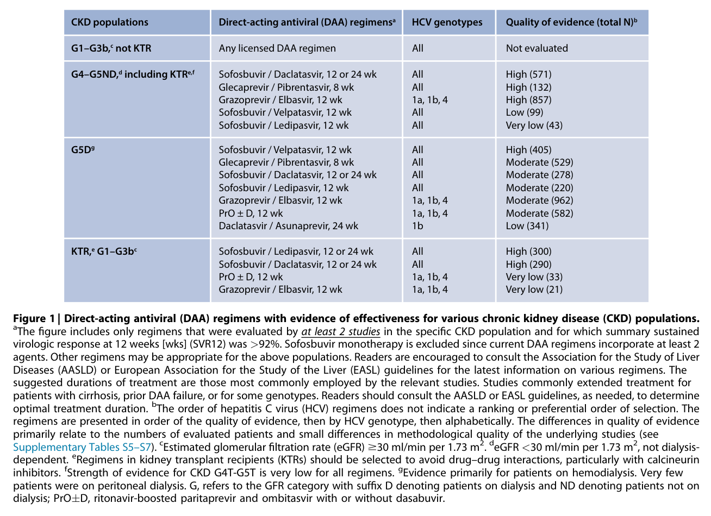

Figure 1 Direct-acting antiviral (DAA) regimens with evidence of effectiveness for various chronic kidney disease (CKD) populations

---

### Fig_2

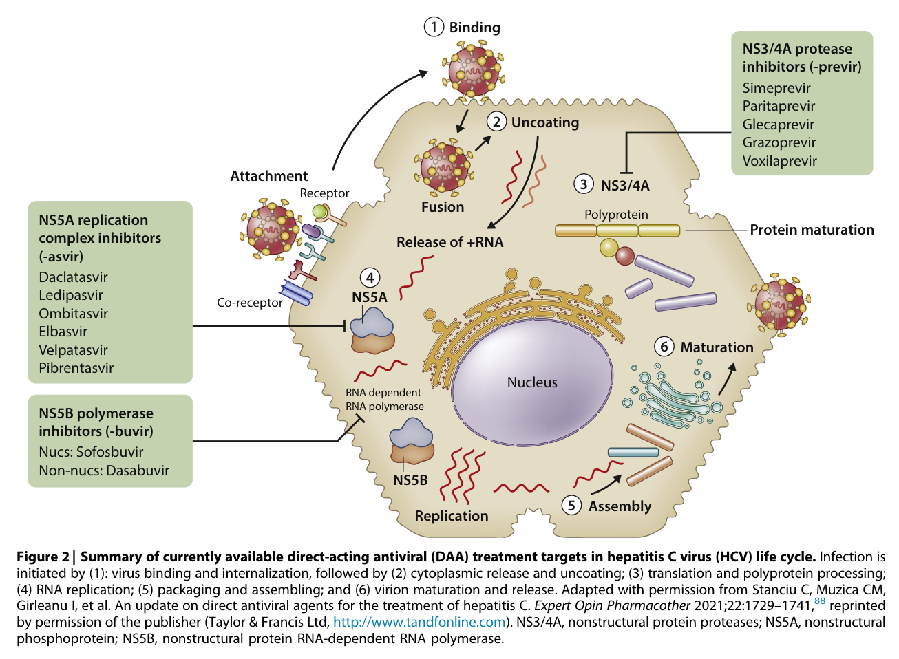

Figure 2 Summary of currently available direct-acting antiviral (DAA) treatment targets in hepatitis C virus (HCV) life cycle

---

### Fig_3

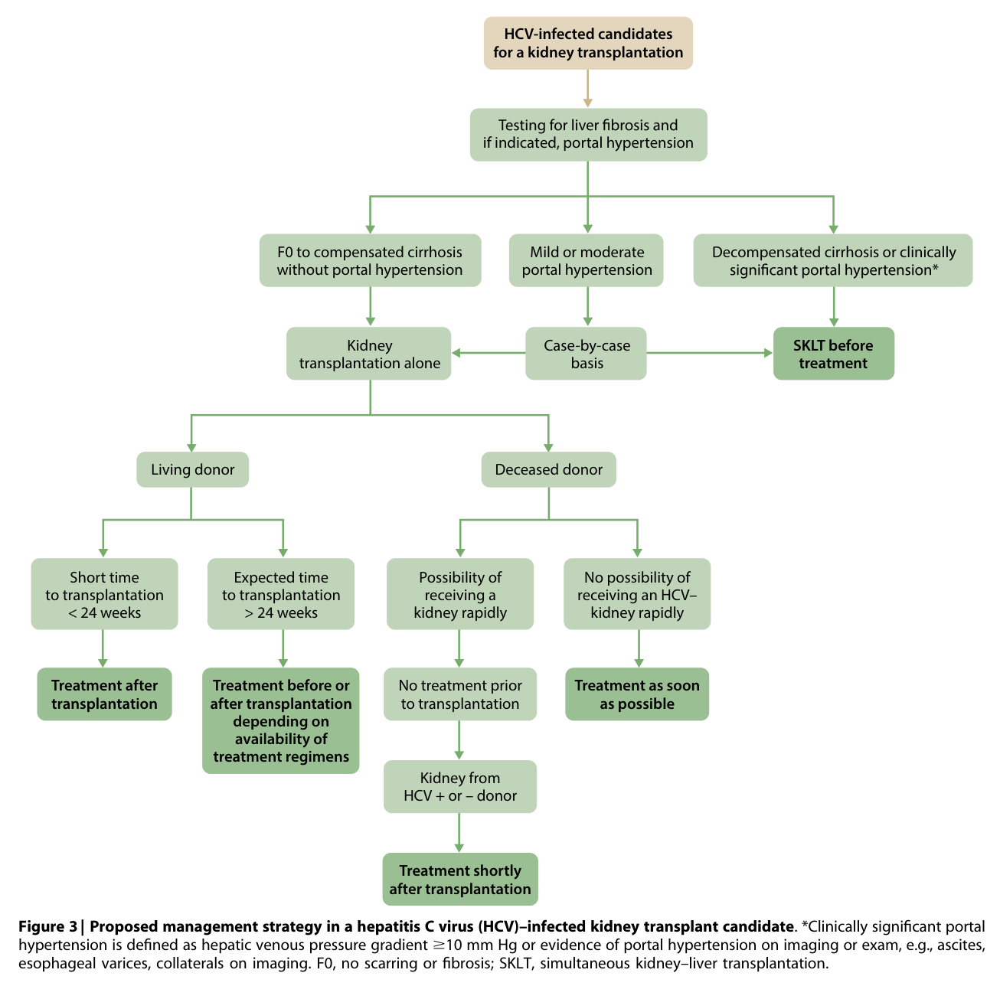

Figure 3 Proposed management strategy in a hepatitis C virus (HCV)–infected kidney transplant candidate

---

### Fig_4

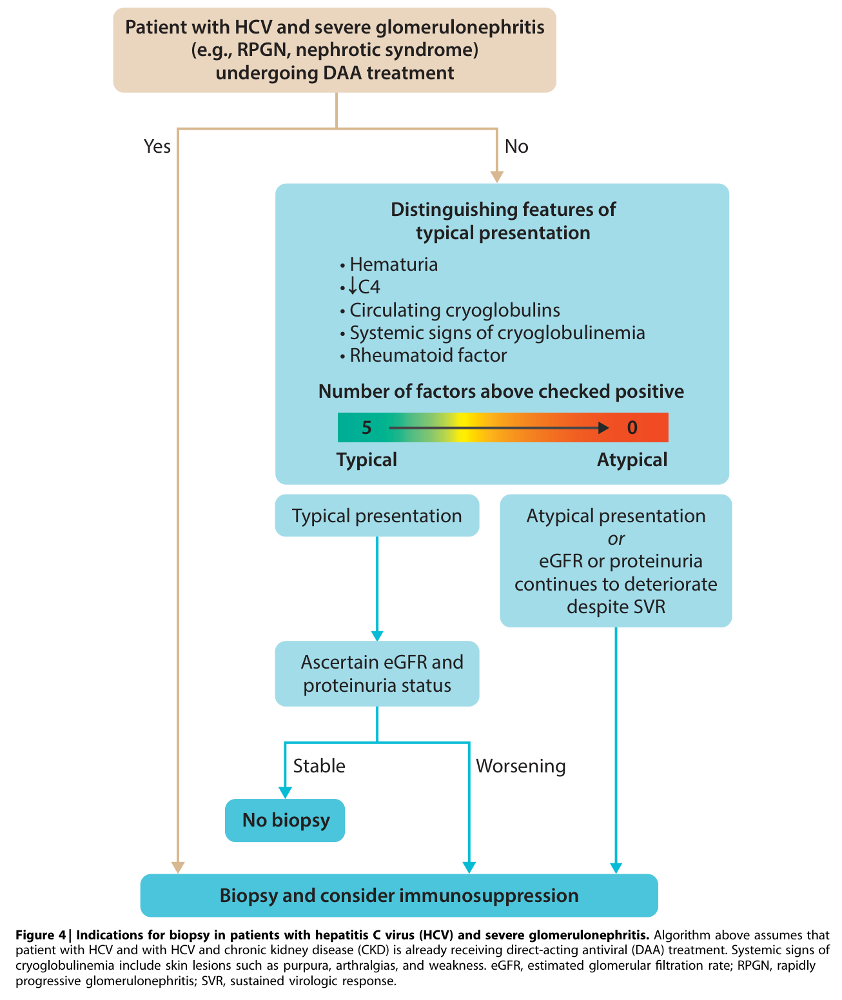

Figure 4 Indications for biopsy in patients with hepatitis C virus (HCV) and severe glomerulonephritis

---

### Fig_5

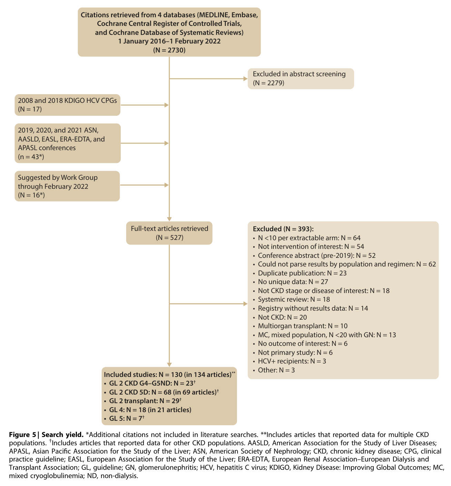

Figure 5 Search yield

---

## Tables

### Table_1

#### Table Image

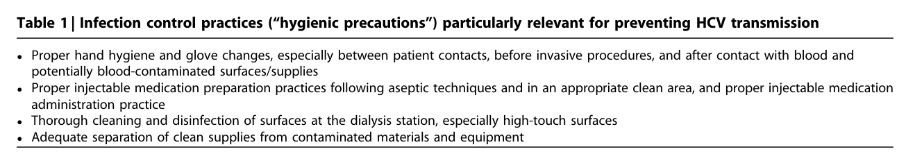

#### Table Data (CSV: [Table_1.csv](Table_1.csv))

```markdown
| Table Text (OCR) |
| :--- |
| Table 1 \| Infection control practices (“hygienic precautions”) particularly relevant for preventing HCV transmission |
| Proper hand hygiene and glove changes, especially between patient contacts, before invasive procedures, and after contact with blood and potentially blood-contaminated surfaces/supplies |
| Proper injectable medication preparation practices following aseptic techniques and in an appropriate clean area, and proper injectable medication administration practice |
| Thorough cleaning and disinfection of surfaces at the dialysis station, especially high-touch surfaces |
| Adequate separation of clean supplies from contaminated materials and equipment |
```

Table 1 Infection control practices (“hygienic precautions”) particularly relevant for preventing HCV transmission

---

### Table_2

#### Table Image

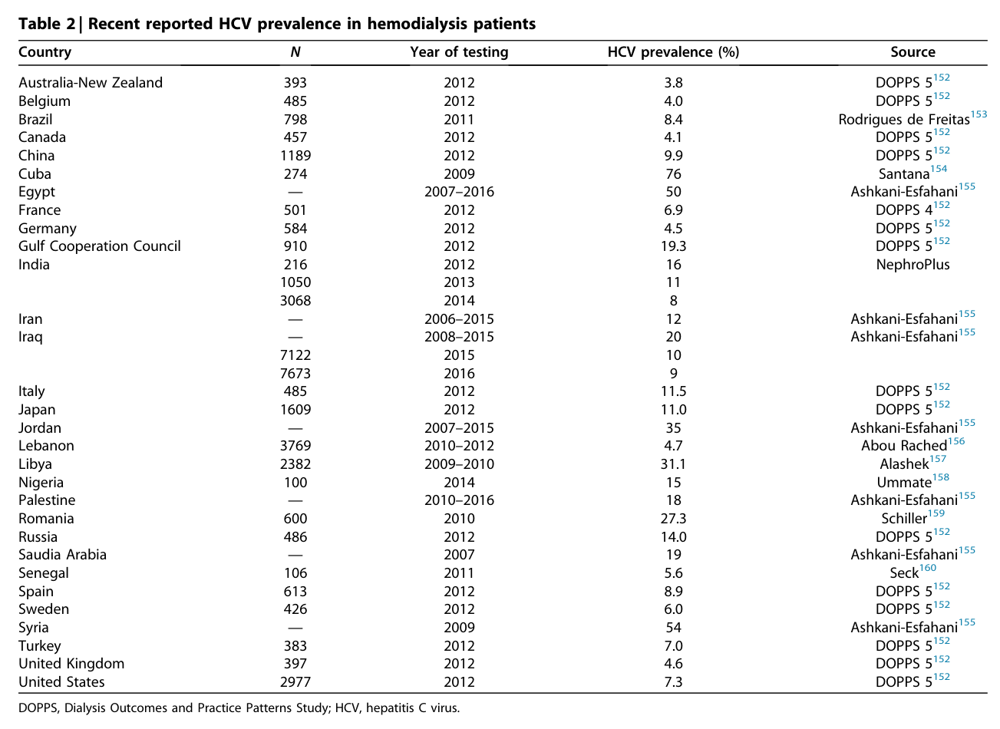

#### Table Data (CSV: [Table_2.csv](Table_2.csv))

```markdown
| Table Text (OCR) |
| :--- |
| Table 2 \| Recent reported HCV prevalence in hemodialysis patients Country  N  Year of testing  HCV prevalence (%)  Source    Australia-New Zealand  393  2012  3.8  DOPPS 5152    Belgium  485  2012  4.0  DOPPS 5152    Brazil  798  2011  8.4  Rodrigues de Freitas153    Canada  457  2012  4.1  DOPPS 51 152    China  1189  2012  9.9  DOPPS 5152    Cuba  274  2009  76  Santana 154    Egypt    2007-2016  50  Ashkani-Esfahani155    France  501  2012  6.9  DOPPS 4152    Germany  584  2012  4.5  DOPPS 5152    Gulf Cooperation Council  910  2012  19.3  DOPPS 5152    India  216  2012  16  NephroPlus      1050  2013  11        3068  2014  8      Iran    2006-2015  12  Ashkani-Esfahani155    Iraq    2008-2015  20  Ashkani-Esfahani155      7122  2015  10        7673  2016  9      Italy  485  2012  11.5  DOPPS 5152    Japan  1609  2012  11.0  DOPPS 5152    Jordan    2007-2015  35  Ashkani-Esfahani155    Lebanon  3769  2010-2012  4.7  Abou Rached156    Libya  2382  2009-2010  31.1  Alashek157    Nigeria  100  2014  15  Ummate158    Palestine    2010-2016  18  Ashkani-Esfahani155    Romania  600  2010  27.3  Schiller159    Russia  486  2012  14.0  DOPPS 5152    Saudia Arabia    2007  19  Ashkani-Esfahani155    Senegal  106  2011  5.6  Seck160    Spain  613  2012  8.9  DOPPS 5152    Sweden  426  2012  6.0  DOPPS 5152    Syria    2009  54  Ashkani-Esfahani155    Turkey  383  2012  7.0  DOPPS 5152    United Kingdom  397  2012  4.6  DOPPS 5152    United States  2977  2012  7.3  DOPPS 5152 DOPPS, Dialysis Outcomes and Practice Patterns Study; HCV, hepatitis C virus |
```

Table 2 Recent reported HCV prevalence in hemodialysis patients

---

### Table_3

#### Table Image

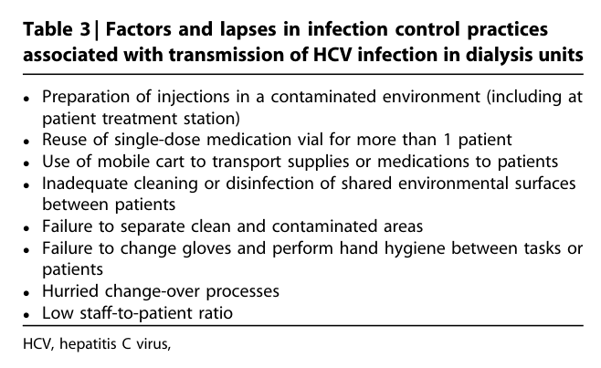

#### Table Data (CSV: [Table_3.csv](Table_3.csv))

```markdown
| Table Text (OCR) |
| :--- |
| Table 3 \| Factors and lapses in infection control practices associated with transmission of HCV infection in dialysis units Preparation of injections in a contaminated environment (including at patient treatment station) Reuse of single-dose medication vial for more than 1 patient Use of mobile cart to transport supplies or medications to patients Inadequate cleaning or disinfection of shared environmental surfaces between patients Failure to separate clean and contaminated areas Failure to change gloves and perform hand hygiene between tasks or patients <sub></sub> Hurried change-over processes Low staff-to-patient ratio HCV, hepatitis C virus, |
```

Table 3 Factors and lapses in infection control practices associated with transmission of HCV infection in dialysis units

---

### Table_4

#### Table Image

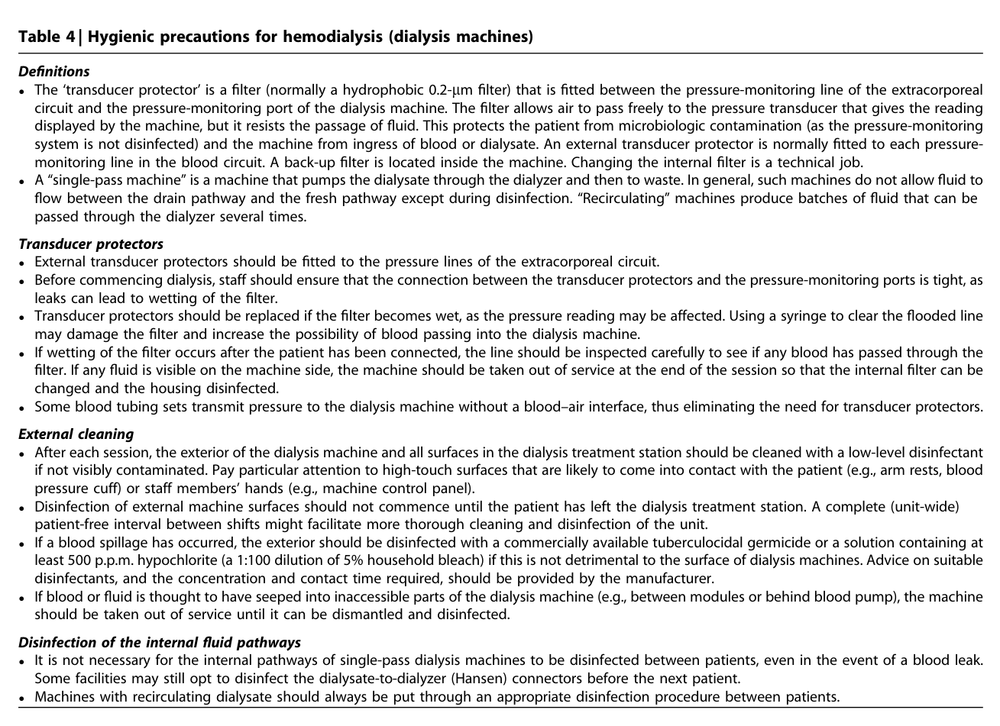

#### Table Data (CSV: [Table_4.csv](Table_4.csv))

```markdown
| Table Text (OCR) |
| :--- |
| Table 4 \| Hygienic precautions for hemodialysis (dialysis machines) |
| De<sup>fi</sup>nitions |
| The ‘transducer protector’ is a <sup>fi</sup>lter (normally a hydrophobic 0.2-mm <sup>fi</sup>lter) that is <sup>fi</sup>tted between the pressure-monitoring line of the extracorporea circuit and the pressure-monitoring port of the dialysis machine. The <sup>fi</sup>lter allows air to pass freely to the pressure transducer that gives the reading displayed by the machine, but it resists the passage of <sup>fl</sup>uid. This protects the patient from microbiologic contamination (as the pressure-monitoring system is not disinfected) and the machine from ingress of blood or dialysate. An external transducer protector is normally <sup>fi</sup>tted to each pressuremonitoring line in the blood circuit. A back-up <sup>fi</sup>lter is located inside the machine. Changing the internal <sup>fi</sup>lter is a technical job. |
| A “single-pass machine” is a machine that pumps the dialysate through the dialyzer and then to waste. In general, such machines do not allow <sup>fl</sup>uid to <sup>fl</sup>ow between the drain pathway and the fresh pathway except during disinfection. “Recirculating” machines produce batches of <sup>fl</sup>uid that can be passed through the dialyzer several times. |
| Transducer protectors |
| External transducer protectors should be <sup>fi</sup>tted to the pressure lines of the extracorporeal circuit. |
| Before commencing dialysis, staff should ensure that the connection between the transducer protectors and the pressure-monitoring ports is tight, as leaks can lead to wetting of the <sup>fi</sup>lter. |
| Transducer protectors should be replaced if the <sup>fi</sup>lter becomes wet, as the pressure reading may be affected. Using a syringe to clear the <sup>fl</sup>ooded line may damage the <sup>fi</sup>lter and increase the possibility of blood passing into the dialysis machine. |
| If wetting of the <sup>fi</sup>lter occurs after the patient has been connected, the line should be inspected carefully to see if any blood has passed through the <sup>fi</sup>lter. If any <sup>fl</sup>uid is visible on the machine side, the machine should be taken out of service at the end of the session so that the internal <sup>fi</sup>lter can be changed and the housing disinfected. |
| Some blood tubing sets transmit pressure to the dialysis machine without a blood–air interface, thus eliminating the need for transducer protectors. |
| External cleaning |
| After each session, the exterior of the dialysis machine and all surfaces in the dialysis treatment station should be cleaned with a low-level disinfectant if not visibly contaminated. Pay particular attention to high-touch surfaces that are likely to come into contact with the patient (e.g., arm rests, blood pressure cuff) or staff members’ hands (e.g., machine control panel). |
| Disinfection of external machine surfaces should not commence until the patient has left the dialysis treatment station. A complete (unit-wide) patient-free interval between shifts might facilitate more thorough cleaning and disinfection of the unit. |
| If a blood spillage has occurred, the exterior should be disinfected with a commercially available tuberculocidal germicide or a solution containing at least 500 p.p.m. hypochlorite (a 1:100 dilution of 5% household bleach) if this is not detrimental to the surface of dialysis machines. Advice on suitable disinfectants, and the concentration and contact time required, should be provided by the manufacturer. |
| If blood or <sup>fl</sup>uid is thought to have seeped into inaccessible parts of the dialysis machine (e.g., between modules or behind blood pump), the machine should be taken out of service until it can be dismantled and disinfected. |
| Disinfection of the internal <sup>fl</sup>uid pathways |
| It is not necessary for the internal pathways of single-pass dialysis machines to be disinfected between patients, even in the event of a blood leak. Some facilities may still opt to disinfect the dialysate-to-dialyzer (Hansen) connectors before the next patient. |
| <sub></sub> Machines with recirculating dialysate should always be put through an appropriate disinfection procedure between patients. |
```

Table 4 Hygienic precautions for hemodialysis (dialysis machines)

---

### Table_5

#### Table Image

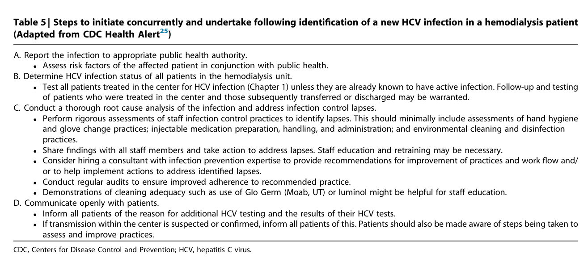

#### Table Data (CSV: [Table_5.csv](Table_5.csv))

```markdown
| Table Text (OCR) |
| :--- |
| Table 5 \| Steps to initiate concurrently and undertake following identi<sup>fi</sup>cation of a new HCV infection in a hemodialysis patient (Adapted from CDC Health Alert<sup>25</sup>) |
| images/a74f4fe4baa73e40029e6fab583feabbba513ec77315fd5cf91d2fc21ba9da69.jpg <table><tr><td>A. Report the infection to appropriate public health authority.</td></tr><tr><td>• Assess risk factors of the affected patient in conjunction with public health.</td></tr><tr><td>B. Determine HCV infection status of all patients in the hemodialysis unit.</td></tr><tr><td>• Test all patients treated in the center for HCV infection (Chapter 1) unless they are already known to have active infection. Follow-up and testing</td></tr><tr><td>of patients who were treated in the center and those subsequently transferred or discharged may be warranted.</td></tr><tr><td>C. Conduct a thorough root cause analysis of the infection and address infection control lapses.</td></tr><tr><td>• Perform rigorous assessments of staff infection control practices to identify lapses. This should minimally include assessments of hand hygiene and glove change practices; injectable medication preparation, handling, and administration; and environmental cleaning and disinfection</td></tr><tr><td>practices.</td></tr><tr><td>• Share findings with all staff members and take action to address lapses. Staff education and retraining may be necessary. • Consider hiring a consultant with infection prevention expertise to provide recommendations for improvement of practices and work flow and/</td></tr><tr><td></td></tr><tr><td>or to help implement actions to address identified lapses. • Conduct regular audits to ensure improved adherence to recommended practice.</td></tr><tr><td>• Demonstrations of cleaning adequacy such as use of Glo Germ (Moab, UT) or luminol might be helpful for staff education.</td></tr><tr><td>D. Communicate openly with patients.</td></tr><tr><td></td></tr><tr><td>• Inform all patients of the reason for additional HCV testing and the results of their HCV tests. • If transmission within the center is suspected or confirmed, inform all patients of this. Patients should also be made aware of steps being taken to</td></tr></table> simple_table |
| CDC, Centers for Disease Control and Prevention; HCV, hepatitis C virus. |
```

Table 5 Steps to initiate concurrently and undertake following identification of a new HCV infection in a hemodialysis patient

---

### Table_6

#### Table Image

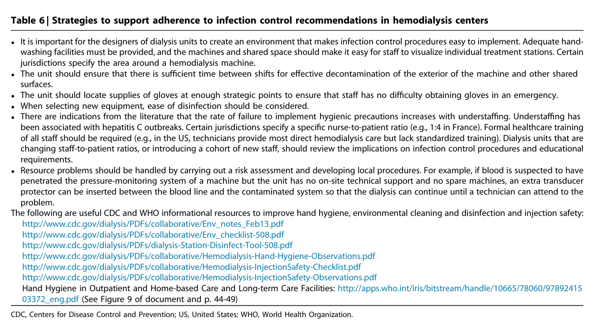

#### Table Data (CSV: [Table_6.csv](Table_6.csv))

```markdown
| Table Text (OCR) |
| :--- |
| Table 6 \| Strategies to support adherence to infection control recommendations in hemodialysis centers |
| It is important for the designers of dialysis units to create an environment that makes infection control procedures easy to implement. Adequate hand washing facilities must be provided, and the machines and shared space should make it easy for staff to visualize individual treatment stations. Certain jurisdictions specify the area around a hemodialysis machine. |
| The unit should ensure that there is suf<sup>fi</sup>cient time between shifts for effective decontamination of the exterior of the machine and other shared surfaces. |
| <sub></sub> The unit should locate supplies of gloves at enough strategic points to ensure that staff has no dif<sup>fi</sup>culty obtaining gloves in an emergency. |
| When selecting new equipment, ease of disinfection should be considered. |
| There are indications from the literature that the rate of failure to implement hygienic precautions increases with understaf<sup>fi</sup>ng. Understaf<sup>fi</sup>ng has been associated with hepatitis C outbreaks. Certain jurisdictions specify a speci<sup>fi</sup>c nurse-to-patient ratio (e.g., 1:4 in France). Formal healthcare training of all staff should be required (e.g., in the US, technicians provide most direct hemodialysis care but lack standardized training). Dialysis units that are changing staff-to-patient ratios, or introducing a cohort of new staff, should review the implications on infection control procedures and educational requirements. |
| Resource problems should be handled by carrying out a risk assessment and developing local procedures. For example, if blood is suspected to have penetrated the pressure-monitoring system of a machine but the unit has no on-site technical support and no spare machines, an extra transducer protector can be inserted between the blood line and the contaminated system so that the dialysis can continue until a technician can attend to the problem. |
| The following are useful CDC and WHO informational resources to improve hand hygiene, environmental cleaning and disinfection and injection safety: http://www.cdc.gov/dialysis/PDFs/collaborative/Env_notes_Feb13.pdf http://www.cdc.gov/dialysis/PDFs/collaborative/Env_checklist-508.pdf http://www.cdc.gov/dialysis/PDFs/dialysis-Station-Disinfect-Tool-508.pdf http://www.cdc.gov/dialysis/PDFs/collaborative/Hemodialysis-Hand-Hygiene-Observations.pdf http://www.cdc.gov/dialysis/PDFs/collaborative/Hemodialysis-InjectionSafety-Checklist.pdf http://www.cdc.gov/dialysis/PDFs/collaborative/Hemodialysis-InjectionSafety-Observations.pd Hand Hygiene in Outpatient and Home-based Care and Long-term Care Facilities: http://apps.who.int/iris/bitstream/handle/10665/78060/97892415 03372_eng.pdf (See Figure 9 of document and p. 44-49) |
| CDC, Centers for Disease Control and Prevention; US, United States; WHO, World Health Organization. |
```

Table 6 Strategies to support adherence to infection control recommendations in hemodialysis centers

---

### Table_7

#### Table Image

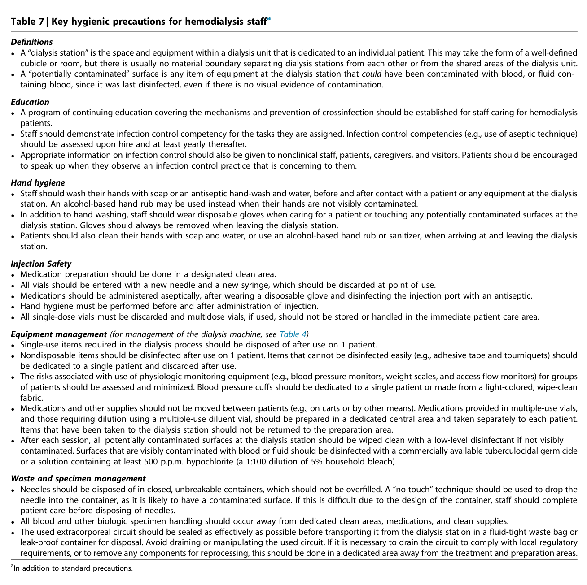

#### Table Data (CSV: [Table_7.csv](Table_7.csv))

```markdown
| Table Text (OCR) |
| :--- |
| Table 7 \| Key hygienic precautions for hemodialysis staff<sup>a</sup> |
| De<sup>fi</sup>nitions |
| A “dialysis station” is the space and equipment within a dialysis unit that is dedicated to an individual patient. This may take the form of a well-de<sup>fi</sup>ned cubicle or room, but there is usually no material boundary separating dialysis stations from each other or from the shared areas of the dialysis unit. |
| A “potentially contaminated” surface is any item of equipment at the dialysis station that could have been contaminated with blood, or <sup>fl</sup>uid con taining blood, since it was last disinfected, even if there is no visual evidence of contamination. |
| Education |
| A program of continuing education covering the mechanisms and prevention of crossinfection should be established for staff caring for hemodialysis patients. |
| Staff should demonstrate infection control competency for the tasks they are assigned. Infection control competencies (e.g., use of aseptic technique) should be assessed upon hire and at least yearly thereafter. |
| Appropriate information on infection control should also be given to nonclinical staff, patients, caregivers, and visitors. Patients should be encouraged to speak up when they observe an infection control practice that is concerning to them. |
| Hand hygiene |
| Staff should wash their hands with soap or an antiseptic hand-wash and water, before and after contact with a patient or any equipment at the dialysis station. An alcohol-based hand rub may be used instead when their hands are not visibly contaminated. |
| In addition to hand washing, staff should wear disposable gloves when caring for a patient or touching any potentially contaminated surfaces at the dialysis station. Gloves should always be removed when leaving the dialysis station. |
| Patients should also clean their hands with soap and water, or use an alcohol-based hand rub or sanitizer, when arriving at and leaving the dialysis station. |
| Injection Safety |
| Medication preparation should be done in a designated clean area. |
| All vials should be entered with a new needle and a new syringe, which should be discarded at point of use. |
| <sub></sub> Medications should be administered aseptically, after wearing a disposable glove and disinfecting the injection port with an antiseptic. |
| Hand hygiene must be performed before and after administration of injection. |
| All single-dose vials must be discarded and multidose vials, if used, should not be stored or handled in the immediate patient care area. |
| Equipment management (for management of the dialysis machine, see Table 4) |
| Single-use items required in the dialysis process should be disposed of after use on 1 patient. |
| Nondisposable items should be disinfected after use on 1 patient. Items that cannot be disinfected easily (e.g., adhesive tape and tourniquets) should be dedicated to a single patient and discarded after use. |
| The risks associated with use of physiologic monitoring equipment (e.g., blood pressure monitors, weight scales, and access <sup>fl</sup>ow monitors) for groups of patients should be assessed and minimized. Blood pressure cuffs should be dedicated to a single patient or made from a light-colored, wipe-clean fabric. |
| Medications and other supplies should not be moved between patients (e.g., on carts or by other means). Medications provided in multiple-use vials, and those requiring dilution using a multiple-use diluent vial, should be prepared in a dedicated central area and taken separately to each patient. Items that have been taken to the dialysis station should not be returned to the preparation area. |
| After each session, all potentially contaminated surfaces at the dialysis station should be wiped clean with a low-level disinfectant if not visibly contaminated. Surfaces that are visibly contaminated with blood or <sup>fl</sup>uid should be disinfected with a commercially available tuberculocidal germicide or a solution containing at least 500 p.p.m. hypochlorite (a 1:100 dilution of 5% household bleach). |
| Waste and specimen management |
| Needles should be disposed of in closed, unbreakable containers, which should not be over<sup>fi</sup>lled. A “no-touch” technique should be used to drop the needle into the container, as it is likely to have a contaminated surface. If this is dif<sup>fi</sup>cult due to the design of the container, staff should complete patient care before disposing of needles. |
| <sub></sub> All blood and other biologic specimen handling should occur away from dedicated clean areas, medications, and clean supplies. |
| The used extracorporeal circuit should be sealed as effectively as possible before transporting it from the dialysis station in a <sup>fl</sup>uid-tight waste bag or leak-proof container for disposal. Avoid draining or manipulating the used circuit. If it is necessary to drain the circuit to comply with local regulatory requirements, or to remove any components for reprocessing, this should be done in a dedicated area away from the treatment and preparation areas. |
| <sup>a</sup>In addition to standard precautions. |
```

Table 7 Key hygienic precautions for hemodialysis staff

---

### Table_8

#### Table Image

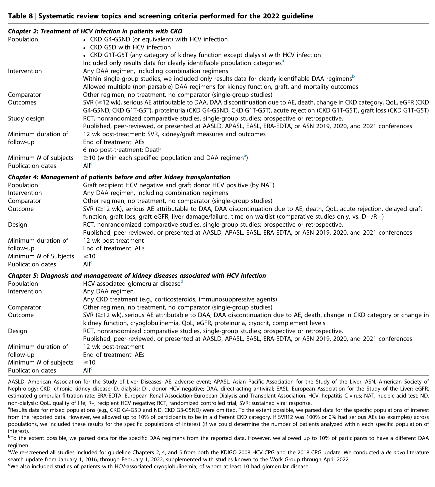

#### Table Data (CSV: [Table_8.csv](Table_8.csv))

```markdown
| Table Text (OCR) |
| :--- |
| Table 8 \| Systematic review topics and screening criteria performed for the 2022 guideline |
| images/11cf69a4a4d1ca563ba0f9e122dec5680d3c8c4c2910387605933ef0bbbe446b.jpg AASLD, American Association for the Study of Liver Diseases; AE, adverse event; APASL, Asian Paci<sup>fi</sup>c Association for the Study of the Liver; ASN, American Society of Nephrology; CKD, chronic kidney disease; D, dialysis; D–, donor HCV negative; DAA, direct-acting antiviral; EASL, European Association for the Study of the Liver; eGFR, estimated glomerular <sup>fi</sup>ltration rate; ERA-EDTA, European Renal Association-European Dialysis and Transplant Association; HCV, hepatitis C virus; NAT, nucleic acid test; ND, non-dialysis; QoL, quality of life; R–, recipient HCV negative; RCT, randomized controlled trial; SVR: sustained viral response. <sup>a</sup>Results data for mixed populations (e.g., CKD G4-G5D and ND, CKD G3-G5ND) were omitted. To the extent possible, we parsed data for the speci<sup>fi</sup>c populations of interest from the reported data. However, we allowed up to 10% of participants to be in a different CKD category. If SVR12 was 100% or 0% had serious AEs (as examples) across populations, we included these results for the speci<sup>fi</sup>c populations of interest (if we could determine the number of patients analyzed within each speci<sup>fi</sup>c population of interest). <sup>b</sup>To the extent possible, we parsed data for the speci<sup>fi</sup>c DAA regimens from the reported data. However, we allowed up to 10% of participants to have a different DAA regimen. <sup>c</sup>We re-screened all studies included for guideline Chapters 2, 4, and 5 from both the KDIGO 2008 HCV CPG and the 2018 CPG update. We conducted a de novo literature search update from January 1, 2016, through February 1, 2022, supplemented with studies known to the Work Group through April 2022. <sup>d</sup>We also included studies of patients with HCV-associated cryoglobulinemia, of whom at least 10 had glomerular disease. <table><tr><td colspan="2">Chapter 2: Treatment of HCV infection in patients with CKD</td></tr><tr><td rowspan="5">Population</td><td>• CKD G4-G5ND (or equivalent) with HCV infection</td></tr><tr><td>• CKD G5D with HCV infection</td></tr><tr><td>• CKD G1T-G5T (any category of kidney function except dialysis) with HCV infection</td></tr><tr><td>Included only results data for clearly identifiable population categories²</td></tr><tr><td>Any DAA regimen, including combination regimens</td></tr><tr><td rowspan="3">Intervention</td><td></td></tr><tr><td>Within single-group studies, we included only results data for clearly identifiable DAA regimensb</td></tr><tr><td>Allowed multiple (non-parsable) DAA regimens for kidney function, graft, and mortality outcomes Other regimen, no treatment, no comparator (single-group studies)</td></tr><tr><td>Comparator Outcomes</td><td>SVR (≥12 wk), serious AE attributable to DAA, DAA discontinuation due to AE, death, change in CKD category, QoL, eGFR (CKD</td></tr><tr><td></td><td>G4-G5ND, CKD G1T-G5T), proteinuria (CKD G4-G5ND, CKD G1T-G5T), acute rejection (CKD G1T-G5T), graft loss (CKD G1T-G5T)</td></tr><tr><td>Study design</td><td>RCT, nonrandomized comparative studies, single-group studies; prospective or retrospective. Published, peer-reviewed, or presented at AASLD, APASL, EASL, ERA-EDTA, or ASN 2019, 2020, and 2021 conferences</td></tr><tr><td>Minimum duration of</td><td>12 wk post-treatment: SVR, kidney/graft measures and outcomes</td></tr><tr><td>follow-up</td><td>End of treatment: AEs</td></tr><tr><td>Minimum N of subjects</td><td>6 mo post-treatment: Death ≥10 (within each specified population and DAA regimenª)</td></tr><tr><td>Publication dates</td><td>Allc</td></tr><tr><td colspan="2">Chapter 4: Management of patients before and after kidney transplantation</td></tr><tr><td>Population</td><td>Graft recipient HCV negative and graft donor HCV positive (by NAT)</td></tr><tr><td>Intervention</td><td>Any DAA regimen, including combination regimens</td></tr><tr><td>Comparator</td><td>Other regimen, no treatment, no comparator (single-group studies)</td></tr><tr><td>Outcome</td><td>SVR (≥12 wk), serious AE attributable to DAA, DAA discontinuation due to AE, death, QoL, acute rejection, delayed graft function, graft loss, graft eGFR, liver damage/failure, time on waitlist (comparative studies only, vs. D—/R—)</td></tr><tr><td>Design</td><td>RCT, nonrandomized comparative studies, single-group studies; prospective or retrospective.</td></tr><tr><td>Minimum duration of</td><td>Published, peer-reviewed, or presented at AASLD, APASL, EASL, ERA-EDTA, or ASN 2019, 2020, and 2021 conferences 12 wk post-treatment</td></tr><tr><td>follow-up</td><td>End of treatment: AEs</td></tr><tr><td>Minimum N of Subjects</td><td>≥10</td></tr><tr><td>Publication dates</td><td>Allc</td></tr><tr><td></td><td>Chapter 5: Diagnosis and management of kidney diseases associated with HCV infection</td></tr><tr><td colspan="2">Population HCV-associated glomerular diseased</td></tr><tr><td>Intervention</td><td>Any DAA regimen</td></tr><tr><td></td><td>Any CKD treatment (e.g., corticosteroids, immunosuppressive agents)</td></tr><tr><td>Comparator</td><td>Other regimen, no treatment, no comparator (single-group studies)</td></tr><tr><td>Outcome</td><td>SVR (≥12 wk), serious AE attributable to DAA, DAA discontinuation due to AE, death, change in CKD category or change in kidney function, cryoglobulinemia, QoL, eGFR, proteinuria, cryocrit, complement levels</td></tr><tr><td>Design</td><td>RCT, nonrandomized comparative studies, single-group studies; prospective or retrospective.</td></tr><tr><td>Minimum duration of</td><td>Published, peer-reviewed, or presented at AASLD, APASL, EASL, ERA-EDTA, or ASN 2019, 2020, and 2021 conferences</td></tr><tr><td>follow-up</td><td>12 wk post-treatment</td></tr><tr><td></td><td>End of treatment: AEs</td></tr><tr><td>Minimum N of subjects</td><td>≥10</td></tr><tr><td>Publication dates</td><td>Allc</td></tr></table> complex_table |
```

Table 8 Systematic review topics and screening criteria performed for the 2022 guideline

---

### Table_9

#### Table Image

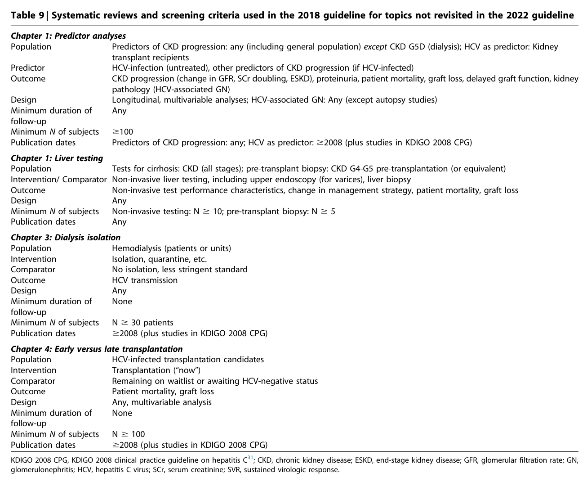

#### Table Data (CSV: [Table_9.csv](Table_9.csv))

```markdown
| Table Text (OCR) |
| :--- |
| Table 9 \| Systematic reviews and screening criteria used in the 2018 guideline for topics not revisited in the 2022 guideline Chapter 1: Predictor analyses    Population  Predictors of CKD progression: any (including general population) except CKD G5D (dialysis); HCV as predictor: Kidney transplant recipients    Predictor Outcome  HCV-infection (untreated), other predictors of CKD progression (if HCV-infected) CKD progression (change in GFR, SCr doubling, ESKD), proteinuria, patient mortality, graft loss, delayed graft function, kidney      pathology (HCV-associated GN)    Design Minimum duration of  Longitudinal, multivariable analyses; HCV-associated GN: Any (except autopsy studies)    follow-up  Any    Minimum N of subjects  ≥100    Publication dates  Predictors of CKD progression: any; HCV as predictor: ≥2008 (plus studies in KDIGO 2008 CPG)    Chapter 1: Liver testing      Population  Tests for cirrhosis: CKD (all stages); pre-transplant biopsy: CKD G4-G5 pre-transplantation (or equivalent)      Intervention/ Comparator Non-invasive liver testing, including upper endoscopy (for varices), liver biopsy    Outcome  Non-invasive test performance characteristics, change in management strategy, patient mortality, graft loss    Design  Any    Minimum N of subjects Publication dates  Non-invasive testing: N ≥ 10; pre-transplant biopsy: N ≥ 5    Chapter 3: Dialysis isolation  Any        Population  Hemodialysis (patients or units)    Intervention  Isolation, quarantine, etc.    Comparator  No isolation, less stringent standard    Outcome Design  HCV transmission    Minimum duration of  Any    follow-up  None    Minimum N of subjects  N ≥ 30 patients    Publication dates  ≥2008 (plus studies in KDIGO 2008 CPG)    Chapter 4: Early versus late transplantation      Population    Intervention  HCV-infected transplantation candidates Transplantation (“now")    Comparator  Remaining on waitlist or awaiting HCV-negative status    Outcome  Patient mortality, graft loss    Design  Any, multivariable analysis    Minimum duration of      follow-up  None    Minimum N of subjects  N≥ 100    Publication dates  ≥2008 (plus studies in KDIGO 2008 CPG) KDIGO 2008 CPG, KDIGO 2008 clinical practice guideline on hepatitis C<sup>31</sup>; CKD, chronic kidney disease; ESKD, end-stage kidney disease; GFR, glomerular <sup>fi</sup>ltration rate; GN, glomerulonephritis; HCV, hepatitis C virus; SCr, serum creatinine; SVR, sustained virologic response. |
```

Table 9 Systematic reviews and screening criteria used in the 2018 guideline for topics not revisited in the 2022 guideline

---

### Table_10

#### Table Image

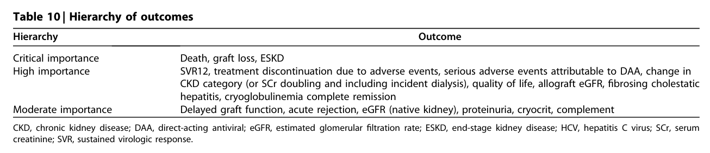

#### Table Data (CSV: [Table_10.csv](Table_10.csv))

```markdown
| Table Text (OCR) |
| :--- |
| Table 10 \| Hierarchy of outcomes Hierarchy  Outcome    Critical importance  Death, graft loss, ESKD    High importance  SVR12, treatment discontinuation due to adverse events, serious adverse events attributable to DAA, change in CKD category (or SCr doubling and including incident dialysis), quality of life, allograft eGFR, fibrosing cholestatic    Moderate importance  hepatitis, cryoglobulinemia complete remission Delayed graft function, acute rejection, eGFR (native kidney), proteinuria, cryocrit, complement CKD, chronic kidney disease; DAA, direct-acting antiviral; eGFR, estimated glomerular <sup>fi</sup>ltration rate; ESKD, end-stage kidney disease; HCV, hepatitis C virus; SCr, serum creatinine; SVR, sustained virologic response. |
```

Table 10 Hierarchy of outcomes

---

### Table_11

#### Table Image

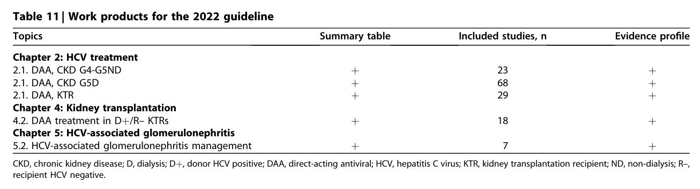

#### Table Data (CSV: [Table_11.csv](Table_11.csv))

```markdown
| Table Text (OCR) |
| :--- |
| Table 11 \| Work products for the 2022 guideline Topics  Summary table  Included studies, n  Evidence profile    Chapter 2: HCV treatment          2.1. DAA, CKD G4-G5ND  十  23  十    2.1. DAA, CKD G5D  十  68  十    2.1. DAA, KTR  十  29  十    Chapter 4: Kidney transplantation          4.2. DAA treatment in D+/R- KTRs  十  18  十    Chapter 5: HCV-associated glomerulonephritis          5.2. HCV-associated glomerulonephritis management  十  7  十 CKD, chronic kidney disease; D, dialysis; D , donor HCV positive; DAA, direct-acting antiviral; HCV, hepatitis C virus; KTR, kidney transplantation recipient; ND, non-dialysis; R–, recipient HCV negative. |
```

Table 11 Work products for the 2022 guideline

---

### Table_12

#### Table Image

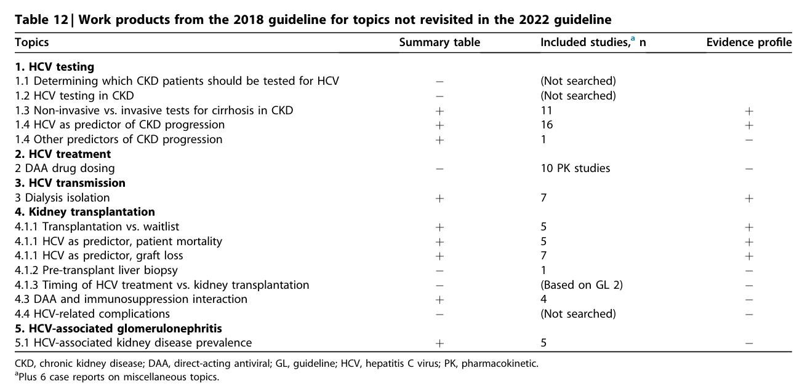

#### Table Data (CSV: [Table_12.csv](Table_12.csv))

```markdown
| Table Text (OCR) |
| :--- |
| Table 12 \| Work products from the 2018 guideline for topics not revisited in the 2022 guideline Topics  Summary table  Included studies,ª n  Evidence profile    1. HCV testing          1.1 Determining which CKD patients should be tested for HCV    (Not searched)      1.2 HCV testing in CKD    (Not searched)      1.3 Non-invasive ys. invasive tests for cirrhosis in CKD  十  11  十    1.4 HCV as predictor of CKD progression  十  16  十    1.4 Other predictors of CKD progression  十  1      2. HCV treatment          2 DAA drug dosing    10 PK studies      3. HCV transmission          3 Dialysis isolation  十  7  十    4. Kidney transplantation          4.1.1 Transplantation vs. waitlist  十  5  十    4.1.1 HCV as predictor, patient mortality  十  5  十    4.1.1 HCV as predictor, graft loss  十  7  十    4.1.2 Pre-transplant liver biopsy    1      4.1.3 Timing of HCV treatment vs. kidney transplantation    (Based on GL 2)      4.3 DAA and immunosuppression interaction  十  4      4.4 HCV-related complications    (Not searched)      5. HCV-associated glomerulonephritis          5.1 HCV-associated kidney disease prevalence  十  5 CKD, chronic kidney disease; DAA, direct-acting antiviral; GL, guideline; HCV, hepatitis C virus; PK, pharmacokinetic. <sup>a</sup>Plus 6 case reports on miscellaneous topics. |
```

Table 12 Work products from the 2018 guideline for topics not revisited in the 2022 guideline

---

### Table_13

#### Table Image

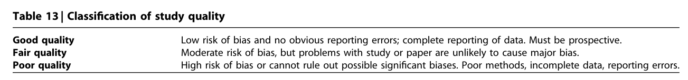

#### Table Data (CSV: [Table_13.csv](Table_13.csv))

```markdown
| Table Text (OCR) |
| :--- |
| Table 13 \| Classi<sup>fi</sup>cation of study quality Good quality  Low risk of bias and no obvious reporting errors; complete reporting of data. Must be prospective.    Fair quality  Moderate risk of bias, but problems with study or paper are unlikely to cause major bias.    Poor quality  High risk of bias or cannot rule out possible significant biases. Poor methods, incomplete data, reporting errors. |
```

Table 13 Classification of study quality

---

### Table_14

#### Table Image

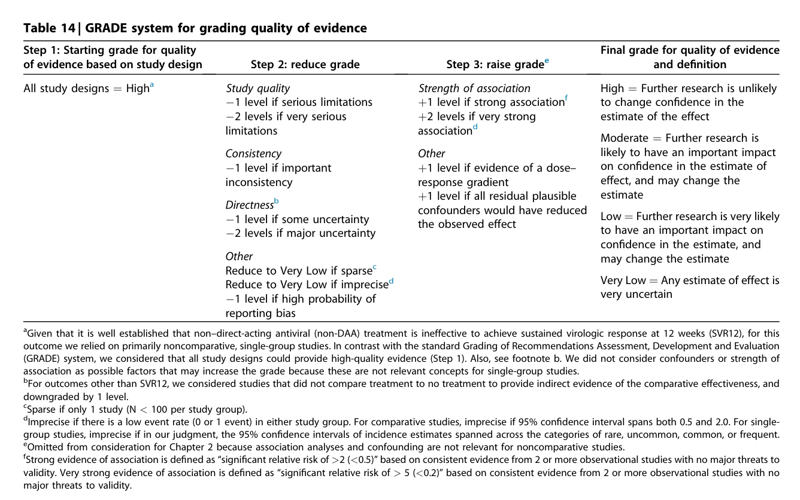

#### Table Data (CSV: [Table_14.csv](Table_14.csv))

```markdown
| Table Text (OCR) |
| :--- |
| Table 14 \| GRADE system for grading quality of evidence Step 1: Starting grade for quality of evidence based on study design All study designs = Highª  Step 2: reduce grade  Step 3: raise gradee  Final grade for quality of evidence and definition      Study quality —1 level if serious limitations —2 levels if very serious limitations  Strength of association +1 level if strong association +2 levels if very strong associationd Other  High = Further research is unlikely to change confidence in the estimate of the effect Moderate = Further research is    Consistency —1 level if important inconsistency  +1 level if evidence of a dose- response gradient  likely to have an important impact on confidence in the estimate of effect, and may change the    Directnessb —1 level if some uncertainty —2 levels if major uncertainty  +1 level if all residual plausible confounders would have reduced the observed effect  estimate Low = Further research is very likely to have an important impact on    Other Reduce to Very Low if sparse Reduce to Very Low if imprecised    confidence in the estimate, and may change the estimate Very Low = Any estimate of effect is    —1 level if high probability of reporting bias    very uncertain |
```

Table 14 GRADE system for grading quality of evidence

---

### Table_15

#### Table Image

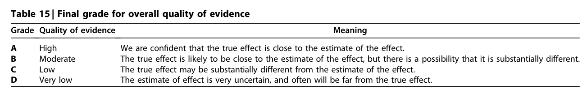

#### Table Data (CSV: [Table_15.csv](Table_15.csv))

```markdown
| Table Text (OCR) |
| :--- |
| Table 15 \| Final grade for overall quality of evidence Grade Quality of evidence  Meaning    A  High  We are confident that the true effect is close to the estimate of the effect.    B  Moderate  The true effect is likely to be close to the estimate of the effect, but there is a possibility that it is substantially different.    C  Low  The true effect may be substantially different from the estimate of the effect.    D  Very low  The estimate of effect is very uncertain, and often will be far from the true effect. |
```

Table 15 Final grade for overall quality of evidence

---

### Table_16

#### Table Image

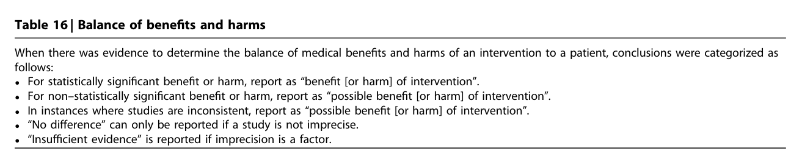

#### Table Data (CSV: [Table_16.csv](Table_16.csv))

```markdown
| Table Text (OCR) |
| :--- |
| Table 16 \| Balance of bene<sup>fi</sup>ts and harms |
| When there was evidence to determine the balance of medical bene<sup>fi</sup>ts and harms of an intervention to a patient, conclusions were categorized as follows: |
| For statistically signi<sup>fi</sup>cant bene<sup>fi</sup>t or harm, report as “bene<sup>fi</sup>t [or harm] of intervention”. |
| For non–statistically signi<sup>fi</sup>cant bene<sup>fi</sup>t or harm, report as “possible bene<sup>fi</sup>t [or harm] of intervention”. |
| In instances where studies are inconsistent, report as “possible bene<sup>fi</sup>t [or harm] of intervention”. |
| “No difference” can only be reported if a study is not imprecise. |
| “Insuf<sup>fi</sup>cient evidence” is reported if imprecision is a factor. |
```

Table 16 Balance of benefits and harms

---

### Table_17

#### Table Image

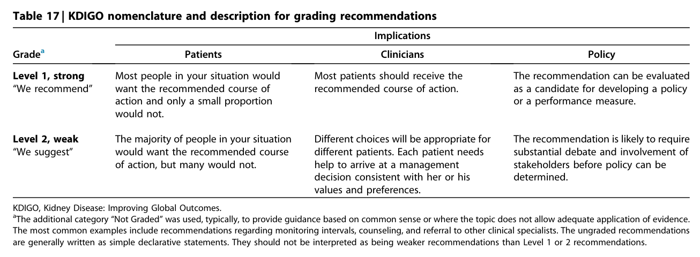

#### Table Data (CSV: [Table_17.csv](Table_17.csv))

```markdown
| Table Text (OCR) |
| :--- |
| Table 17 \| KDIGO nomenclature and description for grading recommendations Implications    Gradeª  Patients  Clinicians  Policy    Level 1, strong “We recommend"  Most people in your situation would want the recommended course of action and only a small proportion would not.  Most patients should receive the recommended course of action.  The recommendation can be evaluated as a candidate for developing a policy or a performance measure.    Level 2, weak “We suggest"  The majority of people in your situation would want the recommended course of action, but many would not.  Different choices will be appropriate for different patients. Each patient needs help to arrive at a management decision consistent with her or his values and preferences.  The recommendation is likely to require substantial debate and involvement of stakeholders before policy can be determined. KDIGO, Kidney Disease: Improving Global Outcomes. <sup>a</sup>The additional category “Not Graded” was used, typically, to provide guidance based on common sense or where the topic does not allow adequate application of evidence. The most common examples include recommendations regarding monitoring intervals, counseling, and referral to other clinical specialists. The ungraded recommendations are generally written as simple declarative statements. They should not be interpreted as being weaker recommendations than Level 1 or 2 recommendations. |
```

Table 17 KDIGO nomenclature and description for grading recommendations

---

### Table_18

#### Table Image

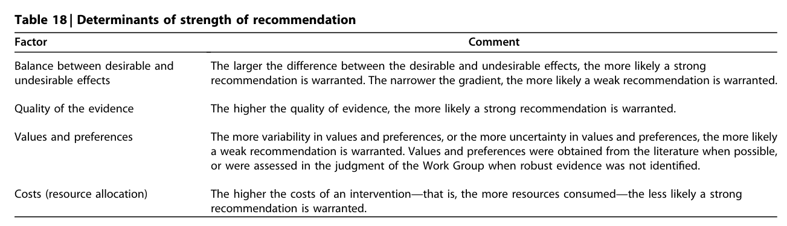

#### Table Data (CSV: [Table_18.csv](Table_18.csv))

```markdown
| Table Text (OCR) |
| :--- |
| Table 18 \| Determinants of strength of recommendation Factor  Comment    Balance between desirable and undesirable effects  The larger the difference between the desirable and undesirable effects, the more likely a strong recommendation is warranted. The narrower the gradient, the more likely a weak recommendation is warranted.    Quality of the evidence  The higher the quality of evidence, the more likely a strong recommendation is warranted.    Values and preferences  The more variability in values and preferences, or the more uncertainty in values and preferences, the more likely a weak recommendation is warranted. Values and preferences were obtained from the literature when possible, or were assessed in the judgment of the Work Group when robust evidence was not identified.    Costs (resource allocation)  The higher the costs of an intervention—that is, the more resources consumed—the less likely a strong recommendation is warranted. |
```

Table 18 Determinants of strength of recommendation

---

### Table_19

#### Table Images (2 Parts)

- **Part 1 (Page 62)**:
  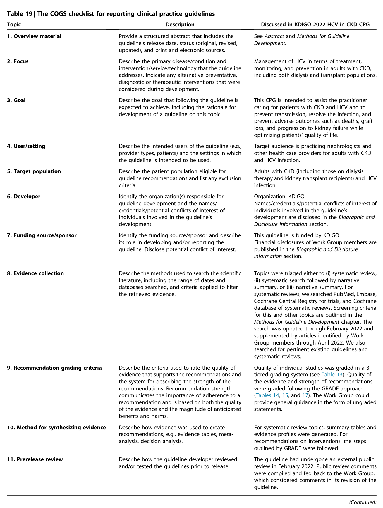

- **Part 2 (Page 63)**:
  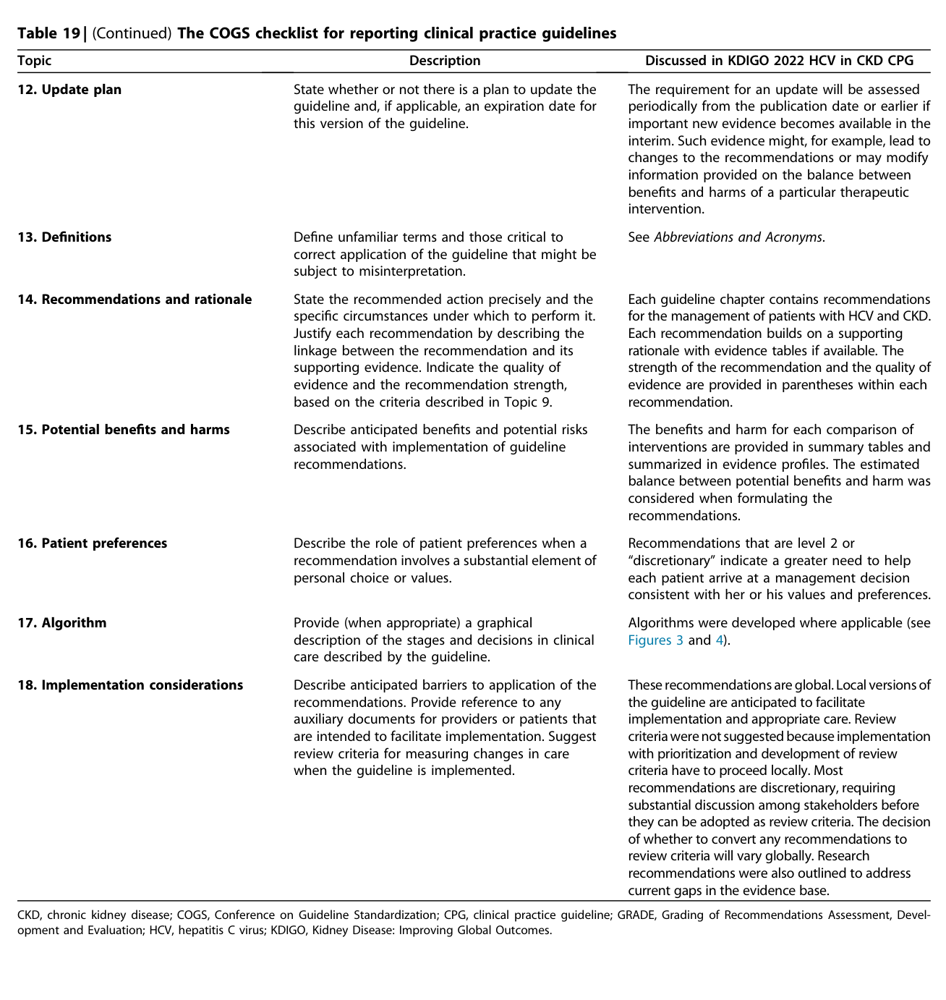

#### Table Data (CSV: [Table_19.csv](Table_19.csv))

```markdown
| Table Text (OCR) |
| :--- |
| images/4a97967381cd5cf636b5cf1cb7273d0bc3e36bbb3c0d4c8536c78d2583ac03ac.jpg Table 19 \| The COGS checklist for reporting clinical practice guidelines CKD, chronic kidney disease; COGS, Conference on Guideline Standardization; CPG, clinical practice guideline; GRADE, Grading of Recommendations Assessment, Devel opment and Evaluation; HCV, hepatitis C virus; KDIGO, Kidney Disease: Improving Global Outcomes. <table><tr><td>Topic</td><td>Description</td><td>Discussed in KDIGO 2022 HCV in CKD CPG</td></tr><tr><td>1. Overview material</td><td>Provide a structured abstract that includes the guideline's release date, status (original, revised, updated), and print and electronic sources.</td><td>See Abstract and Methods for Guideline Development.</td></tr><tr><td>2. Focus</td><td>Describe the primary disease/condition and intervention/service/technology that the quideline addresses. Indicate any alternative preventative, diagnostic or therapeutic interventions that were considered during development.</td><td>Management of HCV in terms of treatment, monitoring, and prevention in adults with CKD, including both dialysis and transplant populations.</td></tr><tr><td>3. Goal</td><td>Describe the goal that following the quideline is expected to achieve, including the rationale for development of a guideline on this topic.</td><td>This CPG is intended to assist the practitioner caring for patients with CKD and HCV and to prevent transmission, resolve the infection, and prevent adverse outcomes such as deaths, graft loss, and progression to kidney failure while optimizing patients' quality of life.</td></tr><tr><td>4. User/setting</td><td>Describe the intended users of the guideline (e.g., provider types, patients) and the settings in which the guideline is intended to be used.</td><td>Target audience is practicing nephrologists and other health care providers for adults with CKD and HCV infection.</td></tr><tr><td>5. Target population</td><td>Describe the patient population eligible for quideline recommendations and list any exclusion criteria.</td><td>Adults with CKD (including those on dialysis therapy and kidney transplant recipients) and HCV infection.</td></tr><tr><td>6. Developer</td><td>Identify the organization(s) responsible for guideline development and the names/ credentials/potential conflicts of interest of individuals involved in the quideline's development.</td><td>Organization: KDIGO Names/credentials/potential conflicts of interest of individuals involved in the guideline's development are disclosed in the Biographic and Disclosure Information section.</td></tr><tr><td>7. Funding source/sponsor</td><td>Identify the funding source/sponsor and describe its role in developing and/or reporting the quideline. Disclose potential conflict of interest.</td><td>This guideline is funded by KDIGO. Financial disclosures of Work Group members are published in the Biographic and Disclosure Information section.</td></tr><tr><td>8. Evidence collection</td><td>Describe the methods used to search the scientific literature, including the range of dates and databases searched, and criteria applied to filter the retrieved evidence</td><td>Topics were triaged either to (i) systematic review, (ii) systematic search followed by narrative summary, or (iii) narrative summary. For systematic reviews, we searched PubMed, Embase, Cochrane Central Registry for trials, and Cochrane database of systematic reviews. Screening criteria for this and other topics are outlined in the Methods for Guideline Development chapter. The search was updated through February 2022 and supplemented by articles identified by Work</td></tr><tr><td></td><td>Describe the criteria used to rate the quality of evidence that supports the recommendations and the system for describing the strength of the recommendations. Recommendation strength communicates the importance of adherence to a recommendation and is based on both the quality of the evidence and the magnitude of anticipated</td><td>Quality of individual studies was graded in a 3- tiered grading system (see Table 13). Quality of the evidence and strength of recommendations were graded following the GRADE approach (Tables 14, 15, and 17). The Work Group could provide general guidance in the form of ungraded statements.</td></tr><tr><td>10. Method for synthesizing evidence</td><td>Describe how evidence was used to create recommendations, e.g., evidence tables, meta- analysis, decision analysis.</td><td>For systematic review topics, summary tables and evidence profiles were generated. For recommendations on interventions, the steps outlined by GRADE were followed.</td></tr><tr><td>11. Prerelease review</td><td>Describe how the guideline developer reviewed and/or tested the guidelines prior to release.</td><td>The guideline had undergone an external public review in February 2022. Public review comments were compiled and fed back to the Work Group, which considered comments in its revision of the</td></tr><tr><td>12. Update plan</td><td>State whether or not there is a plan to update the guideline and, if applicable, an expiration date for this version of the guideline.</td><td>The requirement for an update will be assessed periodically from the publication date or earlier if important new evidence becomes available in the interim. Such evidence might, for example, lead to changes to the recommendations or may modify information provided on the balance between benefits and harms of a particular therapeutic</td></tr><tr><td>13. Definitions</td><td>Define unfamiliar terms and those critical to correct application of the guideline that might be subject to misinterpretation.</td><td>See Abbreviations and Acronyms.</td></tr><tr><td>14. Recommendations and rationale</td><td>State the recommended action precisely and the specific circumstances under which to perform it. Justify each recommendation by describing the linkage between the recommendation and its supporting evidence. Indicate the quality of evidence and the recommendation strength, based on the criteria described in Topic 9.</td><td>Each guideline chapter contains recommendations for the management of patients with HCV and CKD. Each recommendation builds on a supporting rationale with evidence tables if available. The strength of the recommendation and the quality of evidence are provided in parentheses within each recommendation.</td></tr><tr><td>15. Potential benefits and harms</td><td>Describe anticipated benefits and potential risks associated with implementation of guideline recommendations.</td><td>The benefits and harm for each comparison of interventions are provided in summary tables and summarized in evidence profiles. The estimated balance between potential benefits and harm was considered when formulating the recommendations.</td></tr><tr><td>16. Patient preferences</td><td>Describe the role of patient preferences when a recommendation involves a substantial element of personal choice or values.</td><td>Recommendations that are level 2 or “discretionary” indicate a greater need to help each patient arrive at a management decision consistent with her or his values and preferences.</td></tr><tr><td>17. Algorithm</td><td>Provide (when appropriate) a graphical description of the stages and decisions in clinical care described by the guideline.</td><td>Algorithms were developed where applicable (see Figures 3 and 4).</td></tr><tr><td>18. Implementation considerations</td><td>Describe anticipated barriers to application of the recommendations. Provide reference to any auxiliary documents for providers or patients that are intended to facilitate implementation. Suggest review criteria for measuring changes in care when the guideline is implemented.</td><td>These recommendations are global. Local versions of the guideline are anticipated to facilitate implementation and appropriate care. Review criteria were not suggested because implementation with prioritization and development of review criteria have to proceed locally. Most recommendations are discretionary, requiring substantial discussion among stakeholders before they can be adopted as review criteria. The decision</td></tr></table> simple_table (Continued) images/ simple_table |
```

Table 19 The COGS checklist for reporting clinical practice guidelines

---
