# KDIGO-2024-ANCA-Vasculitis-Guideline-Update - Figures and Tables Index

This document lists all figures and tables extracted from `KDIGO-2024-ANCA-Vasculitis-Guideline-Update.pdf`.

## Table of Contents
- [Figures](#figures)
- [Tables](#tables)

---

## Figures

### Fig_1

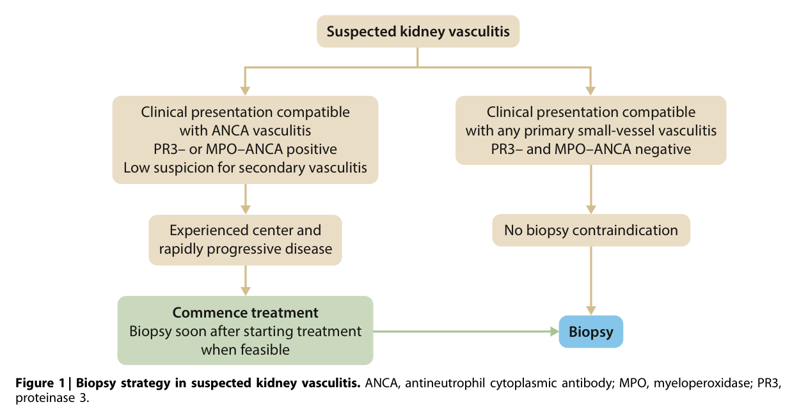

Figure 1 Biopsy strategy in suspected kidney vasculitis

---

### Fig_2

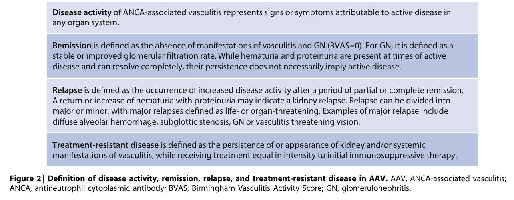

Figure 2 Definition of disease activity, remission, relapse, and treatment-resistant disease in AAV

---

### Fig_3

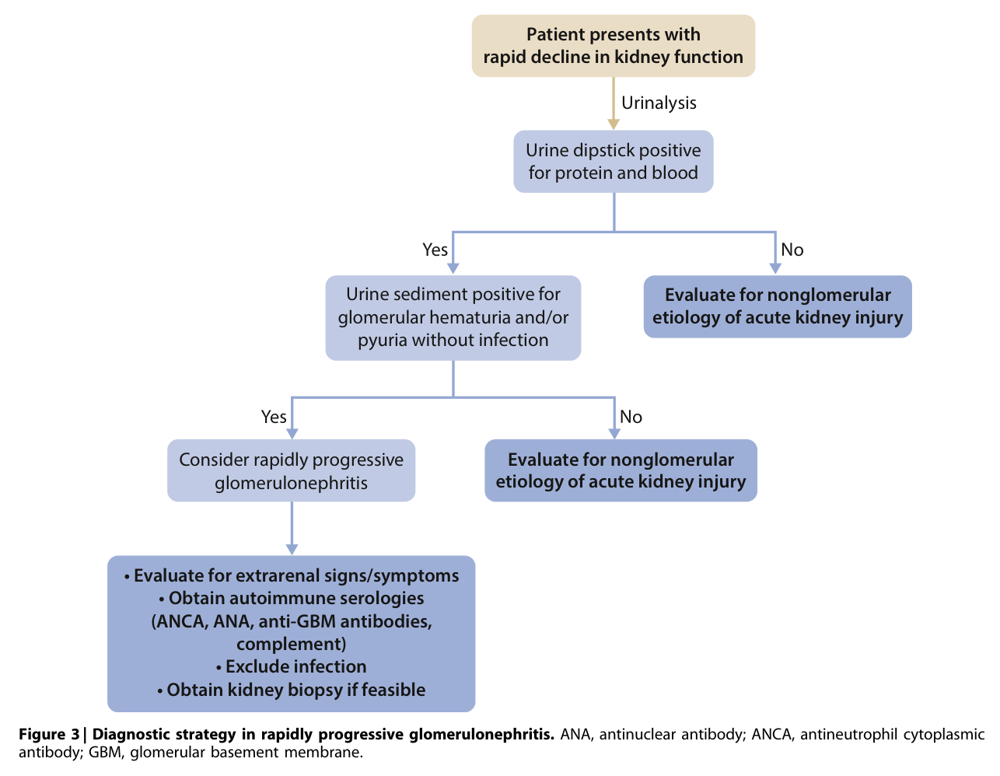

Figure 3 Diagnostic strategy in rapidly progressive glomerulonephritis

---

### Fig_4

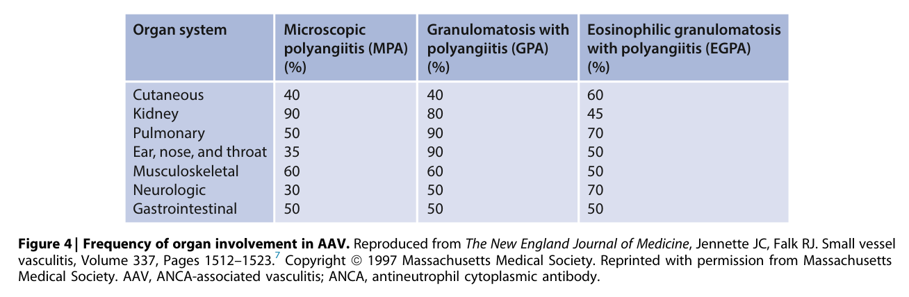

Figure 4 Frequency of organ involvement in AAV

---

### Fig_5

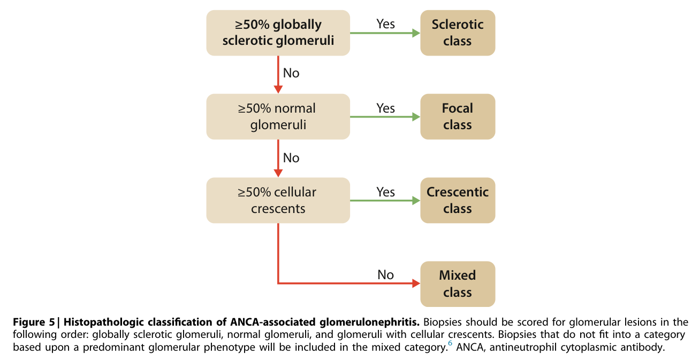

Figure 5 Histopathologic classification of ANCA-associated glomerulonephritis

---

### Fig_6

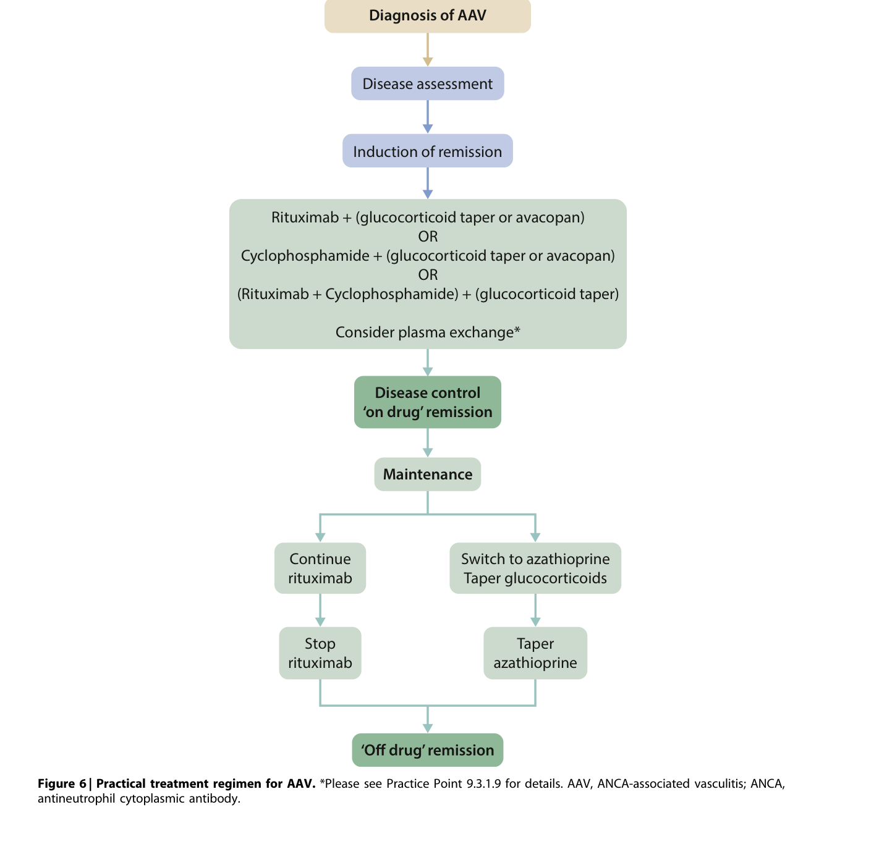

Figure 6 Practical treatment regimen for AAV

---

### Fig_7

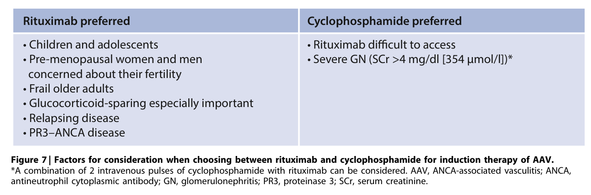

Figure 7 Factors for consideration when choosing between rituximab and cyclophosphamide for induction therapy of AAV

---

### Fig_8

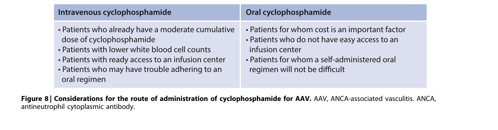

Figure 8 Considerations for the route of administration of cyclophosphamide for AAV

---

### Fig_9

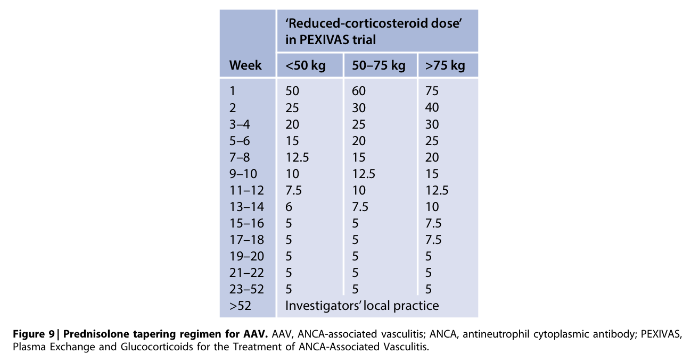

Figure 9 Prednisolone tapering regimen for AAV

---

### Fig_10

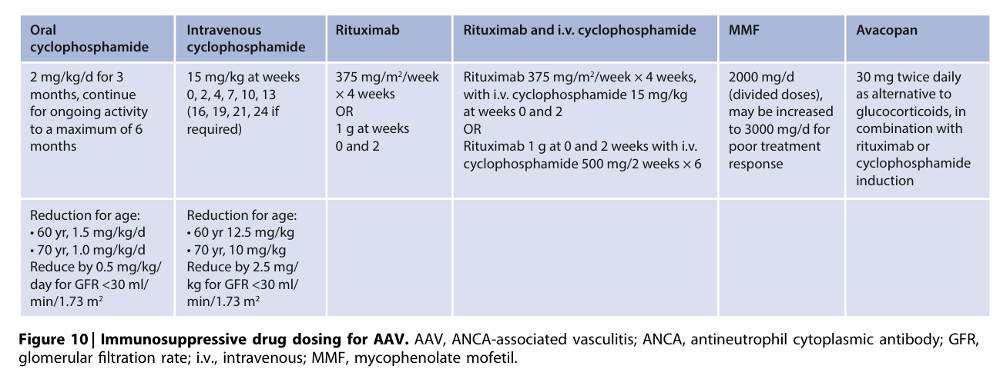

Figure 10 Immunosuppressive drug dosing for AAV

---

### Fig_11

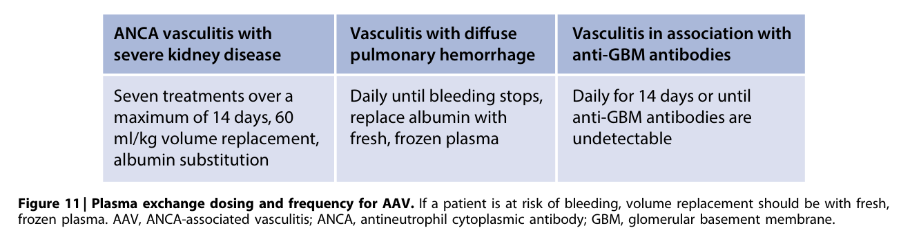

Figure 11 Plasma exchange dosing and frequency for AAV

---

### Fig_12

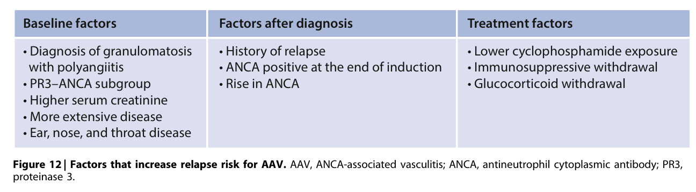

Figure 12 Factors that increase relapse risk for AAV

---

### Fig_13

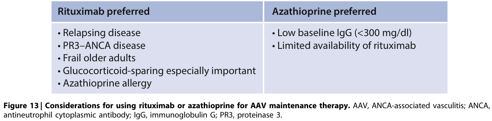

Figure 13 Considerations for using rituximab or azathioprine for AAV maintenance therapy

---

### Fig_14

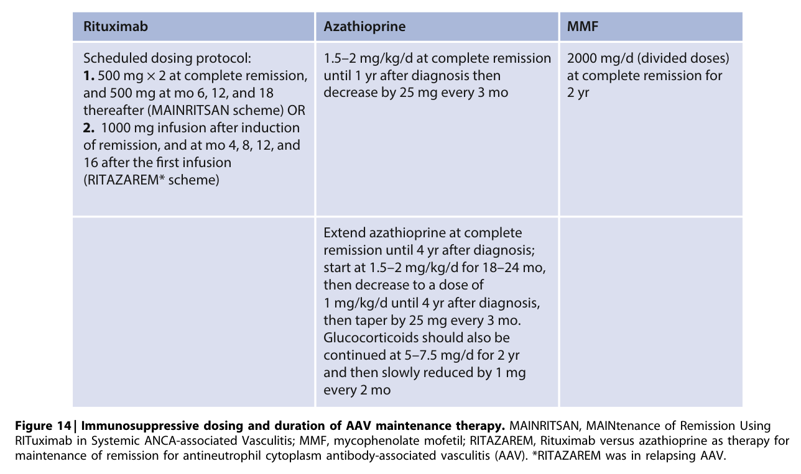

Figure 14 Immunosuppressive dosing and duration of AAV maintenance therapy

---

### Fig_15

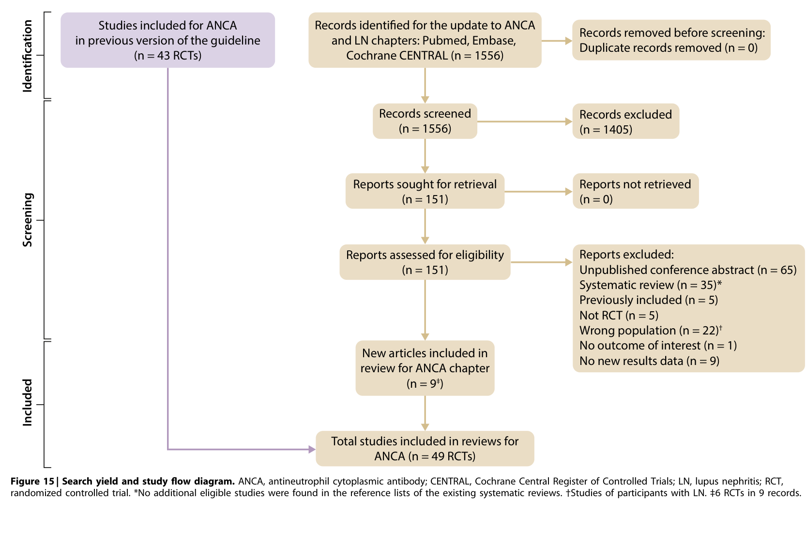

Figure 15 Search yield and study flow diagram

---

## Tables

### Table_1

#### Table Image

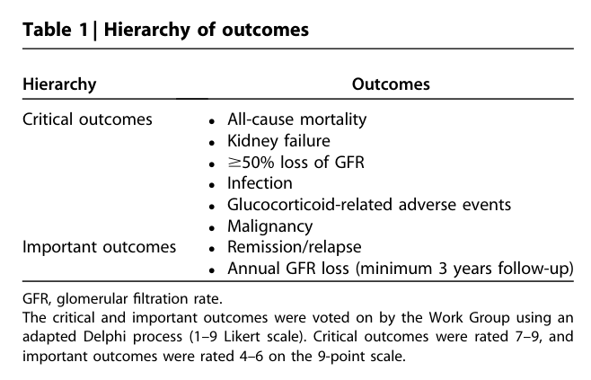

#### Table Data (CSV: [Table_1.csv](Table_1.csv))

```markdown
| Table Text (OCR) |
| :--- |
| Table 1 \| Hierarchy of outcomes Hierarchy  Outcomes    Critical outcomes  • All-cause mortality • Kidney failure • ≥50% loss of GFR    Important outcomes  • Infection • Glucocorticoid-related adverse events • Malignancy • Remission/relapse • Annual GFR loss (minimum 3 years follow-up) GFR, glomerular <sup>fi</sup>ltration rate. The critical and important outcomes were voted on by the Work Group using an adapted Delphi process (1–9 Likert scale). Critical outcomes were rated 7–9, and important outcomes were rated 4–6 on the 9-point scale. |
```

Table 1 Hierarchy of outcomes

---

### Table_2

#### Table Image

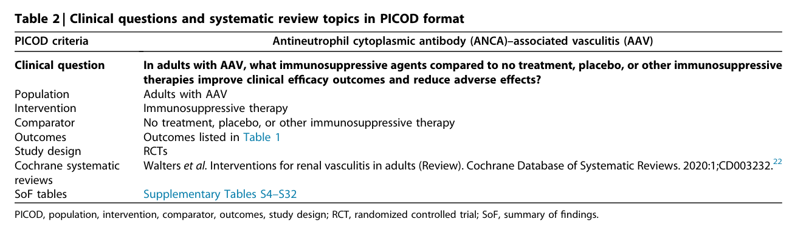

#### Table Data (CSV: [Table_2.csv](Table_2.csv))

```markdown
| Table Text (OCR) |
| :--- |
| Table 2 \| Clinical questions and systematic review topics in PICOD format PICOD criteria  Antineutrophil cytoplasmic antibody (ANCA)-associated vasculitis (AAV)    Clinical question  In adults with AAV, what immunosuppressive agents compared to no treatment, placebo, or other immunosuppressive therapies improve clinical efficacy outcomes and reduce adverse effects?    Population  Adults with AAV    Intervention  Immunosuppressive therapy    Comparator  No treatment, placebo, or other immunosuppressive therapy    Outcomes  Outcomes listed in Table 1    Study design Cochrane systematic  RCTs    reviews  Walters et al. Interventions for renal vasculitis in adults (Review). Cochrane Database of Systematic Reviews. 2020:1;CD003232.22    SoF tables  Supplementary Tables S4-S32 PICOD, population, intervention, comparator, outcomes, study design; RCT, randomized controlled trial; SoF, summary of <sup>fi</sup>ndings. |
```

Table 2 Clinical questions and systematic review topics in PICOD format

---

### Table_3

#### Table Image

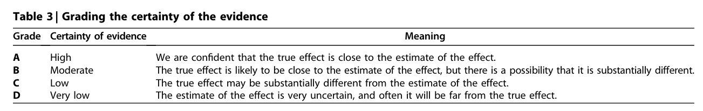

#### Table Data (CSV: [Table_3.csv](Table_3.csv))

```markdown
| Table Text (OCR) |
| :--- |
| Table 3 \| Grading the certainty of the evidence Grade  Certainty of evidence  Meaning    A  High  We are confident that the true effect is close to the estimate of the effect.    B  Moderate  The true effect is likely to be close to the estimate of the effect, but there is a possibility that it is substantially different.    C  Low  The true effect may be substantially different from the estimate of the effect.    D  Very low  The estimate of the effect is very uncertain, and often it will be far from the true effect. |
```

Table 3 Grading the certainty of the evidence

---

### Table_4

#### Table Image

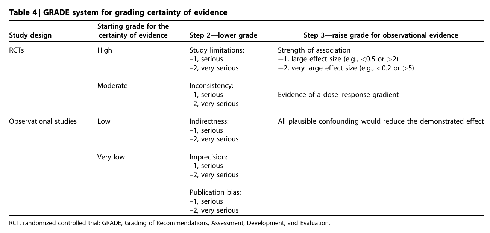

#### Table Data (CSV: [Table_4.csv](Table_4.csv))

```markdown
| Table Text (OCR) |
| :--- |
| Table 4 \| GRADE system for grading certainty of evidence Study design  Starting grade for the certainty of evidence  Step 2—lower grade  Step 3—raise grade for observational evidence    RCTs  High  Study limitations:  Strength of association        -1, serious -2, very serious  +1, large effect size (e.g., <0.5 or >2)          +2, very large effect size (e.g., <0.2 or >5)      Moderate  Inconsistency:          -1, serious  Evidence of a dose-response gradient        -2, very serious      Observational studies  Low  Indirectness:  All plausible confounding would reduce the demonstrated effect        -1, serious          -2, very serious                  Very low  Imprecision:          -1, serious -2, very serious                    Publication bias: -1, serious                    -2, very serious RCT, randomized controlled trial; GRADE, Grading of Recommendations, Assessment, Development, and Evaluation. |
```

Table 4 GRADE system for grading certainty of evidence

---

### Table_5

#### Table Image

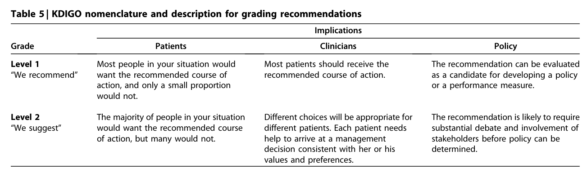

#### Table Data (CSV: [Table_5.csv](Table_5.csv))

```markdown
| Table Text (OCR) |
| :--- |
| Table 5 \| KDIGO nomenclature and description for grading recommendations Implications    Grade  Patients  Clinicians  Policy    Level 1 “We recommend"  Most people in your situation would want the recommended course of action, and only a small proportion would not.  Most patients should receive the recommended course of action.  The recommendation can be evaluated as a candidate for developing a policy or a performance measure.    Level 2  The majority of people in your situation would want the recommended course of action, but many would not.  Different choices will be appropriate for different patients. Each patient needs help to arrive at a management decision consistent with her or his  The recommendation is likely to require substantial debate and involvement of stakeholders before policy can be determined. |
```

Table 5 KDIGO nomenclature and description for grading recommendations

---

### Table_6

#### Table Image

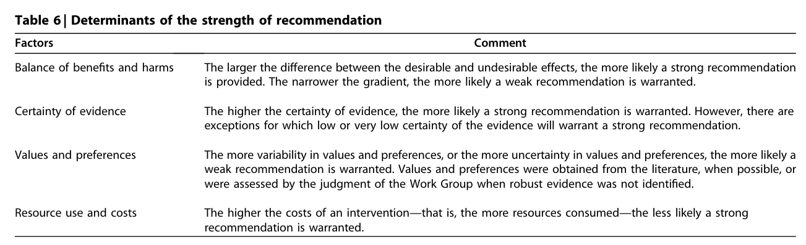

#### Table Data (CSV: [Table_6.csv](Table_6.csv))

```markdown
| Table Text (OCR) |
| :--- |
| Table 6 \| Determinants of the strength of recommendation Factors  Comment    Balance of benefits and harms  The larger the difference between the desirable and undesirable effects, the more likely a strong recommendation is provided. The narrower the gradient, the more likely a weak recommendation is warranted.    Certainty of evidence  The higher the certainty of evidence, the more likely a strong recommendation is warranted. However, there are exceptions for which low or very low certainty of the evidence will warrant a strong recommendation.    Values and preferences  The more variability in values and preferences, or the more uncertainty in values and preferences, the more likely a weak recommendation is warranted. Values and preferences were obtained from the literature, when possible, or were assessed by the judgment of the Work Group when robust evidence was not identified.    Resource use and costs  The higher the costs of an intervention—that is, the more resources consumed—the less likely a strong recommendation is warranted. |
```

Table 6 Determinants of the strength of recommendation

---
