# KDIGO-2024_Lupus_Nephritis_Guideline - Figures and Tables Index

This document lists all figures and tables extracted from `KDIGO-2024_Lupus_Nephritis_Guideline.pdf`.

## Table of Contents
- [Figures](#figures)
- [Tables](#tables)

---

## Figures

### Fig_1

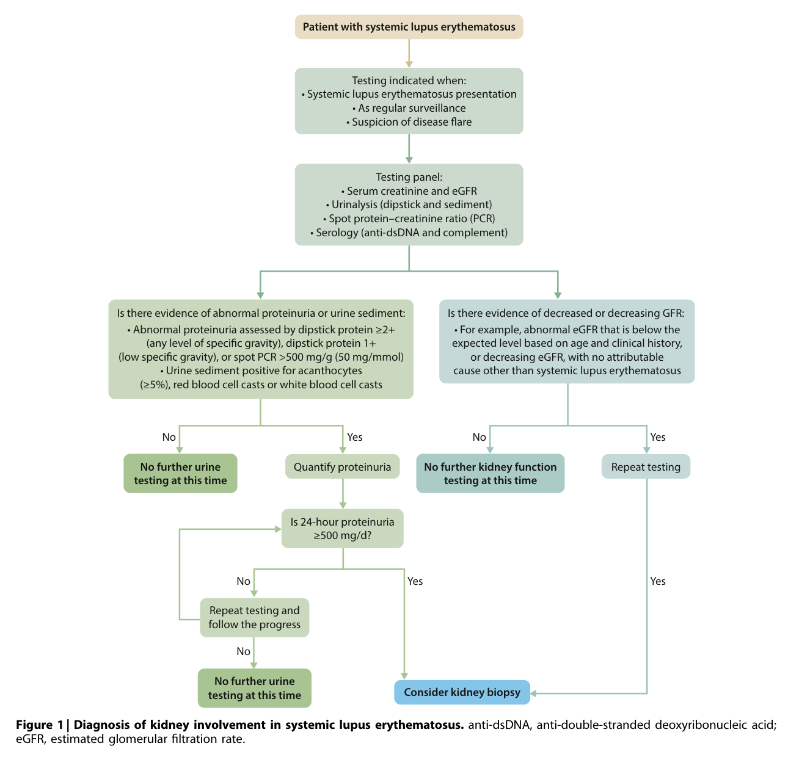

Figure 1 Diagnosis of kidney involvement in systemic lupus erythematosus

---

### Fig_2

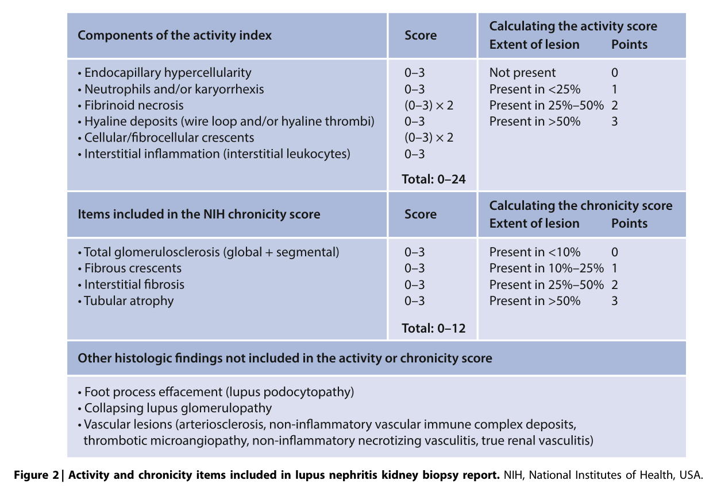

Figure 2 Activity and chronicity items included in lupus nephritis kidney biopsy report

---

### Fig_3

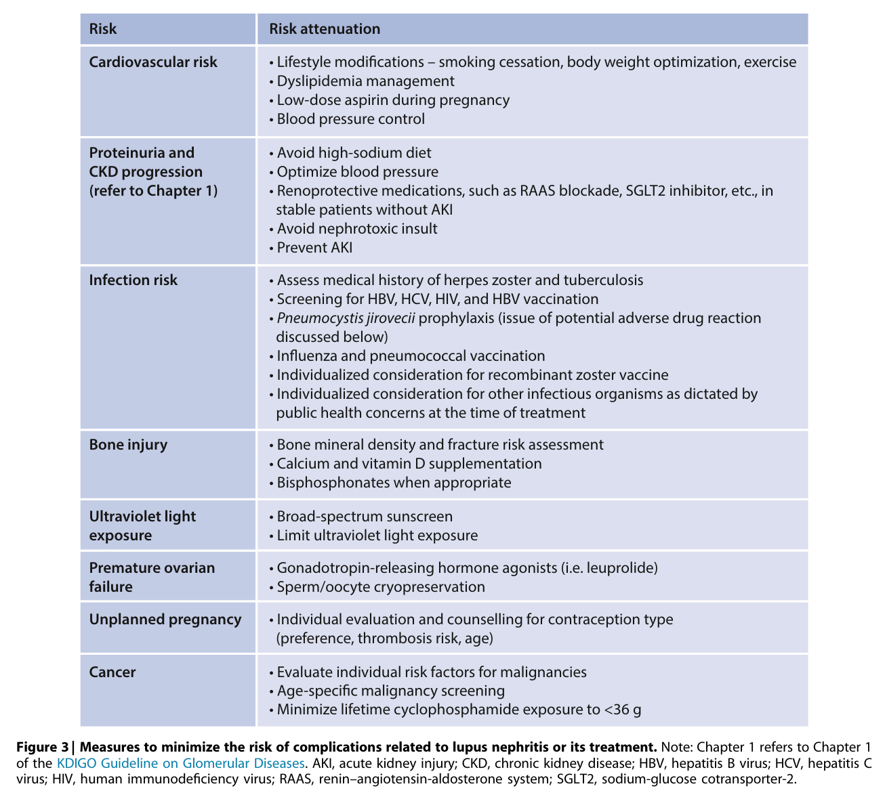

Figure 3 Measures to minimize the risk of complications related to lupus nephritis or its treatment

---

### Fig_4

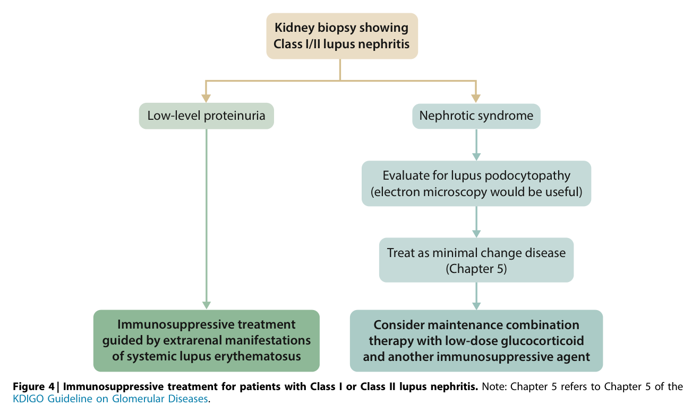

Figure 4 Immunosuppressive treatment for patients with Class I or Class II lupus nephritis

---

### Fig_5

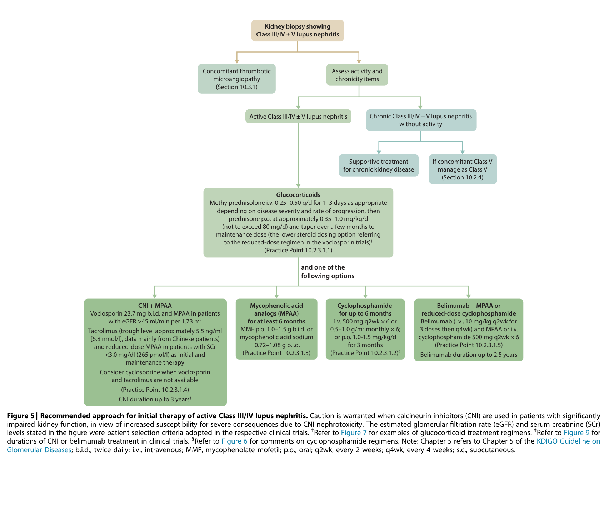

Figure 5 Recommended approach for initial therapy of active Class III/IV lupus nephritis

---

### Fig_6

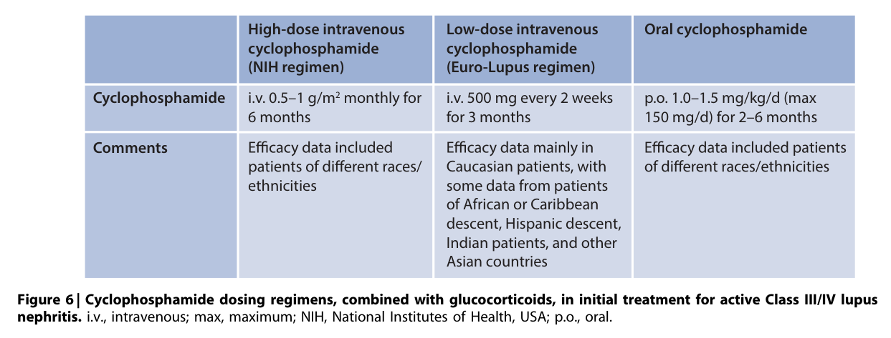

Figure 6 Cyclophosphamide dosing regimens, combined with glucocorticoids, in initial treatment for active Class III/IV lupus nephritis

---

### Fig_7

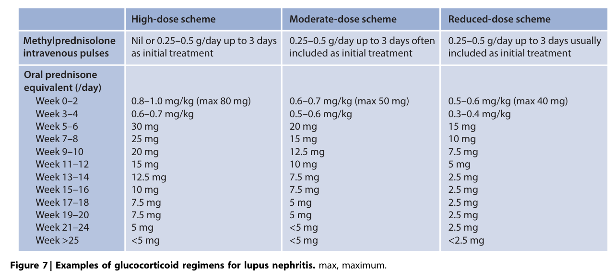

Figure 7 Examples of glucocorticoid regimens for lupus nephritis

---

### Fig_8

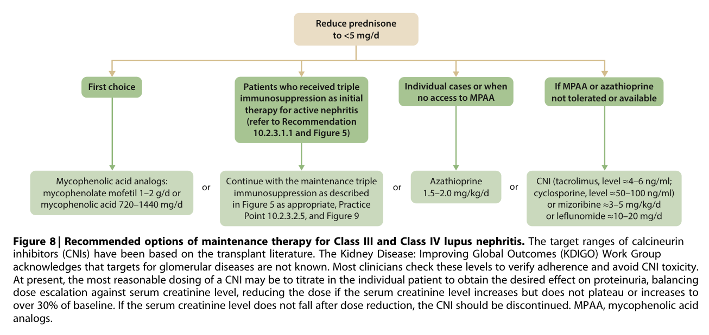

Figure 8 Recommended options of maintenance therapy for Class III and Class IV lupus nephritis

---

### Fig_9

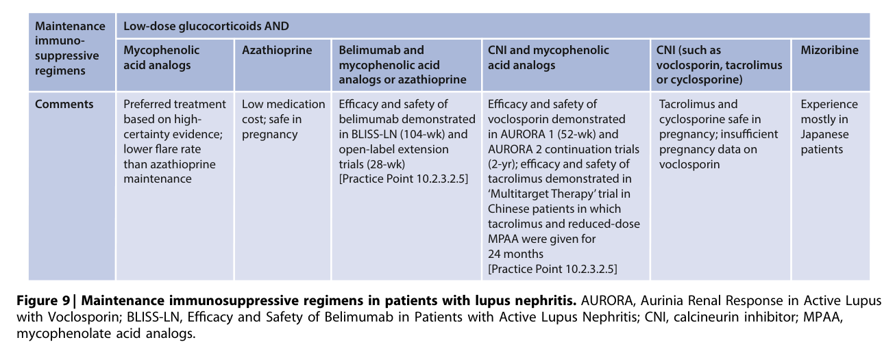

Figure 9 Maintenance immunosuppressive regimens in patients with lupus nephritis

---

### Fig_10

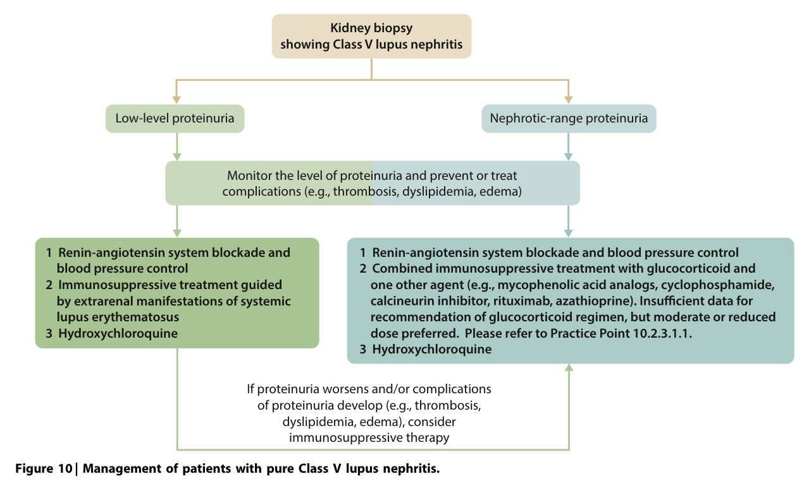

Figure 10 Management of patients with pure Class V lupus nephritis

---

### Fig_11

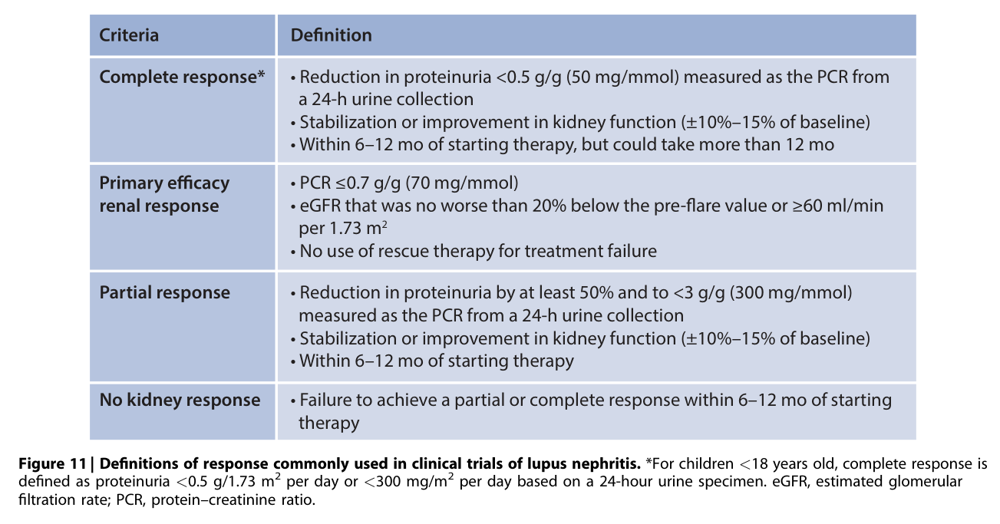

Figure 11 Definitions of response commonly used in clinical trials of lupus nephritis

---

### Fig_12

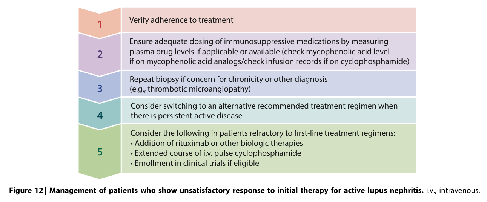

Figure 12 Management of patients who show unsatisfactory response to initial therapy for active lupus nephritis

---

### Fig_13

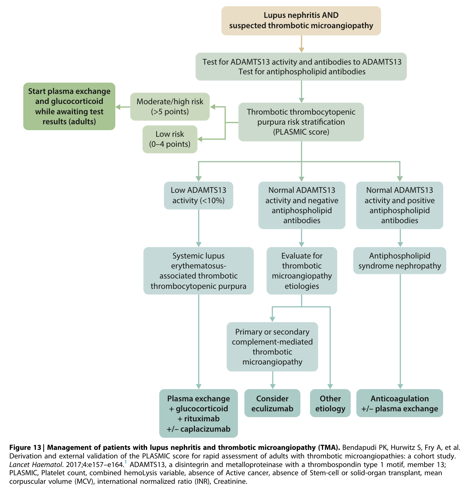

Figure 13 Management of patients with lupus nephritis and thrombotic microangiopathy (TMA)

---

### Fig_14

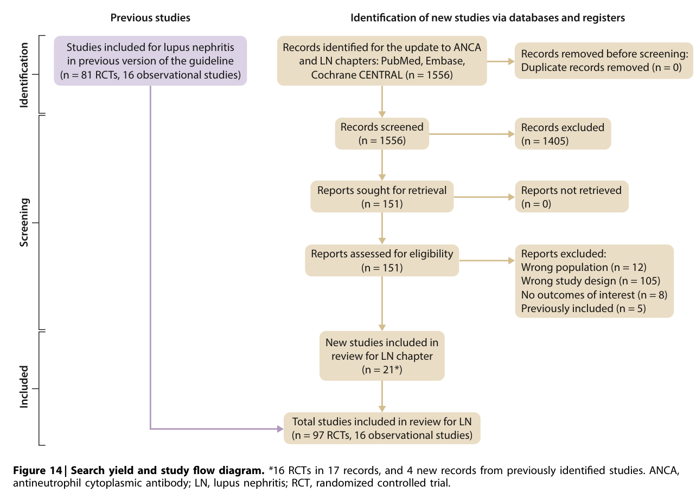

Figure 14 Search yield and study flow diagram

---

## Tables

### Table_1

#### Table Image

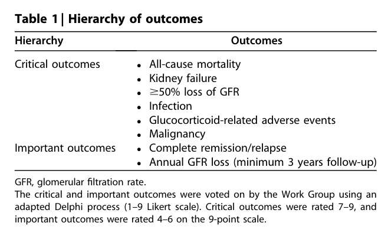

#### Table Data (CSV: [Table_1.csv](Table_1.csv))

```markdown
| Table Text (OCR) |
| :--- |
| Table 1 \| Hierarchy of outcomes Hierarchy  Outcomes    Critical outcomes  • All-cause mortality    • Kidney failure    • ≥50% loss of GFR    • Infection    • Glucocorticoid-related adverse events    Important outcomes  • Malignancy • Complete remission/relapse    • Annual GFR loss (minimum 3 years follow-up) GFR, glomerular <sup>fi</sup>ltration rate. The critical and important outcomes were voted on by the Work Group using an adapted Delphi process (1–9 Likert scale). Critical outcomes were rated 7–9, and important outcomes were rated 4–6 on the 9-point scale. |
```

Table 1 Hierarchy of outcomes

---

### Table_2

#### Table Image

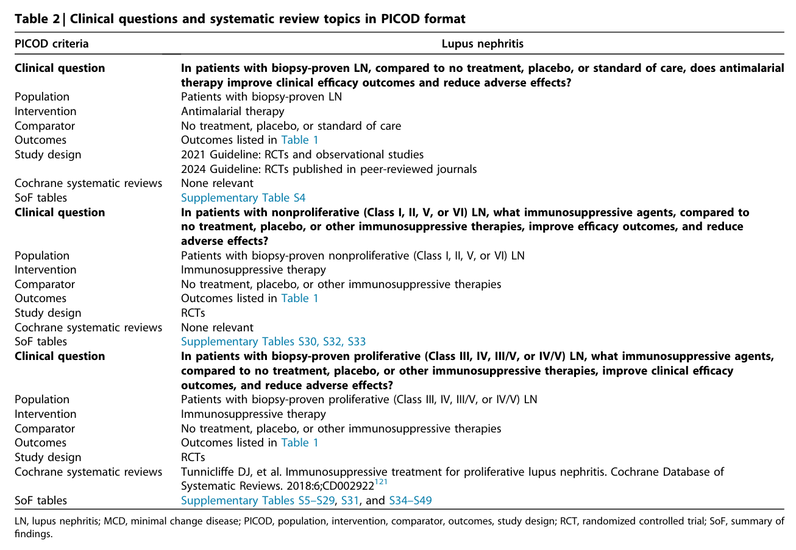

#### Table Data (CSV: [Table_2.csv](Table_2.csv))

```markdown
| Table Text (OCR) |
| :--- |
| Table 2 \| Clinical questions and systematic review topics in PICOD format PICOD criteria  Lupus nephritis    Clinical question  In patients with biopsy-proven LN, compared to no treatment, placebo, or standard of care, does antimalarial therapy improve clinical efficacy outcomes and reduce adverse effects?    Population  Patients with biopsy-proven LN    Intervention  Antimalarial therapy    Comparator  No treatment, placebo, or standard of care    Outcomes  Outcomes listed in Table 1    Study design  2021 Guideline: RCTs and observational studies 2024 Guideline: RCTs published in peer-reviewed journals    Cochrane systematic reviews  None relevant    SoF tables Clinical question  Supplementary Table S4 In patients with nonproliferative (Class I, II, V, or VI) LN, what immunosuppressive agents, compared to      no treatment, placebo, or other immunosuppressive therapies, improve efficacy outcomes, and reduce adverse effects?    Population Intervention  Patients with biopsy-proven nonproliferative (Class I, II, V, or VI) LN    Comparator  Immunosuppressive therapy    Outcomes  No treatment, placebo, or other immunosuppressive therapies    Study design  Outcomes listed in Table 1 RCTs    Cochrane systematic reviews  None relevant    SoF tables  Supplementary Tables S30, S32, S33    Clinical question  In patients with biopsy-proven proliferative (Class III, IV, III/V, or IV/V) LN, what immunosuppressive agents,    Population  compared to no treatment, placebo, or other immunosuppressive therapies, improve clinical efficacy outcomes, and reduce adverse effects? Patients with biopsy-proven proliferative (Class III, IV, III/V, or IV/V) LN    Intervention  Immunosuppressive therapy    Comparator Outcomes  No treatment, placebo, or other immunosuppressive therapies    Study design  Outcomes listed in Table 1    Cochrane systematic reviews  RCTs      Tunnicliffe DJ, et al. Immunosuppressive treatment for proliferative lupus nephritis. Cochrane Database of Systematic Reviews. 2018:6;CD002922121    SoF tables  Supplementary Tables S5-S29, S31, and S34-S49 LN, lupus nephritis; MCD, minimal change disease; PICOD, population, intervention, comparator, outcomes, study design; RCT, randomized controlled trial; SoF, summary of <sup>fi</sup>ndings. |
```

Table 2 Clinical questions and systematic review topics in PICOD format

---

### Table_3

#### Table Image

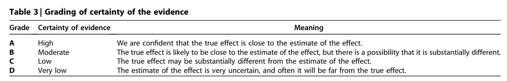

#### Table Data (CSV: [Table_3.csv](Table_3.csv))

```markdown
| Table Text (OCR) |
| :--- |
| Table 3 \| Grading of certainty of the evidence Grade  Certainty of evidence  Meaning    A  High  We are confident that the true effect is close to the estimate of the effect.    B  Moderate  The true effect is likely to be close to the estimate of the effect, but there is a possibility that it is substantially different.    C  Low  The true effect may be substantially different from the estimate of the effect.    D  Very low  The estimate of the effect is very uncertain, and often it will be far from the true effect. |
```

Table 3 Grading the certainty of the evidence

---

### Table_4

#### Table Image

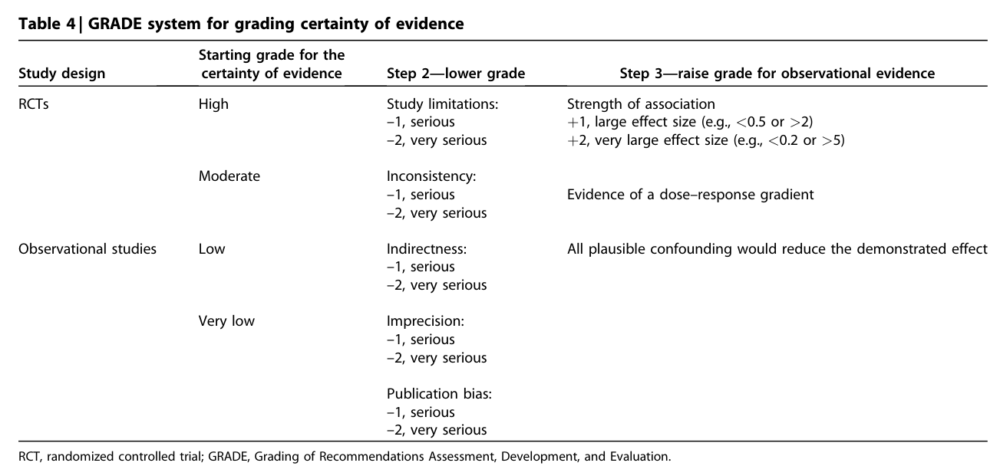

#### Table Data (CSV: [Table_4.csv](Table_4.csv))

```markdown
| Table Text (OCR) |
| :--- |
| Table 4 \| GRADE system for grading certainty of evidence Study design  Starting grade for the certainty of evidence  Step 2—lower grade  Step 3—raise grade for observational evidence    RCTs  High  Study limitations:  Strength of association        -1, serious -2, very serious  +1, large effect size (e.g., <0.5 or >2) +2, very large effect size (e.g., <0.2 or >5)                Moderate  Inconsistency: -1, serious          -2, very serious  Evidence of a dose-response gradient              Observational studies  Low  Indirectness:  All plausible confounding would reduce the demonstrated effect        -1, serious          -2, very serious                  Very low  Imprecision:          -1, serious -2, very serious                    Publication bias:          -1, serious          -2, very serious RCT, randomized controlled trial; GRADE, Grading of Recommendations Assessment, Development, and Evaluation. |
```

Table 4 GRADE system for grading certainty of evidence

---

### Table_5

#### Table Image

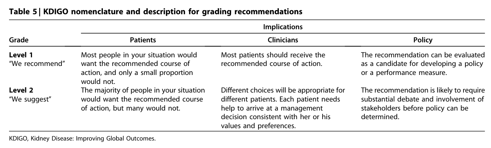

#### Table Data (CSV: [Table_5.csv](Table_5.csv))

```markdown
| Table Text (OCR) |
| :--- |
| Table 5 \| KDIGO nomenclature and description for grading recommendations Grade  Implications    Patients  Clinicians  Policy    Level 1 “We recommend"  Most people in your situation would want the recommended course of action, and only a small proportion  Most patients should receive the recommended course of action.  The recommendation can be evaluated as a candidate for developing a policy or a performance measure.    Level 2 “We suggest"  would not. The majority of people in your situation would want the recommended course of action, but many would not.  Different choices will be appropriate for different patients. Each patient needs help to arrive at a management decision consistent with her or his  The recommendation is likely to require substantial debate and involvement of stakeholders before policy can be determined. KDIGO, Kidney Disease: Improving Global Outcomes. |
```

Table 5 KDIGO nomenclature and description for grading recommendations

---

### Table_6

#### Table Image

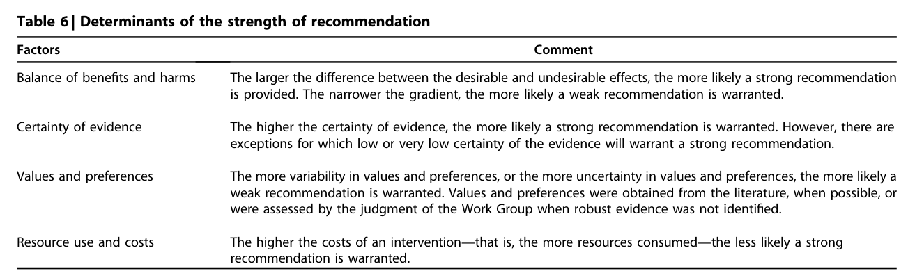

#### Table Data (CSV: [Table_6.csv](Table_6.csv))

```markdown
| Table Text (OCR) |
| :--- |
| Table 6 \| Determinants of the strength of recommendation Factors  Comment    Balance of benefits and harms  The larger the difference between the desirable and undesirable effects, the more likely a strong recommendation is provided. The narrower the gradient, the more likely a weak recommendation is warranted.    Certainty of evidence  The higher the certainty of evidence, the more likely a strong recommendation is warranted. However, there are exceptions for which low or very low certainty of the evidence will warrant a strong recommendation.    Values and preferences  The more variability in values and preferences, or the more uncertainty in values and preferences, the more likely a weak recommendation is warranted. Values and preferences were obtained from the literature, when possible, or were assessed by the judgment of the Work Group when robust evidence was not identified.    Resource use and costs  The higher the costs of an intervention—that is, the more resources consumed—the less likely a strong recommendation is warranted. |
```

Table 6 Determinants of the strength of recommendation

---
