# KDIGO-2025-Guideline-for-Nephrotic-Syndrome-in-Children - Figures and Tables Index

This document lists all figures and tables extracted from `KDIGO-2025-Guideline-for-Nephrotic-Syndrome-in-Children.pdf`.

## Table of Contents
- [Figures](#figures)
- [Tables](#tables)

---

## Figures

### Fig_1

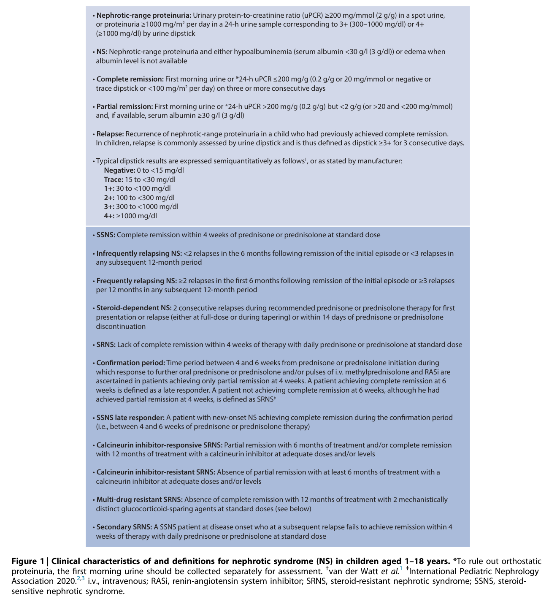

Figure 1 Clinical characteristics of and definitions for nephrotic syndrome (NS) in children aged 1–18 years

---

### Fig_2

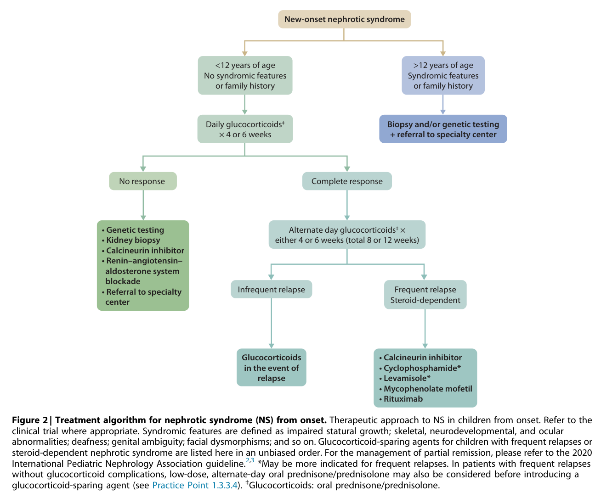

Figure 2 Treatment algorithm for nephrotic syndrome (NS) from onset

---

### Fig_3

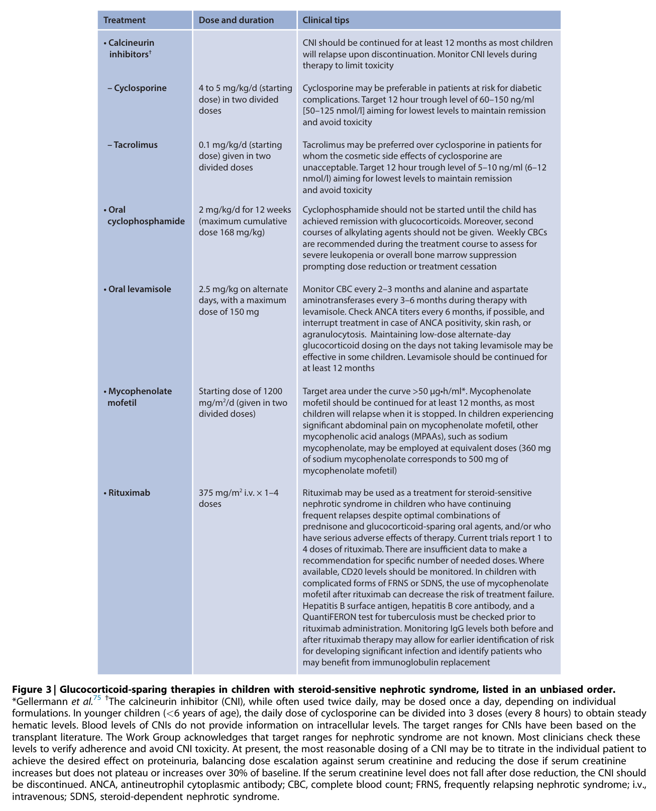

Figure 3 Glucocorticoid-sparing therapies in children with steroid-sensitive nephrotic syndrome, listed in an unbiased order

---

### Fig_4

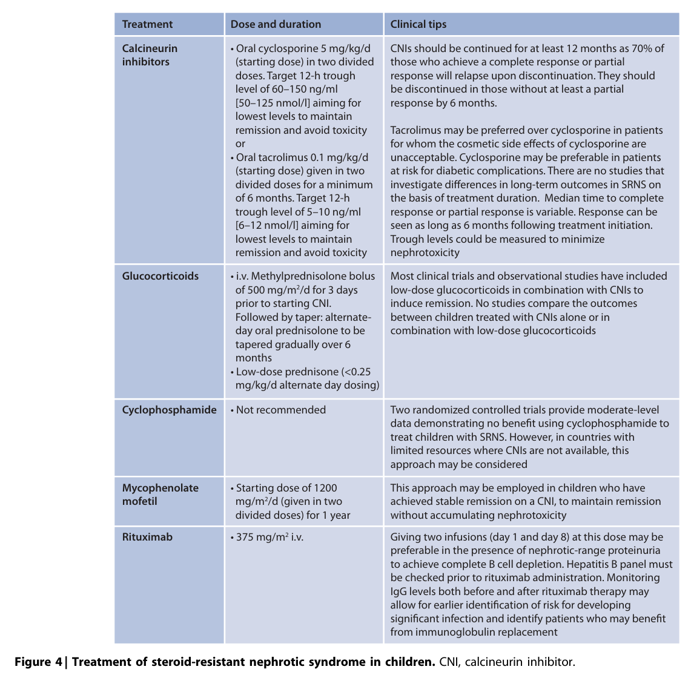

Figure 4 Treatment of steroid-resistant nephrotic syndrome in children

---

### Fig_5

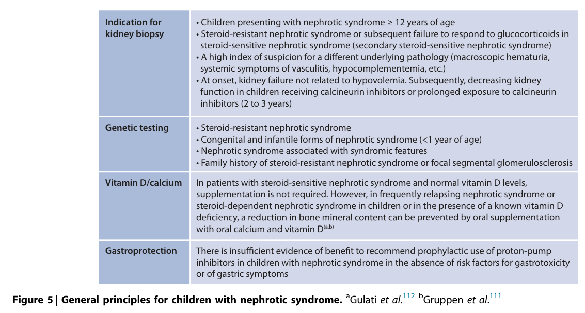

Figure 5 General principles for children with nephrotic syndrome

---

### Fig_6

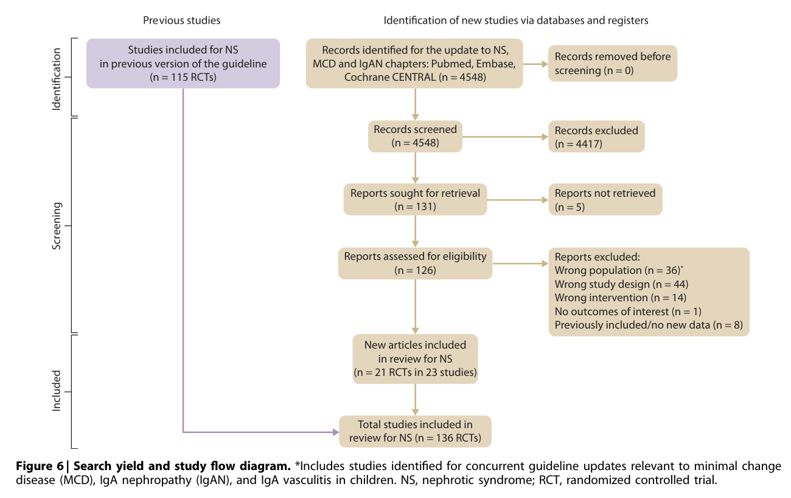

Figure 6 Search yield and study flow diagram

---

## Tables

### Table_1

#### Table Image

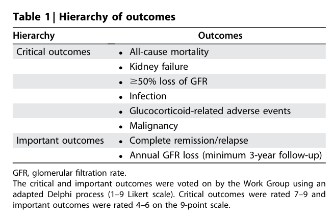

#### Table Data (CSV: [Table_1.csv](Table_1.csv))

```markdown
| Table Text (OCR) |
| :--- |
| Table 1 \| Hierarchy of outcomes Hierarchy  Outcomes    Critical outcomes  All-cause mortalityKidney failure≥50% loss of GFRInfectionGlucocorticoid-related adverse eventsMalignancy    Important outcomes  Complete remission/relapseAnnual GFR loss (minimum 3-year follow-up) GFR, glomerular filtration rate The critical and important outcomes were voted on by the Work Group using an adapted Delphi process (1–9 Likert scale), Critical outcomes were rated 7-9 and important outcomes were rated 4–6 on the 9-point scale |
```

Table 1 Hierarchy of outcomes

---

### Table_2

#### Table Image

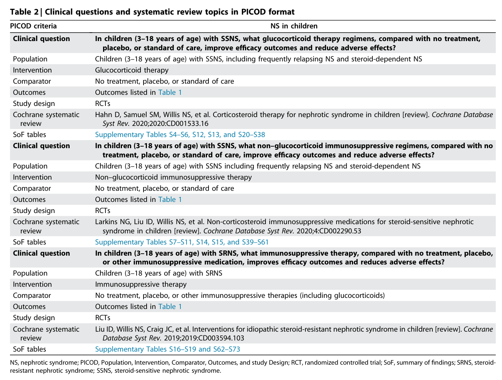

#### Table Data (CSV: [Table_2.csv](Table_2.csv))

```markdown
| Table Text (OCR) |
| :--- |
| Table 2 \| Clinical questions and systematic review topics in PICOD format PICOD criteria  NS in children    Clinical question  In children (3-18 years of age) with SSNS, what glucocorticoid therapy regimens, compared with no treatment, placebo, or standard of care, improve efficacy outcomes and reduce adverse effects?    Population  Children (3-18 years of age) with SSNS, including frequently relapsing NS and steroid-dependent NS    Intervention  Glucocorticoid therapy    Comparator  No treatment, placebo, or standard of care    Outcomes  Outcomes listed in Table 1    Study design  RCTs    Cochrane systematic review  Hahn D, Samuel SM, Willis NS, et al. Corticosteroid therapy for nephrotic syndrome in children [review]. Cochrane Database Syst Rev. 2020;2020:CD001533.16    SoF tables  Supplementary Tables S4-S6, S12, S13, and S20-S38    Clinical question  In children (3-18 years of age) with SSNS, what non-glucocorticoid immunosuppressive regimens, compared with no treatment, placebo, or standard of care, improve efficacy outcomes and reduce adverse effects?    Population  Children (3-18 years of age) with SSNS including frequently relapsing NS and steroid-dependent NS    Intervention  Non-glucocorticoid immunosuppressive therapy    Comparator  No treatment, placebo, or standard of care    Outcomes  Outcomes listed in Table 1    Study design  RCTs    Cochrane systematic review  Larkins NG, Liu ID, Willis NS, et al. Non-corticosteroid immunosuppressive medications for steroid-sensitive nephrotic syndrome in children [review]. Cochrane Database Syst Rev. 2020;4:CD002290.53    SoF tables  Supplementary Tables S7-S11, S14, S15, and S39-S61    Clinical question  In children (3-18 years of age) with SRNS, what immunosuppressive therapy, compared with no treatment, placebo, or other immunosuppressive medication, improves efficacy outcomes and reduces adverse effects?    Population  Children (3-18 years of age) with SRNS    Intervention  Immunosuppressive therapy    Comparator  No treatment, placebo, or other immunosuppressive therapies (including glucocorticoids)    Outcomes  Outcomes listed in Table 1    Study design  RCTs    Cochrane systematic review  Liu ID, Willis NS, Craig JC, et al. Interventions for idiopathic steroid-resistant nephrotic syndrome in children [review]. Cochrane Database Syst Rev. 2019;2019:CD003594.103    SoF tables  Supplementary Tables S16-S19 and S62-S73 NS. nephrotic syndrome: PICOD, Population, Intervention, Comparator, Outcomes, and study Design: RCT, randomized controlled trial: SoE, summary of findings: SRNS, steroid resistant nephrotic syndrome; SSNS, steroid-sensitive nephrotic syndrome. |
```

Table 2 Clinical questions and systematic review topics in PICOD format

---

### Table_3

#### Table Image

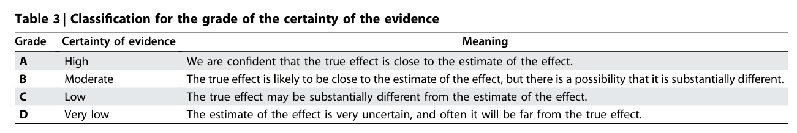

#### Table Data (CSV: [Table_3.csv](Table_3.csv))

```markdown
| Table Text (OCR) |
| :--- |
| Table 3 \| Classification for the grade of the certainty of the evidence Grade  Certainty of evidence  Meaning    A  High  We are confident that the true effect is close to the estimate of the effect.    B  Moderate  The true effect is likely to be close to the estimate of the effect, but there is a possibility that it is substantially different.    C  Low  The true effect may be substantially different from the estimate of the effect.    D  Very low  The estimate of the effect is very uncertain, and often it will be far from the true effect. |
```

Table 3 Classification for the grade of the certainty of evidence

---

### Table_4

#### Table Image

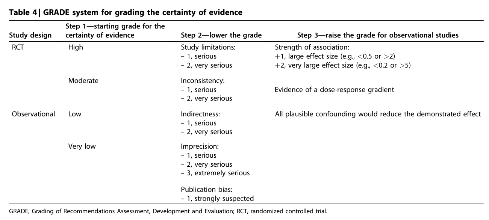

#### Table Data (CSV: [Table_4.csv](Table_4.csv))

```markdown
| Table Text (OCR) |
| :--- |
| Table 4 \| GRADE system for grading the certainty of evidence Study design  Step 1—starting grade for the certainty of evidence  Step 2—lower the grade  Step 3—raise the grade for observational studies    RCT  High  Study limitations: -1, serious -2, very serious  Strength of association: +1, large effect size (e.g., <0.5 or >2) +2, very large effect size (e.g., <0.2 or >5)    Moderate  Inconsistency: -1, serious -2, very serious  Evidence of a dose-response gradient    Observational  Low  Indirectness: -1, serious -2, very serious  All plausible confounding would reduce the demonstrated effect    Very low  Imprecision: -1, serious -2, very serious -3, extremely serious        Publication bias: -1, strongly suspected GRADE, Grading of Recommendations Assessment, Development and Evaluation; RCT, randomized controlled trial. |
```

Table 4 GRADE system for grading the certainty of evidence

---

### Table_5

#### Table Image

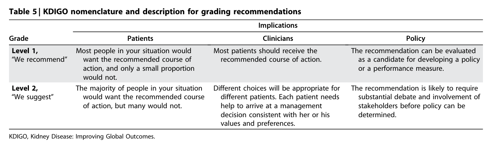

#### Table Data (CSV: [Table_5.csv](Table_5.csv))

```markdown
| Table Text (OCR) |
| :--- |
| Table 5 \| KDIGO nomenclature and description for grading recommendations Grade  Implications    Patients  Clinicians  Policy    Level 1, “We recommend”  Most people in your situation would want the recommended course of action, and only a small proportion would not.  Most patients should receive the recommended course of action.  The recommendation can be evaluated as a candidate for developing a policy or a performance measure.    Level 2, “We suggest”  The majority of people in your situation would want the recommended course of action, but many would not.  Different choices will be appropriate for different patients. Each patient needs help to arrive at a management decision consistent with her or his values and preferences.  The recommendation is likely to require substantial debate and involvement of stakeholders before policy can be determined. KDIGO, Kidney Disease: Improving Global Outcomes. |
```

Table 5 KDIGO nomenclature and description for grading recommendations

---

### Table_6

#### Table Image

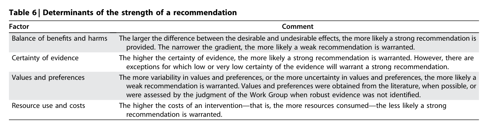

#### Table Data (CSV: [Table_6.csv](Table_6.csv))

```markdown
| Table Text (OCR) |
| :--- |
| Table 6 \| Determinants of the strength of a recommendation Factor  Comment    Balance of benefits and harms  The larger the difference between the desirable and undesirable effects, the more likely a strong recommendation is provided. The narrower the gradient, the more likely a weak recommendation is warranted.    Certainty of evidence  The higher the certainty of evidence, the more likely a strong recommendation is warranted. However, there are exceptions for which low or very low certainty of the evidence will warrant a strong recommendation.    Values and preferences  The more variability in values and preferences, or the more uncertainty in values and preferences, the more likely a weak recommendation is warranted. Values and preferences were obtained from the literature, when possible, or were assessed by the judgment of the Work Group when robust evidence was not identified.    Resource use and costs  The higher the costs of an intervention—that is, the more resources consumed—the less likely a strong recommendation is warranted. |
```

Table 6 Determinants of the strength of a recommendation

---
