# KDIGO-2025-IgAN-IgAV-Guideline - Figures and Tables Index

This document lists all figures and tables extracted from `KDIGO-2025-IgAN-IgAV-Guideline.pdf`.

## Table of Contents
- [Figures](#figures)
- [Tables](#tables)

---

## Figures

### Fig_1

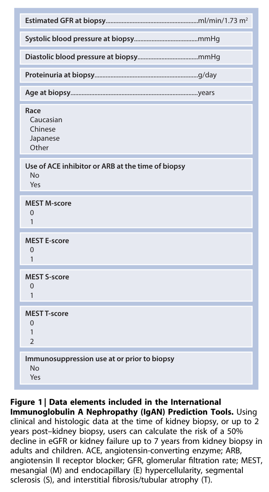

Figure 1 Data elements included in the International Immunoglobulin A Nephropathy (IgAN) Prediction Tools

---

### Fig_2

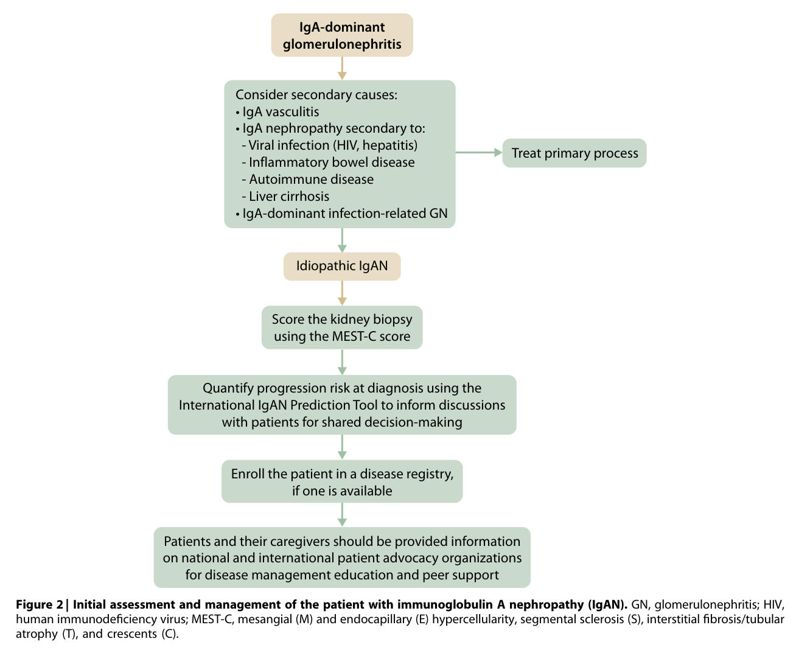

Figure 2 Initial assessment and management of the patient with immunoglobulin A nephropathy (IgAN)

---

### Fig_3

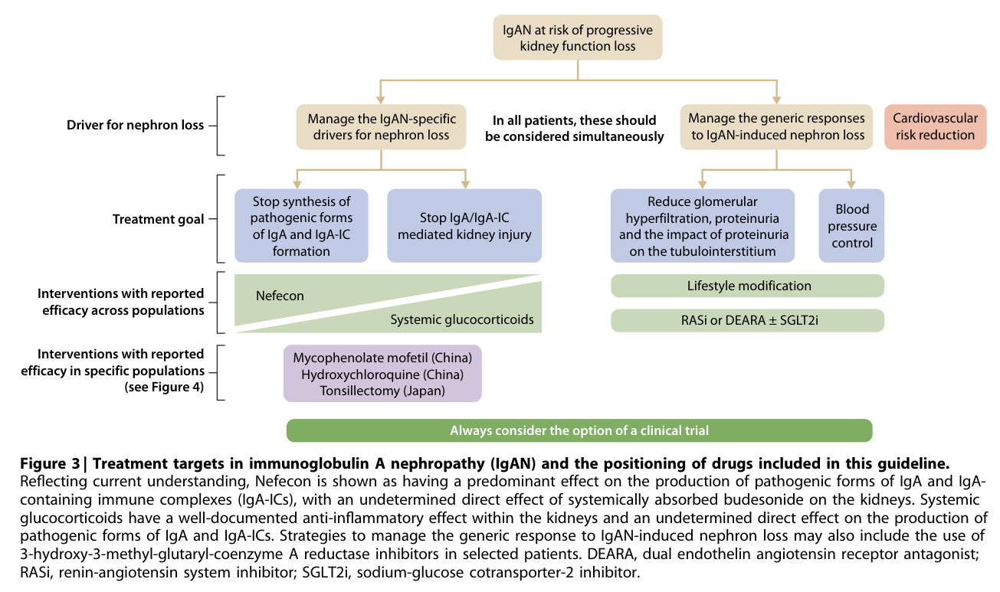

Figure 3 Treatment targets in immunoglobulin A nephropathy (IgAN) and the positioning of drugs included in this guideline

---

### Fig_4

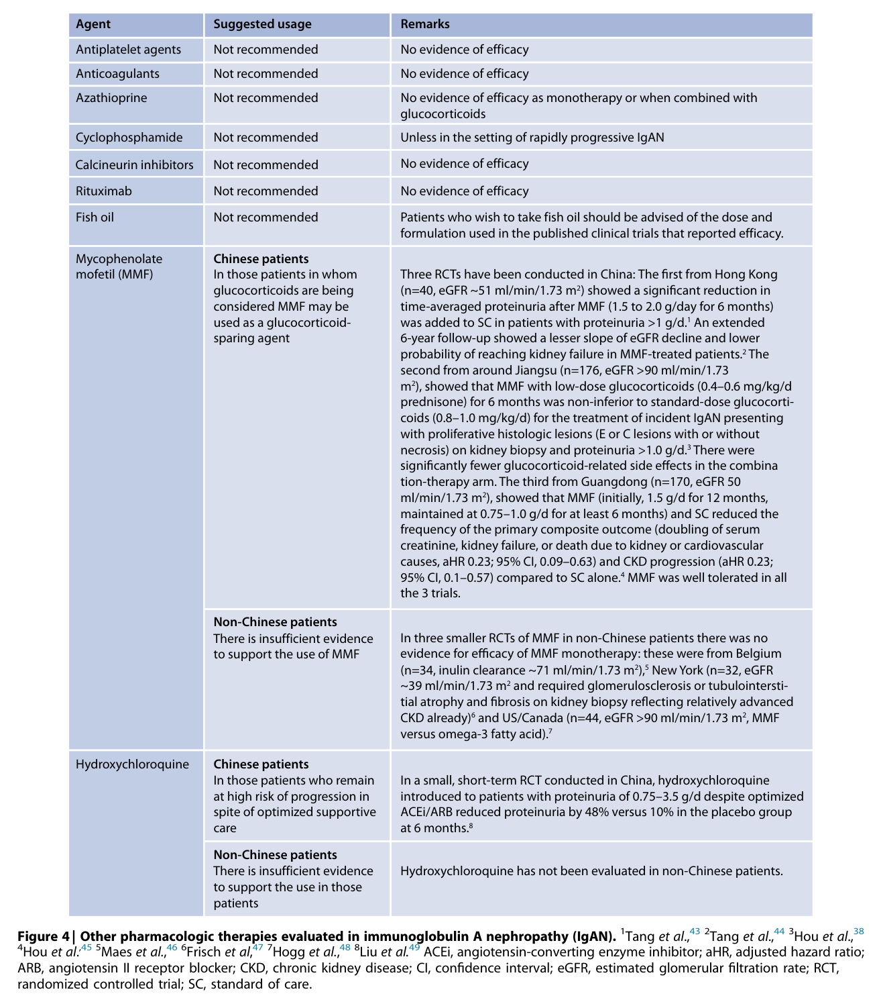

Figure 4 Other pharmacologic therapies evaluated in immunoglobulin A nephropathy (IgAN)

---

### Fig_5

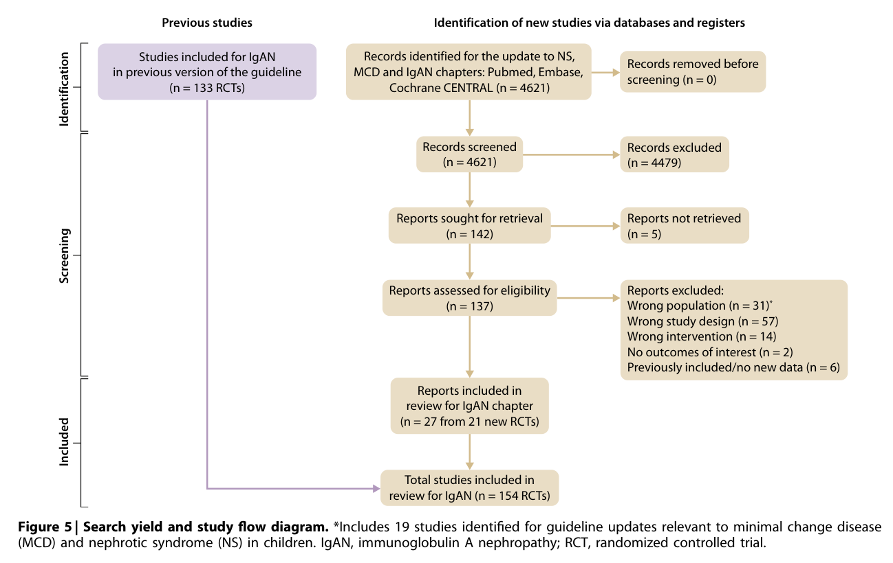

Figure 5 Search yield and study flow diagram

---

## Tables

### Table_1

#### Table Image

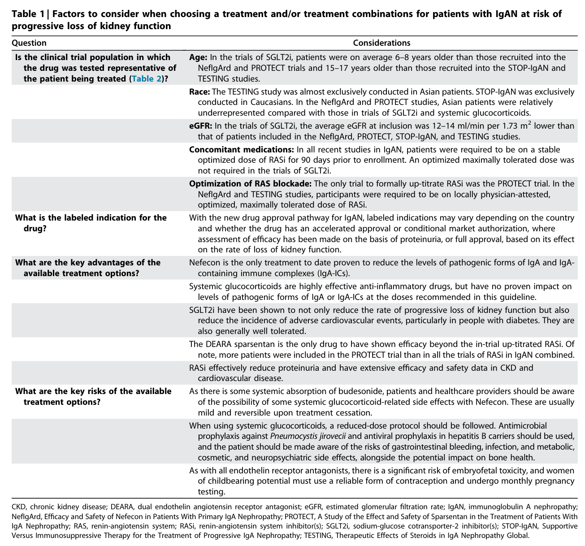

#### Table Data (CSV: [Table_1.csv](Table_1.csv))

```markdown
| Table Text (OCR) |
| :--- |
| Table 1 \| Factors to consider when choosing a treatment and/or treatment combinations for patients with IgAN at risk of progressive loss of kidney function Question  Considerations    Is the clinical trial population in which the drug was tested representative of the patient being treated (Table 2)?  Age: In the trials of SGLT2i, patients were on average 6-8 years older than those recruited into the NeflgArd and PROTECT trials and 15-17 years older than those recruited into the STOP-IgAN and TESTING studies.      Race: The TESTING study was almost exclusively conducted in Asian patients. STOP-IgAN was exclusively conducted in Caucasians. In the NeflgArd and PROTECT studies, Asian patients were relatively underrepresented compared with those in trials of SGLT2i and systemic glucocorticoids.      eGFR: In the trials of SGLT2i, the average eGFR at inclusion was 12-14 ml/min per 1.73 m2 lower than that of patients included in the NeflgArd, PROTECT, STOP-IgAN, and TESTING studies.      Concomitant medications: In all recent studies in IgAN, patients were required to be on a stable optimized dose of RASi for 90 days prior to enrollment. An optimized maximally tolerated dose was not required in the trials of SGLT2i.      Optimization of RAS blockade: The only trial to formally up-titrate RASi was the PROTECT trial. In the NeflgArd and TESTING studies, participants were required to be on locally physician-attested, optimized, maximally tolerated dose of RASi.    What is the labeled indication for the drug?  With the new drug approval pathway for IgAN, labeled indications may vary depending on the country and whether the drug has an accelerated approval or conditional market authorization, where assessment of efficacy has been made on the basis of proteinuria, or full approval, based on its effect on the rate of loss of kidney function.    What are the key advantages of the available treatment options?  Nefecon is the only treatment to date proven to reduce the levels of pathogenic forms of IgA and IgA-containing immune complexes (IgA-ICs).      Systemic glucocorticoids are highly effective anti-inflammatory drugs, but have no proven impact on levels of pathogenic forms of IgA or IgA-ICs at the doses recommended in this guideline.      SGLT2i have been shown to not only reduce the rate of progressive loss of kidney function but also reduce the incidence of adverse cardiovascular events, particularly in people with diabetes. They are also generally well tolerated.      The DEARA sparsentan is the only drug to have shown efficacy beyond the in-trial up-titrated RASi. Of note, more patients were included in the PROTECT trial than in all the trials of RASi in IgAN combined.      RASi effectively reduce proteinuria and have extensive efficacy and safety data in CKD and cardiovascular disease.    What are the key risks of the available treatment options?  As there is some systemic absorption of budesonide, patients and healthcare providers should be aware of the possibility of some systemic glucocorticoid-related side effects with Nefecon. These are usually mild and reversible upon treatment cessation.      When using systemic glucocorticoids, a reduced-dose protocol should be followed. Antimicrobial prophylaxis against Pneumocystis jirovecii and antiviral prophylaxis in hepatitis B carriers should be used, and the patient should be made aware of the risks of gastrointestinal bleeding, infection, and metabolic, cosmetic, and neuropsychiatric side effects, alongside the potential impact on bone health.      As with all endothelin receptor antagonists, there is a significant risk of embryofetal toxicity, and women of childbearing potential must use a reliable form of contraception and undergo monthly pregnancy testing. CKD, chronic kidney disease; DEARA, dual endothelin angiotensin receptor antagonist; eGFR, estimated glomerular filtration rate; IgAN, immunoglobulin A nephropathy NefIgArd, Efficacy and Safety of Nefecon in Patients With Primary IgA Nephropathy; PROTECT, A Study of the Effect and Safety of Sparsentan in the Treatment of Patients With IgA Nephropath ; RAS, renin-angiotensin s stem; RASi, renin-angiotensin s stem inhibitor(s); SGLT2i, sodium-glucose cotransporter-2 inhibitor(s); STOP-IgAN, Supportive Versus Immunosuppressive Therapy for the Treatment of Progressive IgA Nephropathy; TESTING, Therapeutic Effects of Steroids in IgA Nephropathy Global. |
```

Table 1 Factors to consider when choosing a treatment and/or treatment combinations for patients with IgAN at risk of progressive loss of kidney function

---

### Table_2

#### Table Image

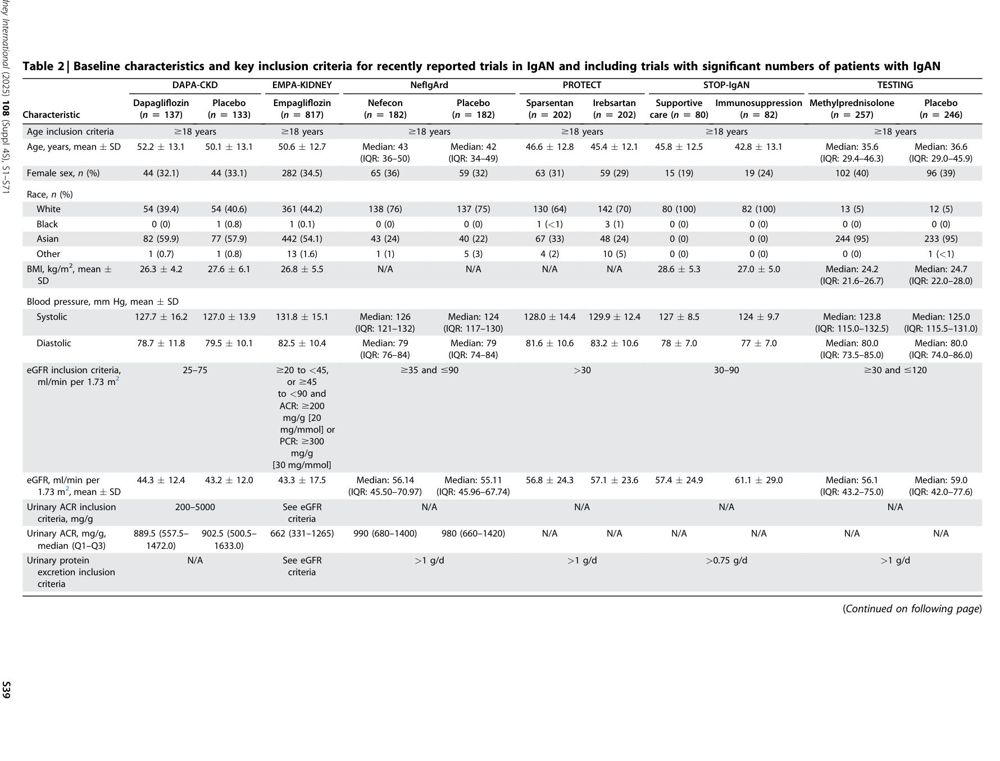

#### Table Data (CSV: [Table_2.csv](Table_2.csv))

```markdown
| Table Text (OCR) |
| :--- |
| Table 2 Baseline characteristics and key inclusion criteria for recently reported trials in IgAN and including trials with significant numbers of patients with IgAN |
```

Table 2 Baseline characteristics and key inclusion criteria for recently reported trials in IgAN and including trials with significant numbers of patients with IgAN

---

### Table_3

#### Table Image

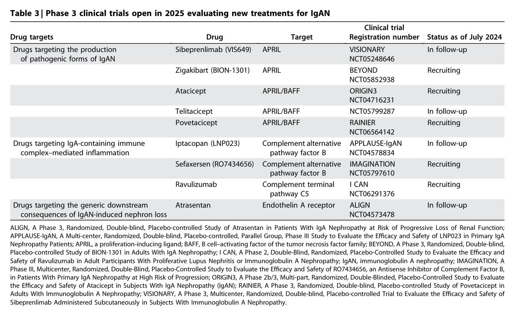

#### Table Data (CSV: [Table_3.csv](Table_3.csv))

```markdown
| Table Text (OCR) |
| :--- |
| Table 3 \| Phase 3 clinical trials open in 2025 evaluating new treatments for IgAN Drug targets  Drug  Target  Clinical trial Registration number  Status as of July 2024    Drugs targeting the production of pathogenic forms of IgAN  Sibeprenlimab (VIS649)  APRIL  VISIONARY NCT05248646  In follow-up      Zigakibart (BION-1301)  APRIL  BEYOND NCT05852938  Recruiting      Atacicept  APRIL/BAFF  ORIGIN3 NCT04716231  Recruiting      Telitacicept  APRIL/BAFF  NCT05799287  In follow-up      Povetacicept  APRIL/BAFF  RAINIER NCT06564142  Recruiting    Drugs targeting IgA-containing immune complex-mediated inflammation  Iptacopan (LNP023)  Complement alternative pathway factor B  APPLAUSE-IgAN NCT04578834  In follow-up      Sefaxersen (RO7434656)  Complement alternative pathway factor B  IMAGINATION NCT05797610  Recruiting      Ravulizumab  Complement terminal pathway C5  I CAN NCT06291376  Recruiting    Drugs targeting the generic downstream consequences of IgAN-induced nephron loss  Atrasentan  Endothelin A receptor  ALIGN NCT04573478  In follow-up ALGN A Phase, 3 Randomized Double-blind Placebo-controlled Study of Atrasentan in Patients With lgA Nephropathy at Risk of Progressive Loss of Renal Eunction APPL AUSE-lgAN, A Multi-center, Randomized, Double-blind, Placebo-controlled, Parallel Group, Phase II Study to Evaluate the Efficacy and Safety of INP023 in Primary lgA Nephropathy Patients: APRIL, a proliferation-inducing ligand: BAFE. B cell-activating factor of the tumor necrosis factor family: BEYOND. A Phase 3. Randomized, Double-blind Placebo-controlled Study of BiON-1301 in Adults With lgA Nephropathy: I CAN, A Phase 2. Double-Blind, Randomized, Placebo-Controlled Study to Evaluate the FEfficacy and Safety of Ravulizumab in Adult Participants With Proliferative Lupus Nephritis or Immunoglobulin A Nephropathy: lgAN, immunoglobulin A nephropathy: IMAGINATION. A Phase III, Multicenter, Randomized, Double-Blind, Placebo-Controlled Study to Evaluate the Efficacy and Safety of RO7434656, an Antisense Inhibitor of Complement Factor B in Patients With Primary IgA Nephropathy at High Risk of Progression; ORIGIN3, A Phase 2b/3, Multi-part, Randomized, Double-Blinded, Placebo-Controlled Study to Evaluate the Efficacy and Safety of Atacicept in Subjects With IgA Nephropathy (IgAN); RAINIER, A Phase 3, Randomized, Double-blind, Placebo-controlled Study of Povetacicept in Adults With Immunoglobulin A Nephropathy; VISIONARY, A Phase 3, Multicenter, Randomized, Double-blind, Placebo-controlled Trial to Evaluate the Efficacy and Safety o Sibeprenlimab Administered Subcutaneously in Subjects With Immunoglobulin A Nephropathy. |
```

Table 3 Phase 3 clinical trials open in 2025 evaluating new treatments for IgAN

---

### Table_4

#### Table Image

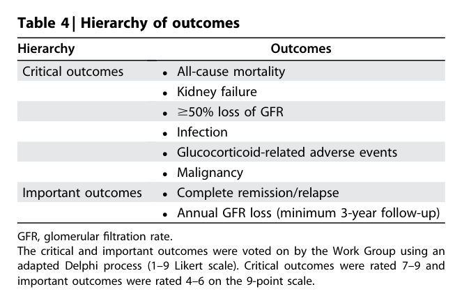

#### Table Data (CSV: [Table_4.csv](Table_4.csv))

```markdown
| Table Text (OCR) |
| :--- |
| Table 4 \| Hierarchy of outcomes Hierarchy  Outcomes    Critical outcomes  All-cause mortalityKidney failure≥50% loss of GFRInfectionGlucocorticoid-related adverse eventsMalignancy    Important outcomes  Complete remission/relapseAnnual GFR loss (minimum 3-year follow-up) GFR, glomerular filtration rate The critical and important outcomes were voted on by the Work Group using an adapted Delphi process (1–9 Likert scale). Critical outcomes were rated 7–9 and important outcomes were rated 4–6 on the 9-point scale |
```

Table 4 Hierarchy of outcomes

---

### Table_5

#### Table Image

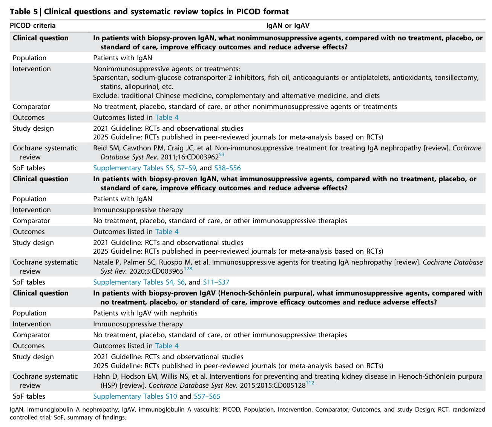

#### Table Data (CSV: [Table_5.csv](Table_5.csv))

```markdown
| Table Text (OCR) |
| :--- |
| Table 5 \| Clinical questions and systematic review topics in PICOD format PICOD criteria  IgAN or IgAV    Clinical question  In patients with biopsy-proven IgAN, what nonimmunosuppressive agents, compared with no treatment, placebo, or standard of care, improve efficacy outcomes and reduce adverse effects?    Population  Patients with IgAN    Intervention  Nonimmunosuppressive agents or treatments:Sparsentan, sodium-glucose cotransporter-2 inhibitors, fish oil, anticoagulants or antiplatelets, antioxidants, tonsillectomy, statins, allopurinol, etc.Exclude: traditional Chinese medicine, complementary and alternative medicine, and diets    Comparator  No treatment, placebo, standard of care, or other nonimmunosuppressive agents or treatments    Outcomes  Outcomes listed in Table 4    Study design  2021 Guideline: RCTs and observational studies2025 Guideline: RCTs published in peer-reviewed journals (or meta-analysis based on RCTs)    Cochrane systematic review  Reid SM, Cawthon PM, Craig JC, et al. Non-immunosuppressive treatment for treating IgA nephropathy [review]. Cochrane Database Syst Rev. 2011;16:CD003962 ^{53}     SoF tables  Supplementary Tables S5, S7–S9, and S38–S56    Clinical question  In patients with biopsy-proven IgAN, what immunosuppressive agents, compared with no treatment, placebo, or standard of care, improve efficacy outcomes and reduce adverse effects?    Population  Patients with IgAN    Intervention  Immunosuppressive therapy    Comparator  No treatment, placebo, standard of care, or other immunosuppressive therapies    Outcomes  Outcomes listed in Table 4    Study design  2021 Guideline: RCTs and observational studies2025 Guideline: RCTs published in peer-reviewed journals (or meta-analysis based on RCTs)    Cochrane systematic review  Natale P, Palmer SC, Ruospo M, et al. Immunosuppressive agents for treating IgA nephropathy [review]. Cochrane Database Syst Rev. 2020;3:CD003965 ^{128}     SoF tables  Supplementary Tables S4, S6, and S11–S37    Clinical question  In patients with biopsy-proven IgAV (Henoch-Schönlein purpura), what immunosuppressive agents, compared with no treatment, placebo, or standard of care, improve efficacy outcomes and reduce adverse effects?    Population  Patients with IgAV with nephritis    Intervention  Immunosuppressive therapy    Comparator  No treatment, placebo, standard of care, or other immunosuppressive therapies    Outcomes  Outcomes listed in Table 4    Study design  2021 Guideline: RCTs and observational studies2025 Guideline: RCTs published in peer-reviewed journals (or meta-analysis based on RCTs)    Cochrane systematic review  Hahn D, Hodson EM, Willis NS, et al. Interventions for preventing and treating kidney disease in Henoch-Schönlein purpura (HSP) [review]. Cochrane Database Syst Rev. 2015;2015:CD005128 ^{112}     SoF tables  Supplementary Tables S10 and S57–S65 IgAN, immunoglobulin A nephropathy; IgAV, immunoglobulin A vasculitis; PICOD, Population, Intervention, Comparator, Outcomes, and study Design; RCT, randomize controlled trial; SoF, summary of findings. |
```

Table 5 Clinical questions and systematic review topics in PICOD format

---

### Table_6

#### Table Image

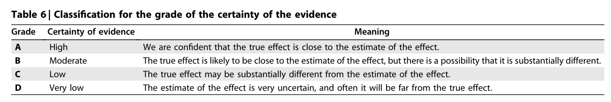

#### Table Data (CSV: [Table_6.csv](Table_6.csv))

```markdown
| Table Text (OCR) |
| :--- |
| Table 6 \| Classification for the grade of the certainty of the evidence Grade  Certainty of evidence  Meaning    A  High  We are confident that the true effect is close to the estimate of the effect.    B  Moderate  The true effect is likely to be close to the estimate of the effect, but there is a possibility that it is substantially different.    C  Low  The true effect may be substantially different from the estimate of the effect.    D  Very low  The estimate of the effect is very uncertain, and often it will be far from the true effect. |
```

Table 6 Classification for the grade of the certainty of the evidence

---

### Table_7

#### Table Image

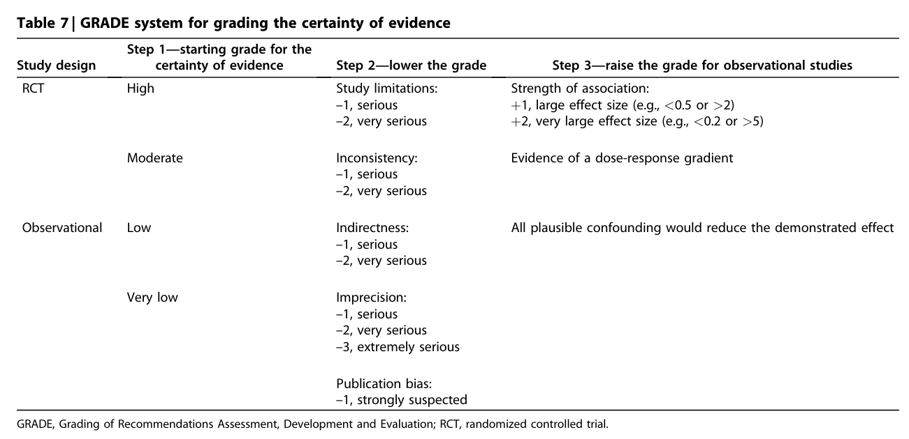

#### Table Data (CSV: [Table_7.csv](Table_7.csv))

```markdown
| Table Text (OCR) |
| :--- |
| Table 7 \| GRADE system for grading the certainty of evidence Study design  Step 1—starting grade for the certainty of evidence  Step 2—lower the grade  Step 3—raise the grade for observational studies    RCT  High  Study limitations:-1, serious-2, very serious  Strength of association:+1, large effect size (e.g., <0.5 or >2)+2, very large effect size (e.g., <0.2 or >5)    Moderate  Inconsistency:-1, serious-2, very serious  Evidence of a dose-response gradient    Observational  Low  Indirectness:-1, serious-2, very serious  All plausible confounding would reduce the demonstrated effect    Very low  Imprecision:-1, serious-2, very serious-3, extremely serious      Publication bias:-1, strongly suspected GRADE, Grading of Recommendations Assessment, Development and Evaluation; RCT, randomized controlled trial. |
```

Table 7 GRADE system for grading the certainty of evidence

---

### Table_8

#### Table Image

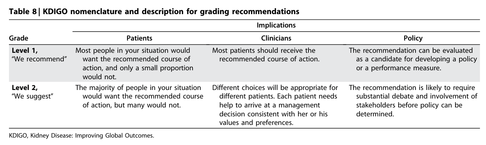

#### Table Data (CSV: [Table_8.csv](Table_8.csv))

```markdown
| Table Text (OCR) |
| :--- |
| Table 8 \| KDIGO nomenclature and description for grading recommendations Grade  Implications    Patients  Clinicians  Policy    Level 1, “We recommend”  Most people in your situation would want the recommended course of action, and only a small proportion would not.  Most patients should receive the recommended course of action.  The recommendation can be evaluated as a candidate for developing a policy or a performance measure.    Level 2, “We suggest”  The majority of people in your situation would want the recommended course of action, but many would not.  Different choices will be appropriate for different patients. Each patient needs help to arrive at a management decision consistent with her or his values and preferences.  The recommendation is likely to require substantial debate and involvement of stakeholders before policy can be determined. KDIGO, Kidney Disease: Improving Global Outcomes. |
```

Table 8 KDIGO nomenclature and description for grading recommendations

---

### Table_9

#### Table Image

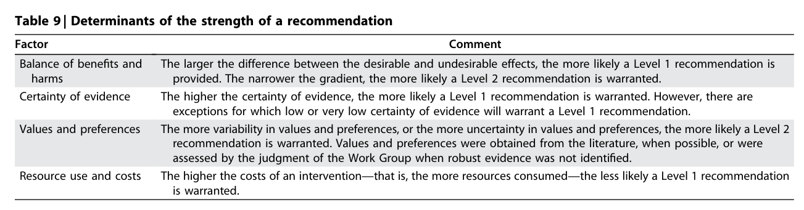

#### Table Data (CSV: [Table_9.csv](Table_9.csv))

```markdown
| Table Text (OCR) |
| :--- |
| Table 9 \| Determinants of the strength of a recommendation Factor  Comment    Balance of benefits and harms  The larger the difference between the desirable and undesirable effects, the more likely a Level 1 recommendation is provided. The narrower the gradient, the more likely a Level 2 recommendation is warranted.    Certainty of evidence  The higher the certainty of evidence, the more likely a Level 1 recommendation is warranted. However, there are exceptions for which low or very low certainty of evidence will warrant a Level 1 recommendation.    Values and preferences  The more variability in values and preferences, or the more uncertainty in values and preferences, the more likely a Level 2 recommendation is warranted. Values and preferences were obtained from the literature, when possible, or were assessed by the judgment of the Work Group when robust evidence was not identified.    Resource use and costs  The higher the costs of an intervention—that is, the more resources consumed—the less likely a Level 1 recommendation is warranted. |
```

Table 9 Determinants of the strength of a recommendation

---
