# KDIGO-2026-Anemia-in-CKD-Guideline - Figures and Tables Index

This document lists all figures and tables extracted from `KDIGO-2026-Anemia-in-CKD-Guideline.pdf`.

## Table of Contents
- [Figures](#figures)
- [Tables](#tables)

---

## Figures

### Fig_1

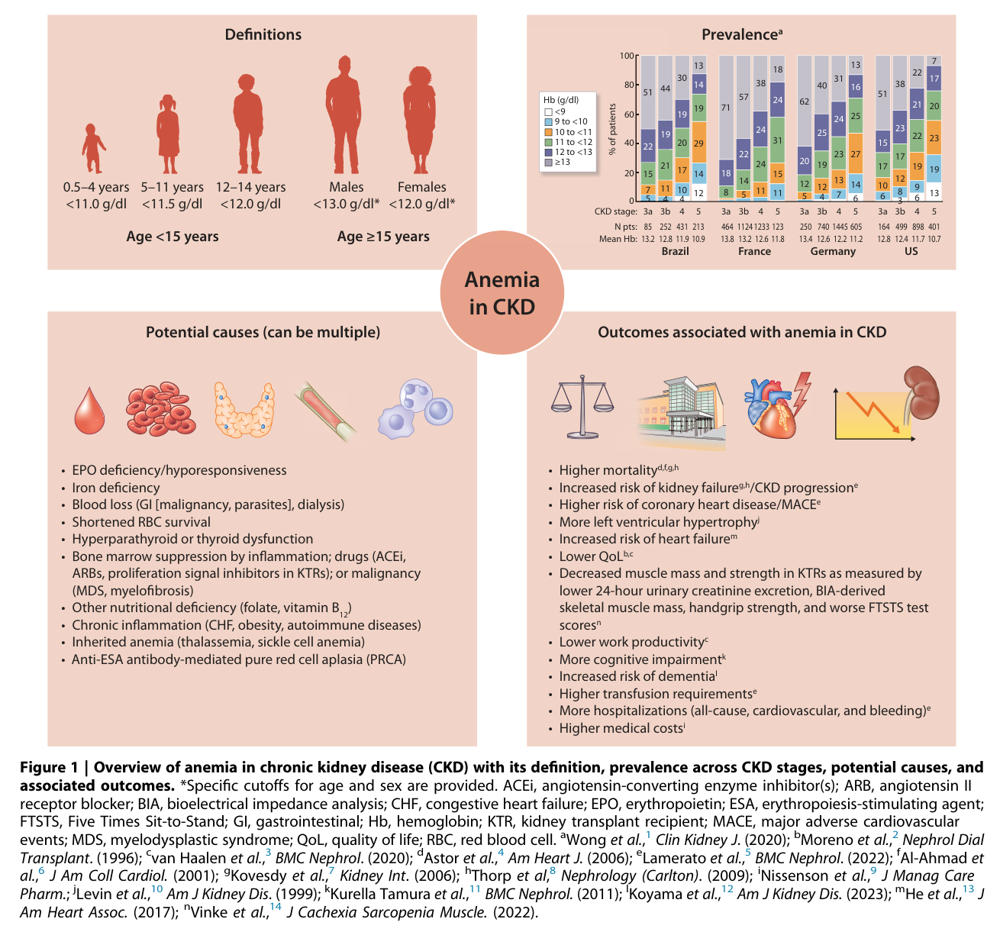

Figure 1 Overview of anemia in chronic kidney disease (CKD) with its definition, prevalence across CKD stages, potential causes, and associated outcomes

---

### Fig_2

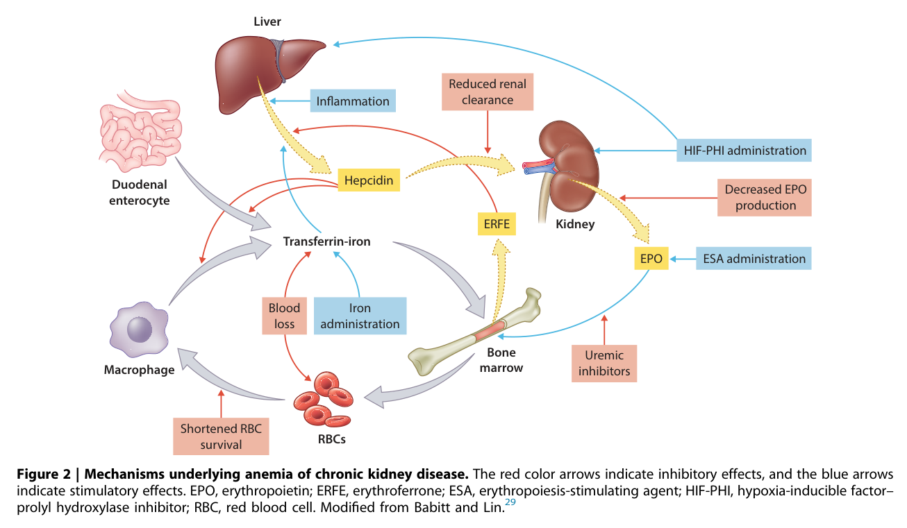

Figure 2 Mechanisms underlying anemia of chronic kidney disease

---

### Fig_3

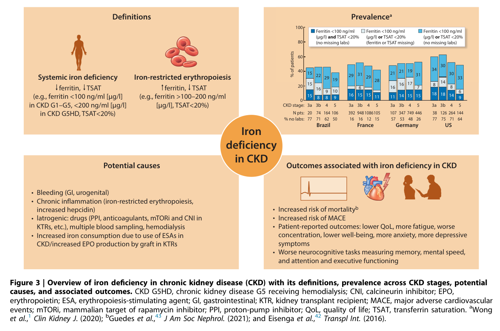

Figure 3 Overview of iron deficiency in chronic kidney disease (CKD) with its definitions, prevalence across CKD stages, potential causes, and associated outcomes

---

### Fig_4

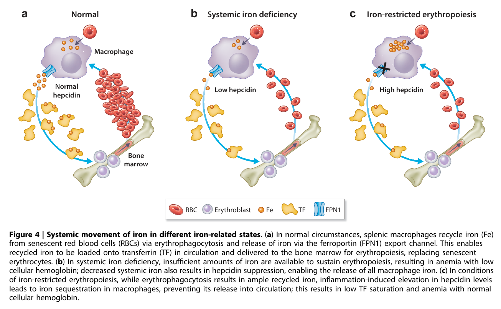

Figure 4 Systemic movement of iron in different iron-related states

---

### Fig_5

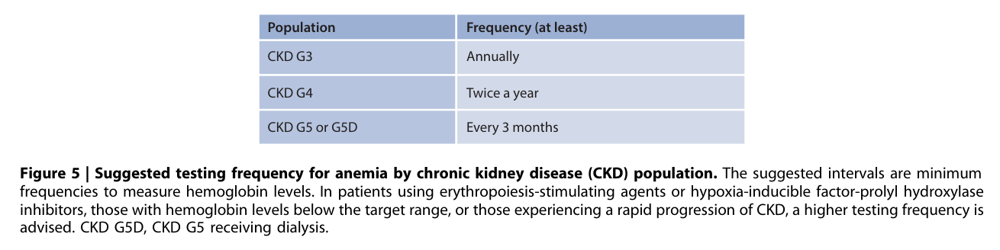

Figure 5 Suggested testing frequency for anemia by chronic kidney disease (CKD) population

---

### Fig_6

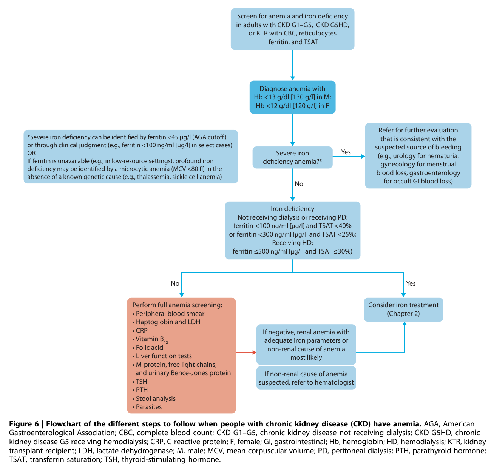

Figure 6 Flowchart of the different steps to follow when people with chronic kidney disease (CKD) have anemia

---

### Fig_7

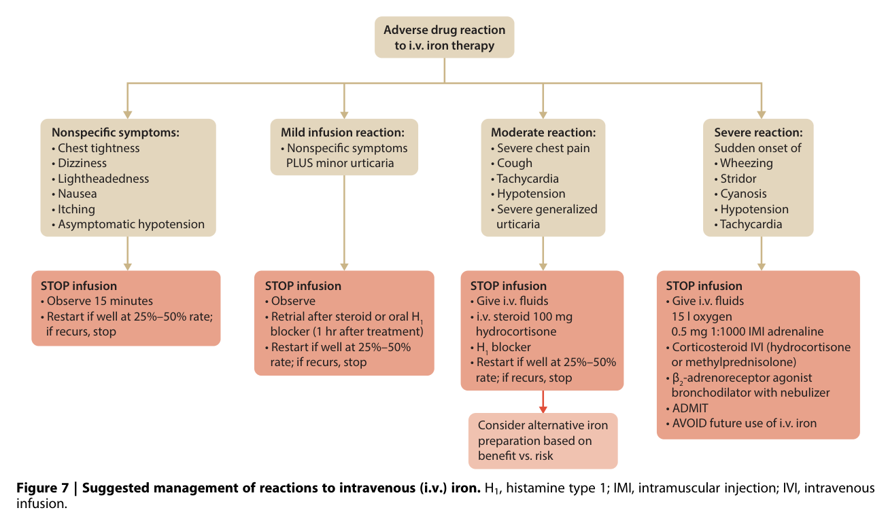

Figure 7 Suggested management of reactions to intravenous (i.v.) iron

---

### Fig_8

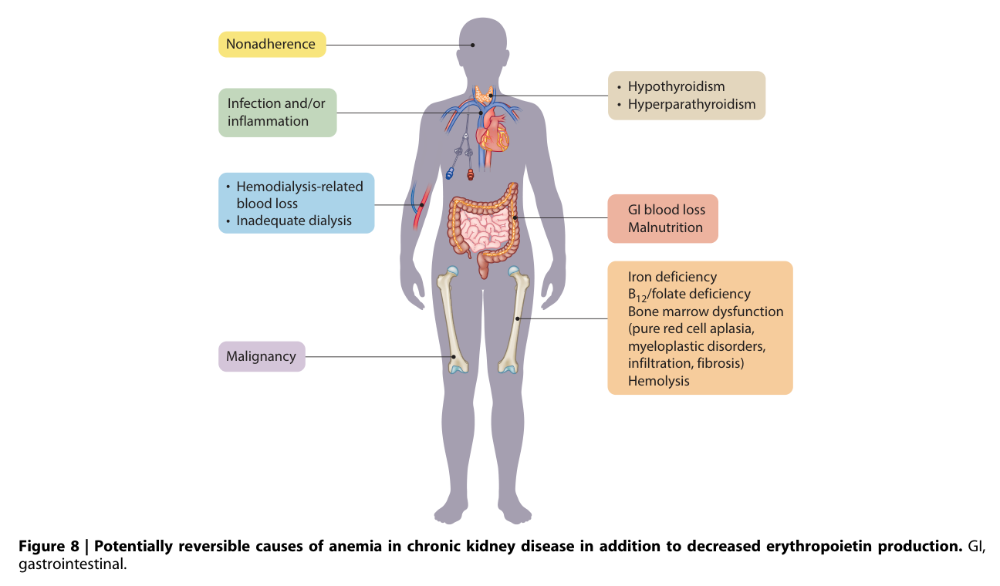

Figure 8 Potentially reversible causes of anemia in chronic kidney disease in addition to decreased erythropoietin production

---

### Fig_9

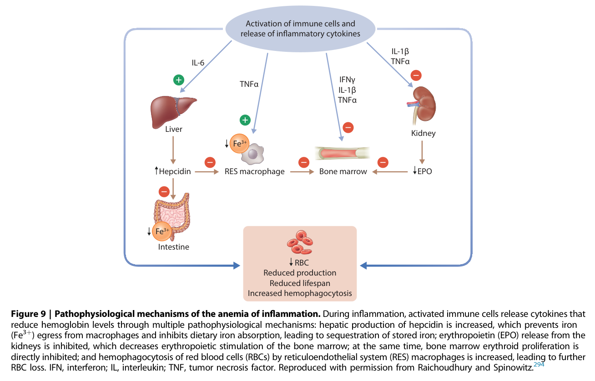

Figure 9 Pathophysiological mechanisms of the anemia of inflammation

---

### Fig_10

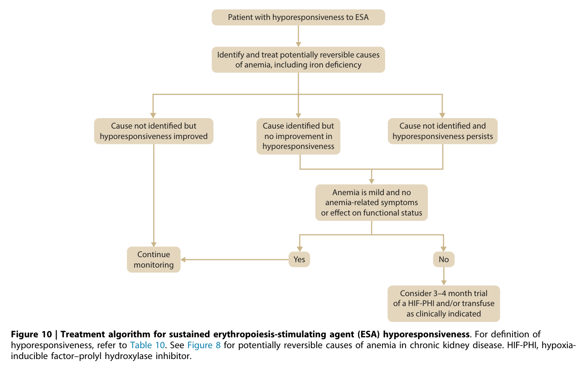

Figure 10 Treatment algorithm for sustained erythropoiesis-stimulating agent (ESA) hyporesponsiveness

---

### Fig_11

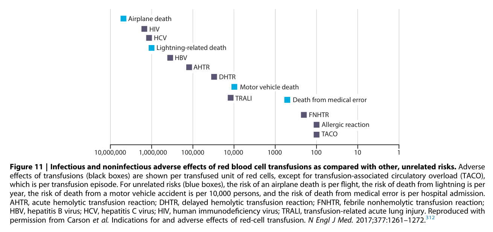

Figure 11 Infectious and noninfectious adverse effects of red blood cell transfusions as compared with other, unrelated risks

---

### Fig_12

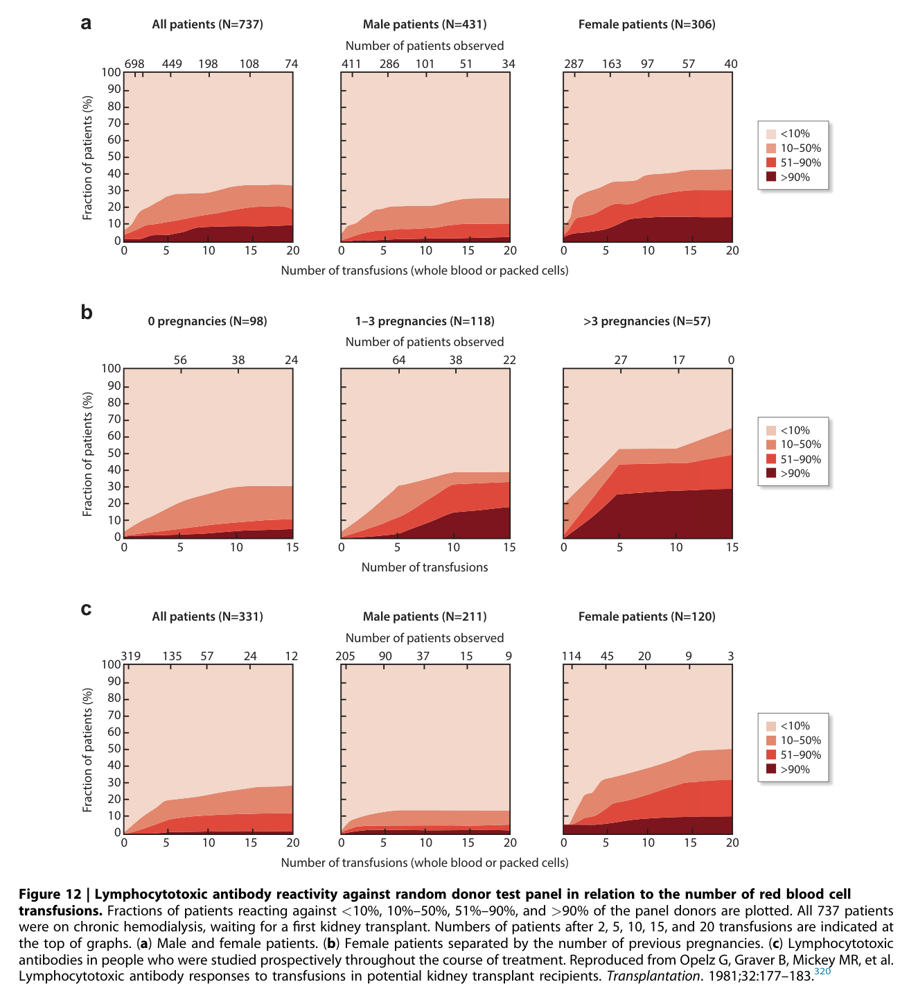

Figure 12 Lymphocytotoxic antibody reactivity against random donor test panel in relation to the number of red blood cell transfusions

---

### Fig_13

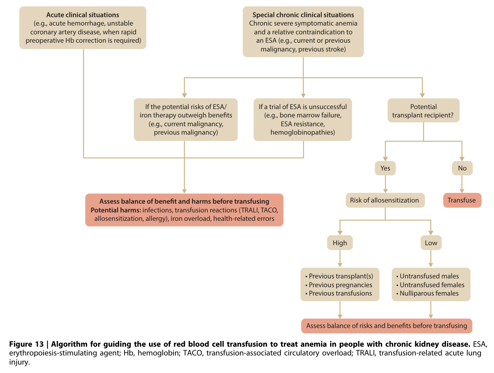

Figure 13 Algorithm for guiding the use of red blood cell transfusion to treat anemia in people with chronic kidney disease

---

### Fig_14

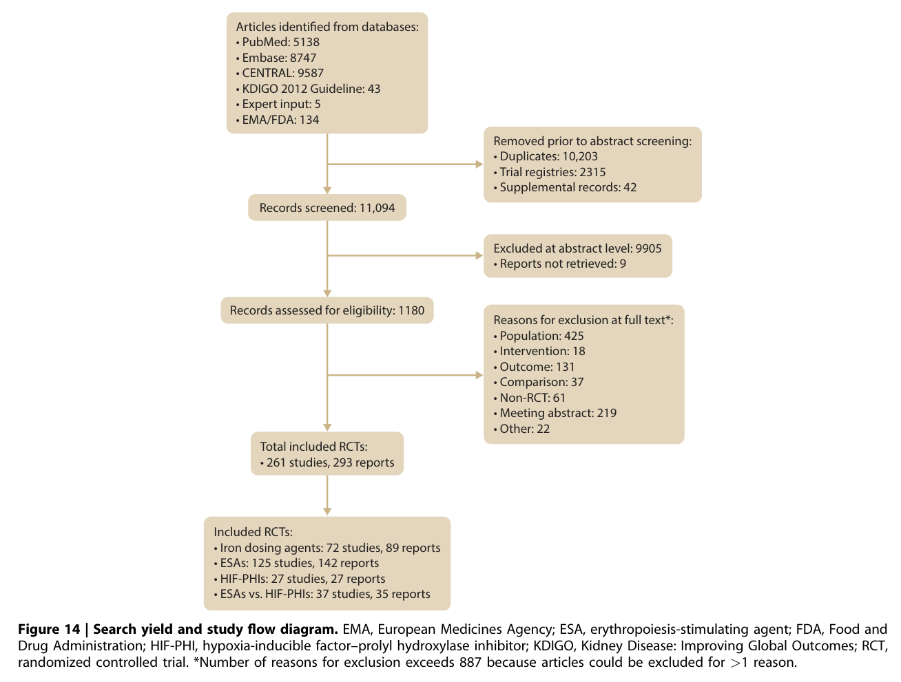

Figure 14 Search yield and study flow diagram

---

## Tables

### Table_1

#### Table Image

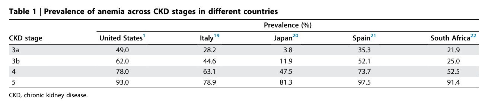

#### Table Data (CSV: [Table_1.csv](Table_1.csv))

```markdown
| Table Text (OCR) |
| :--- |
| Table 1 \| Prevalence of anemia across CKD stages in different countries CKD stage  Prevalence (%)    United States1   { \mathsf { I t a l y } } ^ { 1 9 }    \mathsf { J a p a n } ^ { 2 0 }    \mathsf { S p a i n } ^ { 2 1 }   South  \mathsf { A f r i c a } ^ { 2 2 }     3a  49.0  28.2  3.8  35.3  21.9    3b  62.0  44.6  11.9  52.1  25.0    4  78.0  63.1  47.5  73.7  52.5    5  93.0  78.9  81.3  97.5  91.4 CKD, chronic kidney disease. |
```

Table 1 Prevalence of anemia across CKD stages in different countries

---

### Table_2

#### Table Image

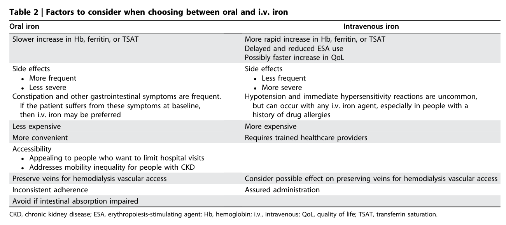

#### Table Data (CSV: [Table_2.csv](Table_2.csv))

```markdown
| Table Text (OCR) |
| :--- |
| Table 2 \| Factors to consider when choosing between oral and i.v. iron Oral iron  Intravenous iron    Slower increase in Hb, ferritin, or TSAT  More rapid increase in Hb, ferritin, or TSAT Delayed and reduced ESA use    Side effects  Possibly faster increase in QoL Side effects    • More frequent  • Less frequent    • Less severe  • More severe    Constipation and other gastrointestinal symptoms are frequent. If the patient suffers from these symptoms at baseline,  Hypotension and immediate hypersensitivity reactions are uncommon, but can occur with any i.v. iron agent, especially in people with a    then i.v. iron may be preferred Less expensive  history of drug allergies More expensive    More convenient  Requires trained healthcare providers    Accessibility • Appealing to people who want to limit hospital visits      • Addresses mobility inequality for people with CKD      Preserve veins for hemodialysis vascular access Inconsistent adherence  Consider possible effect on preserving veins for hemodialysis vascular access    Avoid if intestinal absorption impaired  Assured administration CKD, chronic kidney disease; ESA, erythropoiesis-stimulating agent; Hb, hemoglobin; i.v., intravenous; QoL, quality of life; TSAT, transferrin saturation. |
```

Table 2 Factors to consider when choosing between oral and i.v. iron

---

### Table_3

#### Table Image

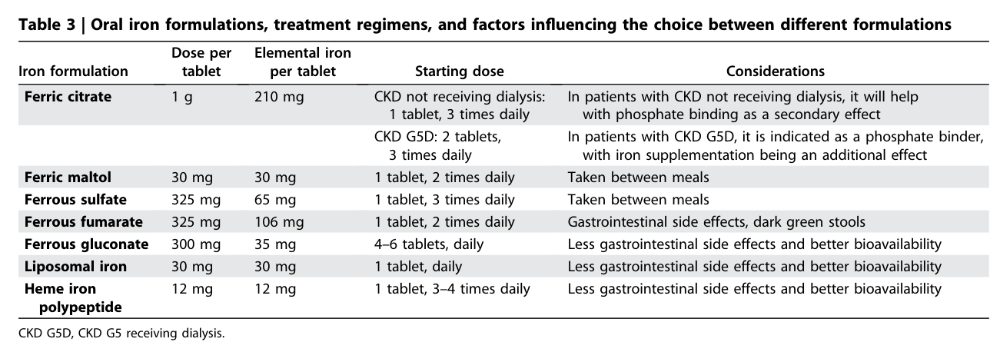

#### Table Data (CSV: [Table_3.csv](Table_3.csv))

```markdown
| Table Text (OCR) |
| :--- |
| Table 3 \| Oral iron formulations, treatment regimens, and factors in<sup>fl</sup>uencing the choice between different formulations Iron formulation  Dose per tablet  Elemental iron per tablet  Starting dose  Considerations    Ferric citrate  1 g  210 mg  CKD not receiving dialysis: 1 tablet, 3 times daily  In patients with CKD not receiving dialysis, it will help with phosphate binding as a secondary effect          CKD G5D: 2 tablets, 3 times daily  In patients with CKD G5D, it is indicated as a phosphate binder, with iron supplementation being an additional effect    Ferric maltol  30 mg  30 mg  1 tablet, 2 times daily  Taken between meals    Ferrous sulfate  325 mg  65 mg  1 tablet, 3 times daily  Taken between meals    Ferrous fumarate  325 mg  106 mg  1 tablet, 2 times daily  Gastrointestinal side effects, dark green stools    Ferrous gluconate  300 mg  35 mg  4–6 tablets, daily  Less gastrointestinal side effects and better bioavailability    Liposomal iron  30 mg  30 mg  1 tablet, daily  Less gastrointestinal side effects and better bioavailability    Heme iron polypeptide  12 mg  12 mg  1 tablet, 3–4 times daily  Less gastrointestinal side effects and better bioavailability CKD G5D, CKD G5 receiving dialysis. |
```

Table 3 Oral iron formulations, treatment regimens, and factors influencing the choice between different formulations

---

### Table_4

#### Table Image

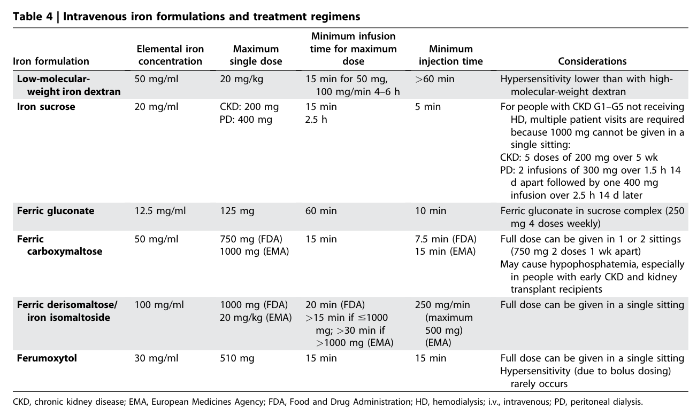

#### Table Data (CSV: [Table_4.csv](Table_4.csv))

```markdown
| Table Text (OCR) |
| :--- |
| Table 4 \| Intravenous iron formulations and treatment regimens Elemental iron  Maximum single dose  Minimum infusion time for maximum Minimum  Considerations    Iron formulation Low-molecular-  concentration 50 mg/ml  dose 15 min for 50 mg,  injection time >60 min    weight iron dextran Iron sucrose  20 mg/ml  20 mg/kg CKD: 200 mg PD: 400 mg  100 mg/min 4–6 h 15 min 2.5 h  5 min  Hypersensitivity lower than with high- molecular-weight dextran For people with CKD G1–G5 not receiving HD, multiple patient visits are required because 1000 mg cannot be given in a    Ferric gluconate          single sitting: CKD: 5 doses of 200 mg over 5 wk PD: 2 infusions of 300 mg over 1.5 h 14 d apart followed by one 400 mg infusion over 2.5 h 14 d later    Ferric carboxymaltose  12.5 mg/ml 50 mg/ml  125 mg 750 mg (FDA)  60 min 15 min  10 min 7.5 min (FDA)  Ferric gluconate in sucrose complex (250 mg 4 doses weekly) Full dose can be given in 1 or 2 sittings        1000 mg (EMA)    15 min (EMA)  (750 mg 2 doses 1 wk apart) May cause hypophosphatemia, especially in people with early CKD and kidney transplant recipients    Ferric derisomaltose/ iron isomaltoside  100 mg/ml  1000 mg (FDA) 20 mg/kg (EMA)  20 min (FDA) >15 min if ≤1000 mg; >30 min if >1000 mg (EMA)  250 mg/min (maximum 500 mg) (EMA)  Full dose can be given in a single sitting    Ferumoxytol  30 mg/ml  510 mg  15 min  15 min  Full dose can be given in a single sitting Hypersensitivity (due to bolus dosing) rarely occurs CKD, chronic kidney disease; EMA, European Medicines Agency; FDA, Food and Drug Administration; HD, hemodialysis; i.v., intravenous; PD, peritoneal dialysis. |
```

Table 4 Intravenous iron formulations and treatment regimens

---

### Table_5

#### Table Image

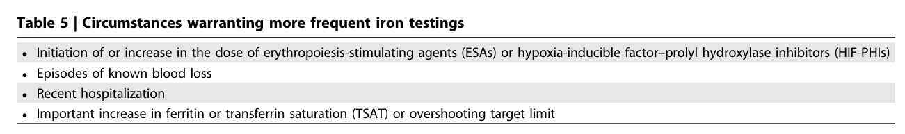

#### Table Data (CSV: [Table_5.csv](Table_5.csv))

```markdown
| Table Text (OCR) |
| :--- |
| Table 5 \| Circumstances warranting more frequent iron testings • Initiation of or increase in the dose of erythropoiesis-stimulating agents (ESAs) or hypoxia-inducible factor-prolyl hydroxylase inhibitors (HIF-PHls)    • Episodes of known blood loss    • Recent hospitalization    • Important increase in ferritin or transferrin saturation (TSAT) or overshooting target limit |
```

Table 5 Circumstances warranting more frequent iron testings

---

### Table_6

#### Table Image

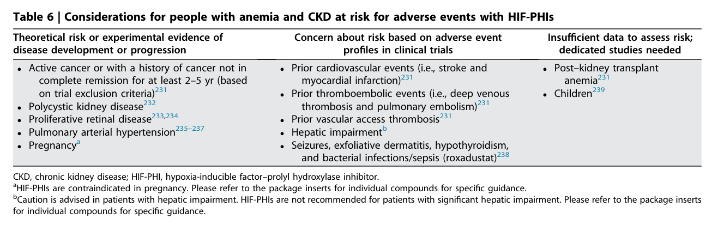

#### Table Data (CSV: [Table_6.csv](Table_6.csv))

```markdown
| Table Text (OCR) |
| :--- |
| Table 6 \| Considerations for people with anemia and CKD at risk for adverse events with HIF-PHIs Theoretical risk or experimental evidence of disease development or progression  Concern about risk based on adverse event profiles in clinical trials  Insufficient data to assess risk; dedicated studies needed    • Active cancer or with a history of cancer not in complete remission for at least 2–5 yr (based  • Prior cardiovascular events (i.e., stroke and myocardial infarction)231  • Post-kidney transplant anemia 231    on trial exclusion criteria)231  • Prior thromboembolic events (i.e., deep venous  • Children239    Polycystic kidney disease232  thrombosis and pulmonary embolism)231      Proliferative retinal disease233,234 235-237  • Prior vascular access thrombosis231      Pulmonary arterial hypertension Pregnancyª  • Hepatic impairmentb        • Seizures, exfoliative dermatitis, hypothyroidism and bacterial infections/sepsis (roxadustat) 238 CKD, chronic kidney disease; HIF-PHI, hypoxia-inducible factor–prolyl hydroxylase inhibitor. <sup>a</sup>HIF-PHIs are contraindicated in pregnancy. Please refer to the package inserts for individual compounds for speci<sup>fi</sup>c guidance. <sup>b</sup>Caution is advised in patients with hepatic impairment. HIF-PHIs are not recommended for patients with signi<sup>fi</sup>cant hepatic impairment. Please refer to the package inserts for individual compounds for speci<sup>fi</sup>c guidance. |
```

Table 6 Considerations for people with anemia and CKD at risk of adverse events with HIF-PHIs

---

### Table_7

#### Table Image

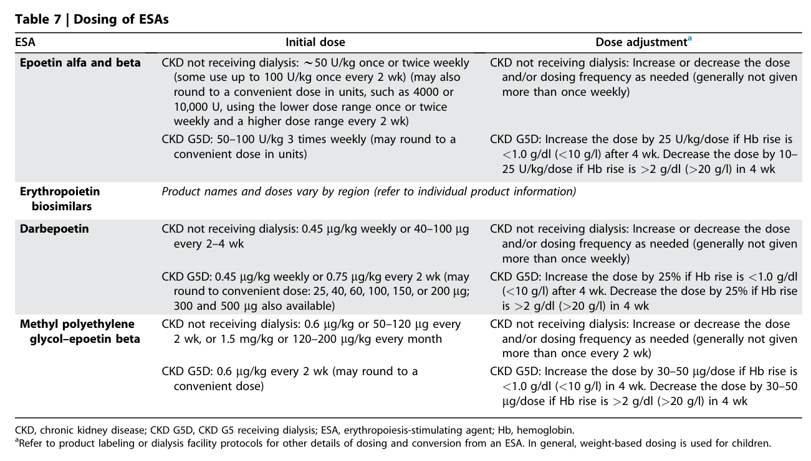

#### Table Data (CSV: [Table_7.csv](Table_7.csv))

```markdown
| Table Text (OCR) |
| :--- |
| Table 7 \| Dosing of ESAs ESA  Initial dose  Dose adjustmenta    Epoetin alfa and beta  CKD not receiving dialysis: ～ 50 U/kg once or twice weekly (some use up to 100 U/kg once every 2 wk) (may also round to a convenient dose in units, such as 4000 or 10,000 U, using the lower dose range once or twice weekly and a higher dose range every 2 wk)  CKD not receiving dialysis: Increase or decrease the dose and/or dosing frequency as needed (generally not given more than once weekly)    CKD G5D: 50–100 U/kg 3 times weekly (may round to a convenient dose in units)  CKD G5D: Increase the dose by 25 U/kg/dose if Hb rise is <1.0 g/dl (<10 g/l) after 4 wk. Decrease the dose by 10– 25 U/kg/dose if Hb rise is >2 g/dl (>20 g/l) in 4 wk    Erythropoietin biosimilars  Product names and doses vary by region (refer to individual product information)    Darbepoetin Methyl polyethylene  CKD not receiving dialysis: 0.45 μg/kg weekly or 40–100 μg every 2–4 wk  CKD not receiving dialysis: Increase or decrease the dose and/or dosing frequency as needed (generally not given more than once weekly)    CKD G5D: 0.45 μg/kg weekly or 0.75 μg/kg every 2 wk (may round to convenient dose: 25, 40, 60, 100, 150, or 200 μg; 300 and 500 μg also available)  CKD G5D: Increase the dose by 25% if Hb rise is <1.0 g/dl (<10 g/l) after 4 wk. Decrease the dose by 25% if Hb rise is >2 g/dl (>20 g/l) in 4 wk    CKD not receiving dialysis: 0.6 μg/kg or 50–120 μg every 2 wk, or 1.5 mg/kg or 120–200 μg/kg every month  CKD not receiving dialysis: Increase or decrease the dose and/or dosing frequency as needed (generally not given more than once every 2 wk)    glycol-epoetin beta  CKD G5D: 0.6 μg/kg every 2 wk (may round to a convenient dose)  CKD G5D: Increase the dose by 30–50 μg/dose if Hb rise is <1.0 g/dl (<10 g/l) in 4 wk. Decrease the dose by 30–50      μg/dose if Hb rise is >2 g/dl (>20 g/l) in 4 wk CKD, chronic kidney disease; CKD G5D, CKD G5 receiving dialysis; ESA, erythropoiesis-stimulating agent; Hb, hemoglobin. <sup>a</sup>Refer to product labeling or dialysis facility protocols for other details of dosing and conversion from an ESA. In general, weight-based dosing is used for children. |
```

Table 7 Dosing of ESAs

---

### Table_8

#### Table Image

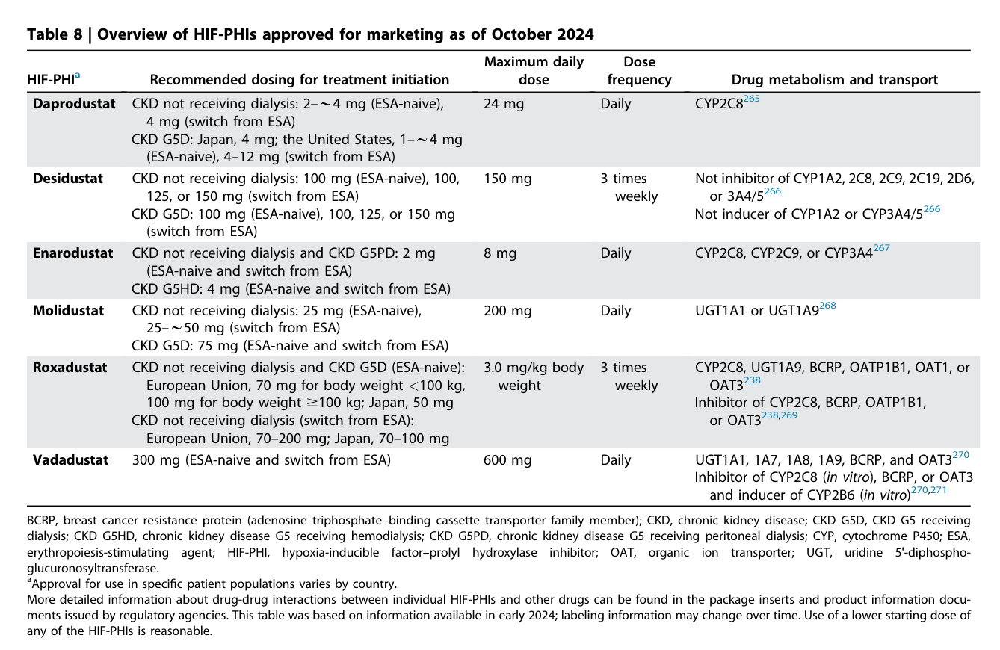

#### Table Data (CSV: [Table_8.csv](Table_8.csv))

```markdown
| Table Text (OCR) |
| :--- |
| Table 8 \| Overview of HIF-PHIs approved for marketing as of October 2024 HIF-PHIa  Recommended dosing for treatment initiation  Maximum daily dose  Dose frequency  Drug metabolism and transport    Daprodustat  CKD not receiving dialysis: 2–~4 mg (ESA-naive), 4 mg (switch from ESA) CKD G5D: Japan, 4 mg; the United States, 1–~4 mg  24 mg  Daily  CYP2C8265    Desidustat  (ESA-naive), 4–12 mg (switch from ESA) CKD not receiving dialysis: 100 mg (ESA-naive), 100, 125, or 150 mg (switch from ESA) CKD G5D: 100 mg (ESA-naive), 100, 125, or 150 mg  150 mg  3 times weekly  Not inhibitor of CYP1A2, 2C8, 2C9, 2C19, 2D6, or 3A4/5266 Not inducer of CYP1A2 or CYP3A4/5266    Enarodustat  (switch from ESA) CKD not receiving dialysis and CKD G5PD: 2 mg (ESA-naive and switch from ESA)  8 mg  Daily  CYP2C8, CYP2C9, or CYP3A4267    Molidustat  CKD G5HD: 4 mg (ESA-naive and switch from ESA) CKD not receiving dialysis: 25 mg (ESA-naive), 25–～ 50 mg (switch from ESA)  200 mg  Daily  UGT1A1 or UGT1A9268    Roxadustat  CKD G5D: 75 mg (ESA-naive and switch from ESA) CKD not receiving dialysis and CKD G5D (ESA-naive): European Union, 70 mg for body weight <100 kg, 100 mg for body weight ≥100 kg; Japan, 50 mg  3.0 mg/kg body 3 times weight  weekly  CYP2C8, UGT1A9, BCRP, OATP1B1, OAT1, or OAT3238 Inhibitor of CYP2C8, BCRP, OATP1B1,    Vadadustat  CKD not receiving dialysis (switch from ESA): European Union, 70–200 mg; Japan, 70–100 mg 300 mg (ESA-naive and switch from ESA)  600 mg  Daily  or OAT3238,269 UGT1A1, 1A7, 1A8, 1A9, BCRP, and OAT3270 Inhibitor of CYP2C8 (in vitro), BCRP, or OAT3 and inducer of CYP2B6 (in vitro)270,271 |
```

Table 8 Overview of HIF-PHIs approved for marketing as of October 2024

---

### Table_9

#### Table Image

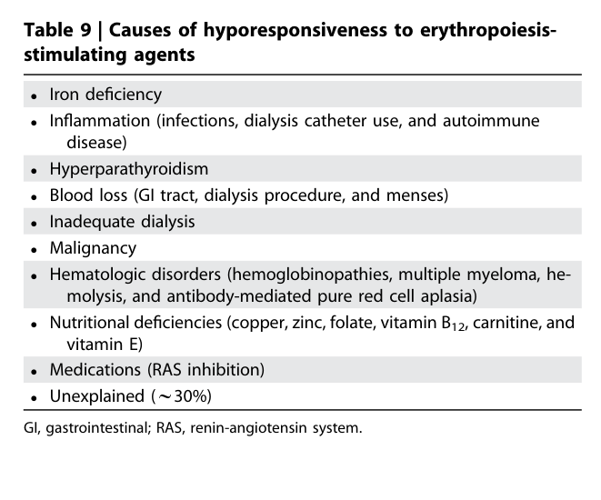

#### Table Data (CSV: [Table_9.csv](Table_9.csv))

```markdown
| Table Text (OCR) |
| :--- |
| Table 9 \| Causes of hyporesponsiveness to erythropoiesisstimulating agents images/18d889fa70693caa729591c1d98fb7cba6d303d47b3ab28a66767f2d2f31a673.jpg GI, gastrointestinal; RAS, renin-angiotensin system <table><tr><td rowspan=1 colspan=1>• Iron deficiency</td></tr><tr><td rowspan=1 colspan=1>• Inflammation (infections, dialysis catheter use, and autoimmunedisease)</td></tr><tr><td rowspan=1 colspan=1>• Hyperparathyroidism</td></tr><tr><td rowspan=1 colspan=1>• Blood loss (GI tract, dialysis procedure, and menses)</td></tr><tr><td rowspan=1 colspan=1>• Inadequate dialysis</td></tr><tr><td rowspan=1 colspan=1>• Malignancy</td></tr><tr><td rowspan=1 colspan=1>• Hematologic disorders (hemoglobinopathies, multiple myeloma, he-molysis, and antibody-mediated pure red cell aplasia)</td></tr><tr><td rowspan=1 colspan=1>• Nutritional deficiencies (copper, zinc, folate, vitamin B12, carnitine, andvitamin E)</td></tr><tr><td rowspan=1 colspan=1>• Medications (RAS inhibition)• Unexplained (~30%)</td></tr></table> complex_table |
```

Table 9 Causes of hyporesponsiveness to erythropoiesis-stimulating agents

---

### Table_10

#### Table Image

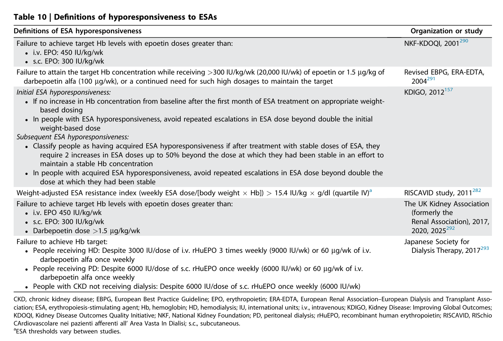

#### Table Data (CSV: [Table_10.csv](Table_10.csv))

```markdown
| Table Text (OCR) |
| :--- |
| Table 10 \| De<sup>fi</sup>nitions of hyporesponsiveness to ESAs Definitions of ESA hyporesponsiveness  Organization or study    Failure to achieve target Hb levels with epoetin doses greater than: ● i.v. EPO: 450 IU/kg/wk • s.c. EPO: 300 IU/kg/wk  NKF-KDOQI, 2001290    Failure to attain the target Hb concentration while receiving >300 lU/kg/wk (20,000 IU/wk) of epoetin or 1.5 μg/kg of darbepoetin alfa (100 μg/wk), or a continued need for such high dosages to maintain the target  Revised EBPG, ERA-EDTA, 2004291    Initial ESA hyporesponsiveness: • If no increase in Hb concentration from baseline after the first month of ESA treatment on appropriate weight- based dosing  KDIGO, 2012157    • In people with ESA hyporesponsiveness, avoid repeated escalations in ESA dose beyond double the initial weight-based dose      Subsequent ESA hyporesponsiveness: • Classify people as having acquired ESA hyporesponsiveness if after treatment with stable doses of ESA, they require 2 increases in ESA doses up to 50% beyond the dose at which they had been stable in an effort to      maintain a stable Hb concentration • In people with acquired ESA hyporesponsiveness, avoid repeated escalations in ESA dose beyond double the      dose at which they had been stable Weight-adjusted ESA resistance index (weekly ESA dose/[body weight × Hb]) > 15.4 IU/kg × g/dI (quartile IV)a  RISCAVID study, 2011282    Failure to achieve target Hb levels with epoetin doses greater than: • i.v. EPO 450 lU/kg/wk  The UK Kidney Association    • s.c. EPO: 300 IU/kg/wk  (formerly the Renal Association), 2017,    • Darbepoetin dose >1.5 μg/kg/wk Failure to achieve Hb target:  2020, 2025292      Japanese Society for    • People receiving HD: Despite 3000 IU/dose of i.v. rHuEPO 3 times weekly (9000 IU/wk) or 60 μg/wk of i.v. darbepoetin alfa once weekly  Dialysis Therapy, 2017293    • People receiving PD: Despite 6000 IU/dose of s.c. rHuEPO once weekly (6000 IU/wk) or 60 μg/wk of i.v. darbepoetin alfa once weekly |
```

Table 10 Definitions of hyporesponsiveness to ESAs

---

### Table_12

#### Table Images (3 Parts)

- **Part 1 (Page 71)**:
  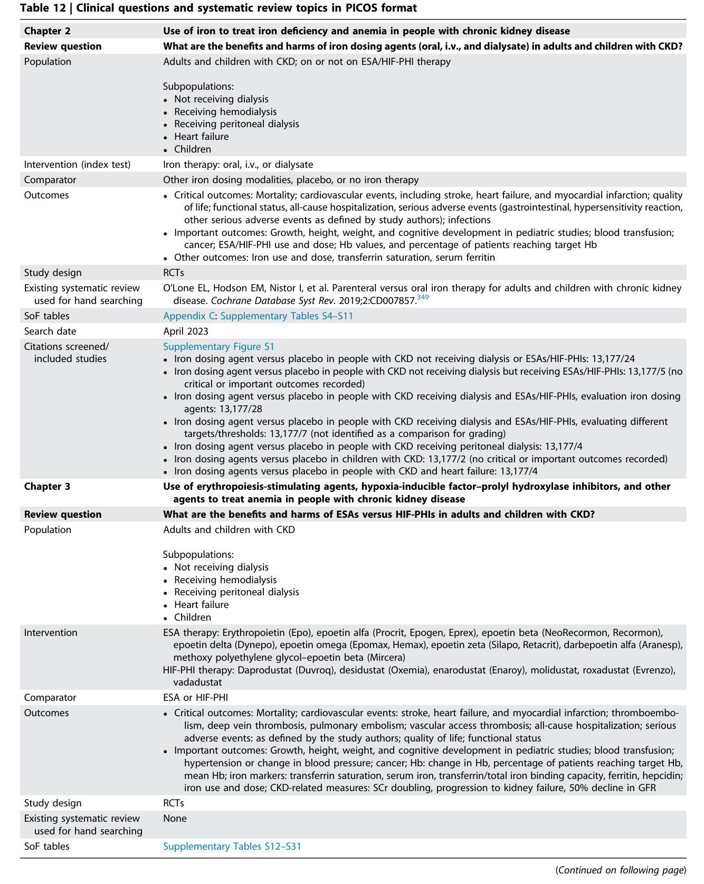

- **Part 2 (Page 72)**:
  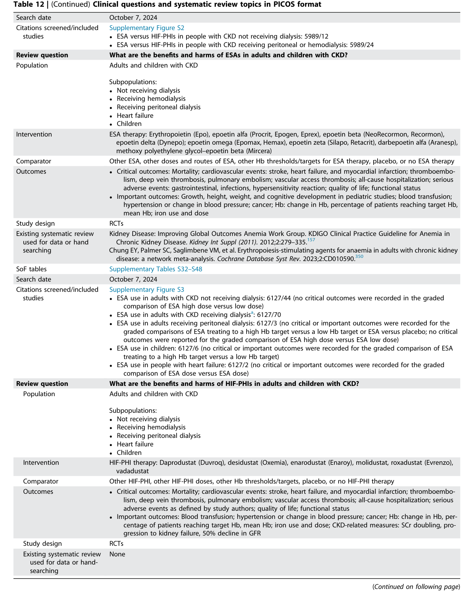

- **Part 3 (Page 73)**:
  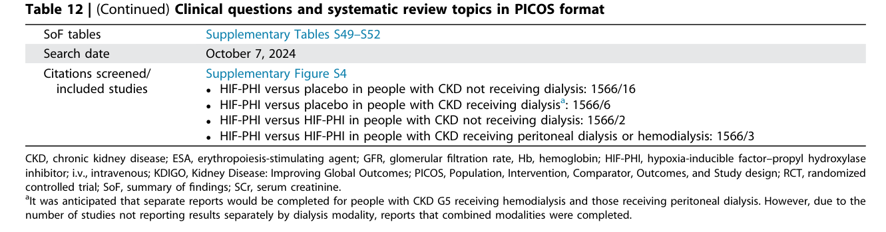

#### Table Data (CSV: [Table_12.csv](Table_12.csv))

```markdown
| Table Text (OCR) |
| :--- |
| images/90949438b5a4df43cfc8db6ab3fc64c27b6325f17f40ab01009a730cb83ba419.jpg Table 12 \| Clinical questions and systematic review topics in PICOS format CKD, chronic kidney disease; ESA, erythropoiesis-stimulating agent; GFR, glomerular <sup>fi</sup>ltration rate, Hb, hemoglobin; HIF-PHI, hypoxia-inducible factor–propyl hydroxylase inhibitor; i.v., intravenous; KDIGO, Kidney Disease: Improving Global Outcomes; PICOS, Population, Intervention, Comparator, Outcomes, and Study design; RCT, randomized controlled trial; SoF, summary of <sup>fi</sup>ndings; SCr, serum creatinine. <sup>a</sup>It was anticipated that separate reports would be completed for people with CKD G5 receiving hemodialysis and those receiving peritoneal dialysis. However, due to the number of studies not reporting results separately by dialysis modality, reports that combined modalities were completed. <table><tr><td>Chapter 2</td><td>Use of iron to treat iron deficiency and anemia in people with chronic kidney disease</td></tr><tr><td>Review question</td><td>What are the benefits and harms of iron dosing agents (oral, i.v., and dialysate) in adults and children with CKD? Adults and children with CKD; on or not on ESA/HIF-PHI therapy</td></tr><tr><td>Population</td><td>Subpopulations: • Not receiving dialysis</td></tr><tr><td></td><td>• Receiving peritoneal dialysis • Heart failure • Children</td></tr><tr><td>Intervention (index test) Comparator</td><td>Iron therapy: oral, i.v., or dialysate Other iron dosing modalities, placebo, or no iron therapy</td></tr><tr><td>Outcomes</td><td>• Critical outcomes: Mortality; cardiovascular events, including stroke, heart failure, and myocardial infarction; quality of life; functional status, all-cause hospitalization, serious adverse events (gastrointestinal, hypersensitivity reaction, other serious adverse events as defined by study authors); infections</td></tr><tr><td></td><td>• Important outcomes: Growth, height, weight, and cognitive development in pediatric studies; blood transfusion; cancer; ESA/HIF-PHI use and dose; Hb values, and percentage of patients reaching target Hb • Other outcomes: Iron use and dose, transferrin saturation, serum ferritin RCTs</td></tr><tr><td>Study design Existing systematic review</td><td>O'Lone EL, Hodson EM, Nistor I, et al. Parenteral versus oral iron therapy for adults and children with chronic kidney</td></tr><tr><td>used for hand searching SoF tables</td><td>disease. Cochrane Database Syst Rev. 2019;2:CD007857.349</td></tr><tr><td>Search date</td><td>Appendix C: Supplementary Tables S4–S11 April 2023</td></tr><tr><td>Citations screened/ included studies</td><td>Supplementary Figure S1 • Iron dosing agent versus placebo in people with CKD not receiving dialysis or ESAs/HIF-PHIs: 13,177/24</td></tr><tr><td></td><td>• Iron dosing agent versus placebo in people with CKD not receiving dialysis but receiving ESAs/HIF-PHIs: 13,177/5 (no critical or important outcomes recorded) • Iron dosing agent versus placebo in people with CKD receiving dialysis and ESAs/HIF-PHIs, evaluation iron dosing agents: 13,177/28 • Iron dosing agent versus placebo in people with CKD receiving dialysis and ESAs/HIF-PHls, evaluating different targets/thresholds: 13,177/7 (not identified as a comparison for grading) • Iron dosing agent versus placebo in people with CKD receiving peritoneal dialysis: 13,177/4 • Iron dosing agents versus placebo in children with CKD: 13,177/2 (no critical or important outcomes recorded)</td></tr><tr><td>Chapter 3</td><td>• Iron dosing agents versus placebo in people with CKD and heart failure: 13,177/4 Use of erythropoiesis-stimulating agents, hypoxia-inducible factor-prolyl hydroxylase inhibitors, and other</td></tr><tr><td>Review question</td><td>agents to treat anemia in people with chronic kidney disease What are the benefits and harms of ESAs versus HIF-PHIs in adults and children with CKD?</td></tr><tr><td>Population</td><td>Adults and children with CKD Subpopulations: • Not receiving dialysis</td></tr><tr><td>Intervention</td><td>• Receiving peritoneal dialysis • Heart failure • Children ESA therapy: Erythropoietin (Epo), epoetin alfa (Procrit, Epogen, Eprex), epoetin beta (NeoRecormon, Recormon), epoetin delta (Dynepo), epoetin omega (Epomax, Hemax), epoetin zeta (Silapo, Retacrit), darbepoetin alfa (Aranesp),</td></tr><tr><td>Comparator</td><td>methoxy polyethylene glycol-epoetin beta (Mircera) HIF-PHI therapy: Daprodustat (Duvroq), desidustat (Oxemia), enarodustat (Enaroy), molidustat, roxadustat (Evrenzo), vadadustat ESA or HIF-PHI</td></tr><tr><td>Outcomes</td><td>• Critical outcomes: Mortality; cardiovascular events: stroke, heart failure, and myocardial infarction; thromboembo- lism, deep vein thrombosis, pulmonary embolism; vascular access thrombosis; all-cause hospitalization; serious adverse events: as defined by the study authors; quality of life; functional status</td></tr><tr><td></td><td>• Important outcomes: Growth, height, weight, and cognitive development in pediatric studies; blood transfusion; hypertension or change in blood pressure; cancer; Hb: change in Hb, percentage of patients reaching target Hb, mean Hb; iron markers: transferrin saturation, serum iron, transferrin/total iron binding capacity, ferritin, hepcidin; iron use and dose; CKD-related measures: SCr doubling, progression to kidney failure, 50% decline in GFR</td></tr><tr><td>Study design</td><td>RCTs</td></tr><tr><td>Existing systematic review</td><td>None</td></tr><tr><td>used for hand searching SoF tables</td><td></td></tr><tr><td>Search date</td><td>October 7, 2024</td></tr><tr><td>Citations screened/included studies</td><td>Supplementary Figure S2 • ESA versus HIF-PHls in people with CKD not receiving dialysis: 5989/12</td></tr><tr><td></td><td>• ESA versus HIF-PHls in people with CKD receiving peritoneal or hemodialysis: 5989/24</td></tr><tr><td>Review question Population</td><td>What are the benefits and harms of ESAs in adults and children with CKD? Adults and children with CKD</td></tr><tr><td></td><td>Subpopulations: • Not receiving dialysis • Receiving hemodialysis</td></tr><tr><td></td><td>• Receiving peritoneal dialysis • Heart failure • Children</td></tr><tr><td>Intervention</td><td>ESA therapy: Erythropoietin (Epo), epoetin alfa (Procrit, Epogen, Eprex), epoetin beta (NeoRecormon, Recormon), epoetin delta (Dynepo); epoetin omega (Epomax, Hemax), epoetin zeta (Silapo, Retacrit), darbepoetin alfa (Aranesp), methoxy polyethylene glycol-epoetin beta (Mircera)</td></tr><tr><td>Comparator Outcomes</td><td>Other ESA, other doses and routes of ESA, other Hb thresholds/targets for ESA therapy, placebo, or no ESA therapy • Critical outcomes: Mortality; cardiovascular events: stroke, heart failure, and myocardial infarction; thromboembo-</td></tr><tr><td></td><td>lism, deep vein thrombosis, pulmonary embolism; vascular access thrombosis; all-cause hospitalization; serious adverse events: gastrointestinal, infections, hypersensitivity reaction; quality of life; functional status</td></tr><tr><td></td><td>• Important outcomes: Growth, height, weight, and cognitive development in pediatric studies; blood transfusion; hypertension or change in blood pressure; cancer; Hb: change in Hb, percentage of patients reaching target Hb,</td></tr><tr><td>Study design Existing systematic review Kidney Disease: Improving Global Outcomes Anemia Work Group. KDIGO Clinical Practice Guideline for Anemia in</td><td>mean Hb; iron use and dose RCTs</td></tr><tr><td>used for data or hand searching</td><td>Chronic Kidney Disease. Kidney Int Suppl (2011). 2012;2:279–335.157 Chung EY, Palmer SC, Saglimbene VM, et al. Erythropoiesis-stimulating agents for anaemia in adults with chronic kidney</td></tr><tr><td>SoF tables Search date</td><td>disease: a network meta-analysis. Cochrane Database Syst Rev. 2023;2:CD010590.350 Supplementary Tables S32-S48</td></tr><tr><td>Citations screened/included studies</td><td>October 7, 2024 Supplementary Figure S3</td></tr><tr><td></td><td>• ESA use in adults with CKD not receiving dialysis: 6127/44 (no critical outcomes were recorded in the graded comparison of ESA high dose versus low dose) • ESA use in adults with CKD receiving dialysisa: 6127/70 • ESA use in adults receiving peritoneal dialysis: 6127/3 (no critical or important outcomes were recorded for the graded comparisons of ESA treating to a high Hb target versus a low Hb target or ESA versus placebo; no critical</td></tr><tr><td></td><td>outcomes were reported for the graded comparison of ESA high dose versus ESA low dose) • ESA use in children: 6127/6 (no critical or important outcomes were recorded for the graded comparison of ESA treating to a high Hb target versus a low Hb target)</td></tr><tr><td>Review question Population</td><td>• ESA use in people with heart failure: 6127/2 (no critical or important outcomes were recorded for the graded comparison of ESA dose versus ESA dose) What are the benefits and harms of HIF-PHIs in adults and children with CKD?</td></tr><tr><td></td><td>Adults and children with CKD</td></tr><tr><td></td><td>Subpopulations: • Not receiving dialysis</td></tr><tr><td></td><td>• Receiving hemodialysis • Receiving peritoneal dialysis</td></tr><tr><td></td><td>• Heart failure • Children</td></tr><tr><td>Intervention</td><td>HIF-PHI therapy: Daprodustat (Duvroq), desidustat (Oxemia), enarodustat (Enaroy), molidustat, roxadustat (Evrenzo),</td></tr><tr><td>Comparator</td><td>vadadustat</td></tr><tr><td>Outcomes</td><td>Other HIF-PHI, other HIF-PHI doses, other Hb thresholds/targets, placebo, or no HIF-PHI therapy • Critical outcomes: Mortality; cardiovascular events: stroke, heart failure, and myocardial infarction; thromboembo-</td></tr><tr><td></td><td>lism, deep vein thrombosis, pulmonary embolism; vascular access thrombosis; all-cause hospitalization; serious adverse events as defined by study authors; quality of life; functional status</td></tr><tr><td></td><td>• Important outcomes: Blood transfusion; hypertension or change in blood pressure; cancer; Hb: change in Hb, per-</td></tr><tr><td></td><td>centage of patients reaching target Hb, mean Hb; iron use and dose; CKD-related measures: SCr doubling, pro- gression to kidney failure, 50% decline in GFR</td></tr><tr><td>Study design RCTs Existing systematic review None</td><td></td></tr><tr><td>SoF tables</td><td>Supplementary Tables S49-S52</td></tr><tr><td>Search date</td><td>October 7, 2024</td></tr><tr><td>Citations screened/ included studies</td><td>Supplementary Figure S4</td></tr><tr><td rowspan="4"></td><td>• HIF-PHI versus placebo in people with CKD not receiving dialysis: 1566/16</td></tr><tr><td>• HIF-PHI versus placebo in people with CKD receiving dialysisª: 1566/6</td></tr><tr><td>• HIF-PHI versus HIF-PHI in people with CKD not receiving dialysis: 1566/2</td></tr><tr><td>• HIF-PHI versus HIF-PHI in people with CKD receiving peritoneal dialysis or hemodialysis: 1566/3</td></tr></table> complex_table images/ simple_table images/ simple_table |
```

Table 12 Clinical questions and systematic review topics in PICOS format

---

### Table_13

#### Table Image

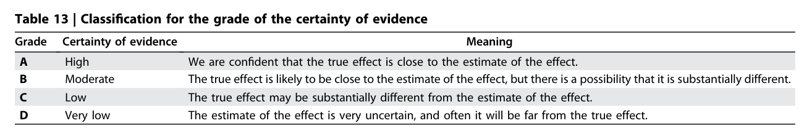

#### Table Data (CSV: [Table_13.csv](Table_13.csv))

```markdown
| Table Text (OCR) |
| :--- |
| Table 13 \| Classi<sup>fi</sup>cation for the grade of the certainty of evidence Grade  Certainty of evidence  Meaning    A  High  We are confident that the true effect is close to the estimate of the effect.    B  Moderate  The true effect is likely to be close to the estimate of the effect, but there is a possibility that it is substantially different.    C  Low  The true effect may be substantially different from the estimate of the effect.    D  Very low  The estimate of the effect is very uncertain, and often it will be far from the true effect. |
```

Table 13 Classification for the grade of the certainty of evidence

---

### Table_14

#### Table Image

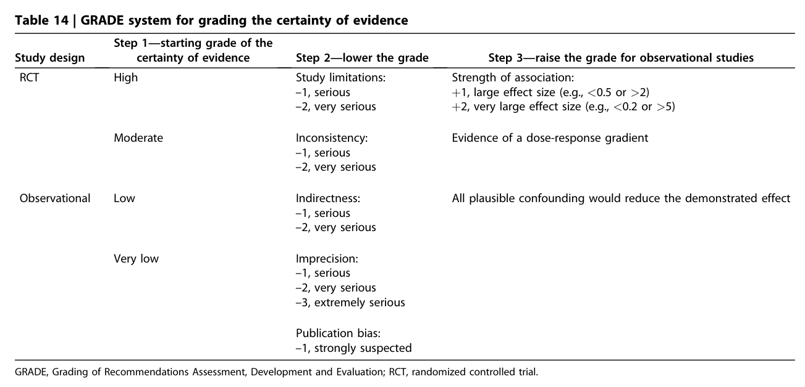

#### Table Data (CSV: [Table_14.csv](Table_14.csv))

```markdown
| Table Text (OCR) |
| :--- |
| Table 14 \| GRADE system for grading the certainty of evidence Study design  Step 1—starting grade of the certainty of evidence  Step 2—lower the grade  Step 3—raise the grade for observational studies    RCT  High  Study limitations:  Strength of association:    -1, serious  +1, large effect size (e.g., <0.5 or >2) +2, very large effect size (e.g., <0.2 or >5)    Moderate  -2, very serious      Inconsistency:  Evidence of a dose-response gradient    -1, serious -2, very serious      Observational  Low  Indirectness:  All plausible confounding would reduce the demonstrated effect      -1, serious      -2, very serious        Imprecision:        Very low    -1, serious        -2, very serious        -3, extremely serious                  Publication bias:          -1, strongly suspected GRADE, Grading of Recommendations Assessment, Development and Evaluation; RCT, randomized controlled trial. |
```

Table 14 GRADE system for grading the certainty of evidence

---

### Table_15

#### Table Image

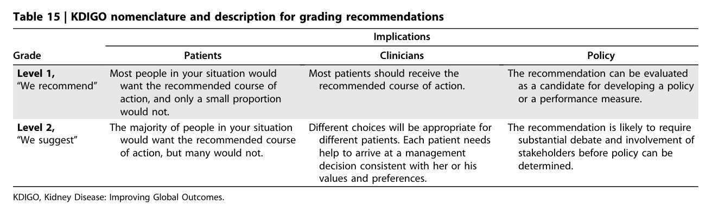

#### Table Data (CSV: [Table_15.csv](Table_15.csv))

```markdown
| Table Text (OCR) |
| :--- |
| Table 15 \| KDIGO nomenclature and description for grading recommendations Grade  Implications    Patients  Clinicians  Policy    Level 1, “We recommend”  Most people in your situation would want the recommended course of action, and only a small proportion would not.  Most patients should receive the recommended course of action.  The recommendation can be evaluated as a candidate for developing a policy or a performance measure.    Level 2, "We suggest"  The majority of people in your situation would want the recommended course of action, but many would not.  Different choices will be appropriate for different patients. Each patient needs help to arrive at a management decision consistent with her or his values and preferences.  The recommendation is likely to require substantial debate and involvement of stakeholders before policy can be determined. KDIGO, Kidney Disease: Improving Global Outcomes. |
```

Table 15 KDIGO nomenclature and description for grading recommendations

---

### Table_16

#### Table Image

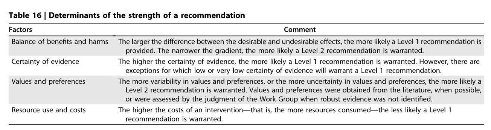

#### Table Data (CSV: [Table_16.csv](Table_16.csv))

```markdown
| Table Text (OCR) |
| :--- |
| images/34e6bcf1fce7f71916acf5b82b2bafecb7ca1291176d2d796be7b7d0b9e034a2.jpg Table 16 \| Determinants of the strength of a recommendation <table><tr><td>Factors</td><td>Comment</td></tr><tr><td>Balance of benefits and harms</td><td>The larger the difference between the desirable and undesirable effects, the more likely a Level 1 recommendation is provided. The narrower the gradient, the more likely a Level 2 recommendation is warranted.</td></tr><tr><td>Certainty of evidence</td><td>The higher the certainty of evidence, the more likely a Level 1 recommendation is warranted. However, there are exceptions for which low or very low certainty of evidence will warrant a Level 1 recommendation.</td></tr><tr><td>Values and preferences</td><td>The more variability in values and preferences, or the more uncertainty in values and preferences, the more likely a Level 2 recommendation is warranted. Values and preferences were obtained from the literature, when possible,</td></tr><tr><td>Resource use and costs</td><td>or were assessed by the judgment of the Work Group when robust evidence was not identified. The higher the costs of an intervention—that is, the more resources consumed—the less likely a Level 1 recommendation is warranted.</td></tr></table> simple_table |
```

Table 16 Determinants of the strength of a recommendation

---
